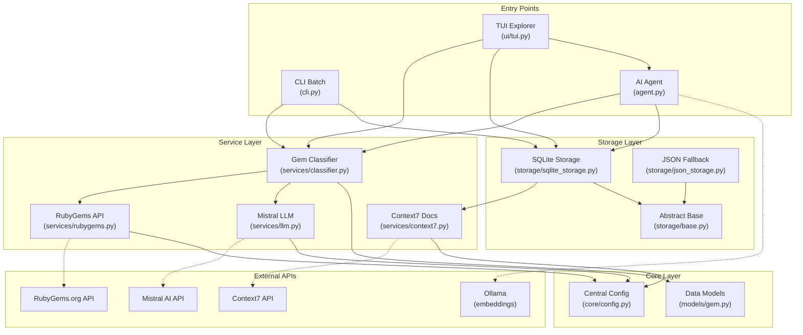
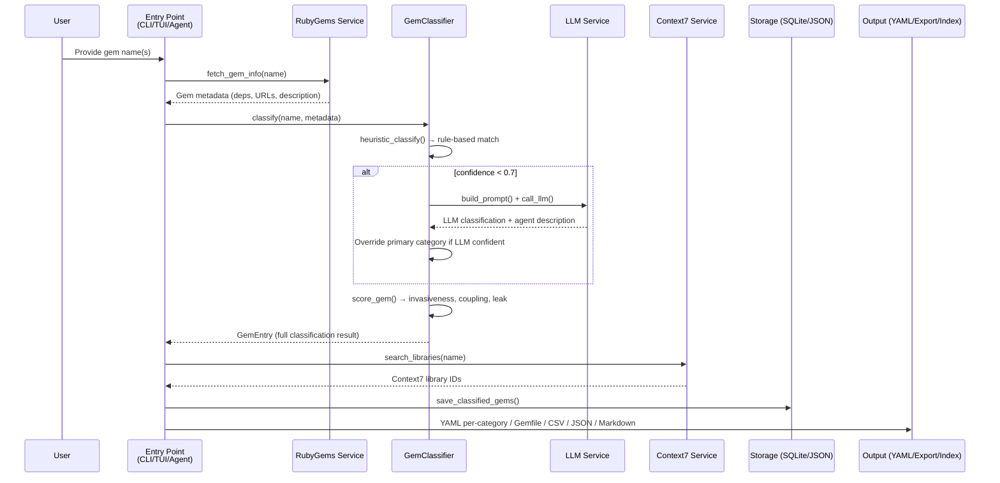

**RubyGemDB** is a **Ruby gem classification and analysis toolkit** that transforms unstructured gem inventories into architecturally categorized, semantically searchable knowledge. It operates across three distinct interfaces — a batch CLI pipeline, an interactive TUI explorer, and an AI-powered chat agent — all backed by a shared core of heuristic classification, LLM augmentation, vector embeddings, and dual storage backends.

Sources: [README.md](README.md#L1-L25)

## What Problem Does RubyGemDB Solve?

When working with large Ruby gem inventories (200+ gems), teams face three persistent challenges. **First**, gem taxonomies are inconsistent — a gem like `sidekiq` could be called "background job processing", "queue system", or "async worker" depending on who documents it. **Second**, metadata degrades — source links rot, descriptions drift, and documentation references vanish as projects evolve. **Third**, discovering the *right* gem for a task requires cross-referencing multiple APIs and documentation sources manually.

RubyGemDB tackles all three by providing a **single unified platform** that ingests gem lists from CSV, verifies metadata against RubyGems.org and Context7 APIs, applies a deterministic 12-category taxonomy (augmented by Mistral LLM when confidence dips), stores results in SQLite with JSON fallback, and makes everything searchable via txtai-powered vector embeddings with multi-query expansion.

Sources: [services/classifier.py](src/rubygemdb/services/classifier.py#L1-L25), [README.md](README.md#L27-L48)

## Architecture at a Glance

The following diagram shows how the three entry points (CLI, TUI, Agent) flow through the shared service and storage layers:



This design enforces a **layered separation** where entry points never talk directly to external APIs — they delegate to services, which in turn use configuration from [Centralized Configuration with Pydantic-Settings](9-centralized-configuration-with-pydantic-settings). Storage is abstracted through an interface defined in [Storage Abstraction Interface](10-storage-abstraction-interface), allowing transparent swap between [SQLite Storage with Metadata Verification](11-sqlite-storage-with-metadata-verification) and [JSON File Storage Fallback](12-json-file-storage-fallback).

Sources: [cli.py](src/rubygemdb/cli.py#L1-L30), [agent.py](src/rubygemdb/agent.py#L1-L30), [ui/tui.py](src/rubygemdb/ui/tui.py#L1-L50)

## Three Usage Modes

RubyGemDB adapts to different workflows through three distinct interfaces, each sharing the same classification engine and storage:

| Mode | Entry Point | Best For | Key Feature |
|------|------------|----------|-------------|
| **CLI Batch Pipeline** | `rubygemdb process` | Headless, automated processing of large inventories | 3-phase pipeline: Verify → Classify → Embed |
| **TUI Interactive Explorer** | `rubygemdb-tui` | Visual browsing, filtering, manual curation | Real-time classification, export to Gemfile/CSV/JSON/Markdown |
| **AI-Powered Agent** | `agent.py` / `TxtaiAgent` | Semantic search and conversational queries | Multi-query expansion with "Other Steve" prompt |

The CLI pipeline runs a structured three-phase process: **Phase 1** verifies gem existence and enriches metadata from RubyGems.org and Context7; **Phase 2** applies heuristic classification with optional Mistral LLM fallback for low-confidence cases; **Phase 3** (optional) builds a txtai vector embedding index for semantic search.

The TUI expands on this by allowing interactive filtering by category, editing classifications, fetching Context7 cheatsheets, and exporting selected gems in four formats. A dedicated agent chat tab lets users ask natural-language questions that route through the vector index.

The **AI Agent** layer ([Agent-Powered Semantic Chat](6-agent-powered-semantic-chat)) adds MCP tool integration for Context7 documentation retrieval, Codebase Memory context search, and Trackboi backlog distillation, making it suitable for architectural planning and gem discovery.

Sources: [README.md](README.md#L145-L180), [INSTALL.md](INSTALL.md#L60-L95), [cli.py](src/rubygemdb/cli.py#L220-L278)

## 12-Category Taxonomy System

At the heart of RubyGemDB is a **deterministic, rule-based classification engine** that maps every gem into exactly one of twelve architectural categories. This is not machine-learned — it is a hand-crafted set of pattern-matching rules defined in the classifier service.

| # | Category | Example Gems | Invasiveness | Description |
|---|----------|-------------|:----------:|-------------|
| 1 | `runtime_spine` | rails, bundler, activesupport | 5/5 | Boot + wiring, frameworks, core Ruby extensions |
| 2 | `cli_terminal_ui` | thor, gli, tty-commander | 1/5 | CLI frameworks, terminal UI tools |
| 3 | `storage_persistence` | activerecord, sequel, mongoid | 4/5 | ORMs, database adapters, file stores |
| 4 | `async_networking_orchestration` | sidekiq, falcon, faraday | 4/5 | HTTP clients, messaging, job queues, servers |
| 5 | `ai_nlp` | ruby-openai, langchain, tiktoken | 3/5 | AI/ML, NLP, LLM, embeddings |
| 6 | `data_processing` | nokogiri, roo, prawn | 3/5 | HTML/XML parsing, CSV, spreadsheets, PDF, scraping |
| 7 | `retrieval_similarity_fuzzy` | elasticsearch, searchkick, fuzz | 3/5 | Search, fuzzy matching, indexing |
| 8 | `algorithms_knowledge_structures` | algorithms, rbtree, bloom | 2/5 | Data structures, graphs, trees, algorithms |
| 9 | `validation_types` | dry-validation, dry-types, json-schema | 2/5 | Validation frameworks, type systems, schemas |
| 10 | `parsing_encoding` | yajl-ruby, msgpack, toml | 2/5 | JSON, YAML, XML, MessagePack, serializers |
| 11 | `debugging_introspection` | pry, byebug, sentry, opentelemetry | 1/5 | Debuggers, profilers, loggers, instrumentation |
| 12 | `mcp_tooling` | fast-mcp, model-context-protocol | 1/5 | Model Context Protocol tools |

The heuristic engine also **detects sub-categories** from dependency names (e.g., detecting `redis`, `database`, `search`, `auth`, `background_jobs` from runtime dependencies). When heuristic confidence falls below **0.7**, the system falls back to the Mistral LLM for re-classification, combining the fast pattern-matching path with LLM-powered reasoning.

Each gem also receives a **risk & invasiveness score** that evaluates three dimensions: invasiveness (how deeply it integrates into your codebase), coupling (how many dependencies it pulls in), and abstraction leak risk.

Sources: [services/classifier.py](src/rubygemdb/services/classifier.py#L10-L115), [services/classifier.py](src/rubygemdb/services/classifier.py#L200-L261)

## Project Structure

```
rubygemdb/
├── src/rubygemdb/
│   ├── __init__.py          # Package entry (hello world)
│   ├── __main__.py          # `python -m rubygemdb` → run_cli()
│   ├── cli.py               # CLI batch processor with argparse
│   ├── agent.py             # AI agent: txtai embeddings + smolagents + MCP
│   ├── core/
│   │   └── config.py        # Pydantic Settings with .env support
│   ├── models/
│   │   └── gem.py           # Pydantic models: GemEntry, GemClassification, etc.
│   ├── services/
│   │   ├── classifier.py    # Heuristic + LLM classification engine
│   │   ├── rubygems.py      # RubyGems.org API client with file cache
│   │   ├── llm.py           # Mistral LLM client with SHA-256 cache
│   │   └── context7.py      # Context7 documentation search service
│   ├── storage/
│   │   ├── base.py          # ABC: StorageBase interface
│   │   ├── json_storage.py  # JSON file implementation
│   │   └── sqlite_storage.py# SQLite implementation with metadata verification
│   └── ui/
│       └── tui.py           # Textual-based TUI (1815 lines)
├── tests/
│   ├── test_classifier.py   # 12-category heuristic tests
│   └── test_export.py       # Export format tests
├── pyproject.toml           # uv-based project config
├── INSTALL.md               # Installation & quick start guide
└── README.md                # Project README
```

Sources: [Project root](.), [pyproject.toml](pyproject.toml#L1-L53)

## Data Flow Overview

When a gem name enters the system, it follows this path:



This flow reveals a key design decision: **external API calls are cached**. The RubyGems service caches responses in `data/cache/gem_cache.json`, the LLM service caches via SHA-256 hashes in `data/cache/llm_cache.json`, and the SQLite storage acts as a persistent truth store. This means subsequent runs over the same inventory are significantly faster — metadata verification hits cache, not the network.

Sources: [services/rubygems.py](src/rubygemdb/services/rubygems.py#L20-L49), [services/llm.py](src/rubygemdb/services/llm.py#L15-L35), [storage/sqlite_storage.py](src/rubygemdb/storage/sqlite_storage.py#L10-L60)

## Key Dependencies

RubyGemDB is built on a modern Python stack with careful dependency management via `uv`:

| Dependency | Purpose | Role |
|-----------|---------|------|
| **Pydantic** v2.12+ | Data models for gems, classification, risks | `models/gem.py` — structured data contracts |
| **Pydantic-Settings** v2.13+ | Centralized config with .env file support | `core/config.py` — API keys, endpoints, paths |
| **txtai** 9.13+ | Vector embeddings, similarity search, agent pipeline | `agent.py` — semantic indexing + retrieval |
| **Textual** 8.2 | Terminal UI framework | `ui/tui.py` — interactive explorer application |
| **Rich** 14+ | CLI output formatting (tables, progress bars) | `cli.py` — progress spinners, summary tables |
| **SQLite-vec** | SQLite vector extension | `agent.py` — backend for txtai embeddings |
| **smolagents** | AI agent framework with tool calling | `agent.py` — MCP tool integration |
| **Ollama** | Local LLM inference (embeddinggemma) | `agent.py` — local embedding generation |
| **Requests** 2.33+ | HTTP client for RubyGems, Mistral, Context7 APIs | All service modules — external API calls |

Sources: [pyproject.toml](pyproject.toml#L8-L30)

## Reading Progression

To get started quickly, follow this path through the catalog:

1. **[Quick Start](2-quick-start)** — Get RubyGemDB running in under 5 minutes
2. **[Setup & Environment Configuration](3-setup-and-environment-configuration)** — Configure API keys and environment variables
3. **[CLI Batch Processing Pipeline](4-cli-batch-processing-pipeline)** — Process your first gem inventory from the command line
4. **[TUI Interactive Gem Explorer](5-tui-interactive-gem-explorer)** — Browse and manage classified gems visually
5. **[Agent-Powered Semantic Chat](6-agent-powered-semantic-chat)** — Search gems by natural language with the AI agent

For a deeper understanding of the internals, move to the **Deep Dive** section starting with **[Architecture Overview & Data Flow](7-architecture-overview-and-data-flow)** and continue through the Pydantic models, storage layer, classification engine, and external integrations — each page builds on the previous one in a logical sequence from data models outward to the API boundaries.