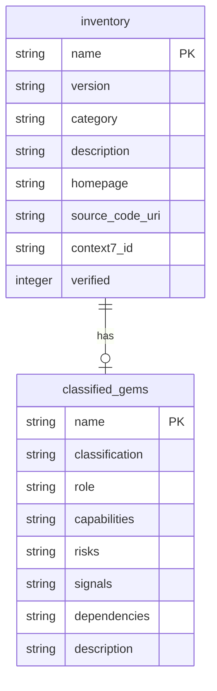
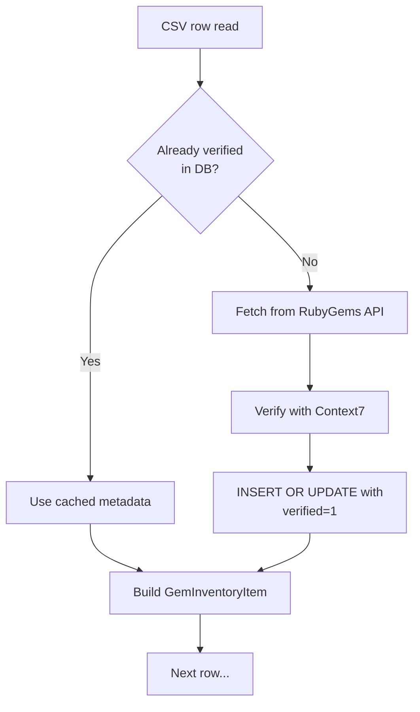

The `SQLiteStorage` class serves as the primary persistence engine for the rubygemdb system, implementing the `StorageBase` abstract interface while adding a critical layer of metadata verification sourced from external APIs. Unlike its simpler counterpart `JSONStorage`, which writes static JSON files, `SQLiteStorage` maintains a relational SQLite database that stores both raw inventory data and deeply structured classification results, with built-in verification workflows that cross-reference gem metadata against the RubyGems.org API and Context7 documentation service.

## Relational Schema Design

The storage layer uses two interrelated tables that mirror the conceptual separation between source inventory and classification output.

The **`inventory`** table stores the authoritative metadata for each gem — its version, category hints, homepage URL, source code repository URI, and a Context7 library identifier — alongside a boolean `verified` flag that tracks whether the record has been validated against live external sources. The **`classified_gems`** table holds the full classification output produced by the `GemClassifier`, with complex nested Pydantic models serialised as JSON text columns. The two tables are linked by a foreign key constraint from `classified_gems.name` to `inventory.name`, ensuring referential integrity between a gem's raw metadata and its analysed classification.

Initialisation happens via `_init_db()`, which executes `CREATE TABLE IF NOT EXISTS` statements to ensure the schema exists without destroying existing data. This idempotent startup pattern makes the storage safe to instantiate repeatedly across different usage modes (CLI, TUI, agent). Sources: [sqlite_storage.py](src/rubygemdb/storage/sqlite_storage.py#L21-L52), [base.py](src/rubygemdb/storage/base.py#L1-L17)

## Verification-Driven Inventory Loading

The most distinctive behaviour of `SQLiteStorage` — and the feature that gives this page its title — is the metadata verification flow embedded within `load_inventory()`. When a CSV file containing a raw gem list is provided, the method does not simply ingest rows wholesale. Instead, it implements a **verify-or-cache** pattern that checks each gem against the RubyGems.org API and Context7 service before committing the record.

The method first queries the database with `SELECT verified, homepage, source_code_uri, context7_id` for a matching name. If the row exists and `verified == 1` with a non-null `source_code_uri`, it skips the API calls entirely and reuses the stored values — a critical optimisation for large inventories. When verification is needed, it calls `RubyGemsService.fetch_gem_info()` to obtain the authoritative `homepage_uri` and `source_code_uri`, and `Context7Service.verify_library()` to obtain a documentation library identifier. The resulting record is then upserted via the `INSERT ... ON CONFLICT(name) DO UPDATE` pattern, which atomically inserts a new row or updates an existing one, with `verified` always set to `1`. Sources: [sqlite_storage.py](src/rubygemdb/storage/sqlite_storage.py#L55-L110), [rubygems.py](src/rubygemdb/services/rubygems.py#L31-L49), [context7.py](src/rubygemdb/services/context7.py#L32-L42)

This design solves a practical problem: raw gem lists from external sources often contain stale or missing metadata. By enriching every entry at load time with live API data, the system ensures that downstream classification and export operations work with the most accurate information available, while the verification flag prevents redundant network calls on subsequent runs.

## Classification Persistence with JSON Serialisation

While the `inventory` table stores flat scalar fields, the `classified_gems` table must accommodate the rich nested structure of a `GemEntry` model, which includes nested Pydantic objects like `GemClassification`, `GemRisks`, and `GemSignals`. `SQLiteStorage` handles this by serialising each complex field into JSON text using `json.dumps()` on write and parsing it back with `GemClassification(**json.loads(...))` on read.

The `save_classified_gems()` method accepts a list of `GemEntry` instances and upserts each one using a wide `INSERT` that covers all columns. The `ON CONFLICT(name) DO UPDATE` clause ensures that re-running classification over the same gem set updates existing records rather than raising constraint violations. This is the same upsert pattern used for inventory, but applied to the deeply structured classification output. Sources: [sqlite_storage.py](src/rubygemdb/storage/sqlite_storage.py#L112-L137)

Conversely, `load_classified_gems()` performs a `LEFT JOIN` between `classified_gems` and `inventory`, pulling in `homepage`, `source_code_uri`, and `context7_id` from the inventory side. It then reconstructs each `GemEntry` by parsing the JSON columns back into their respective Pydantic models. This join-based reconstruction means that consumers of the storage layer (such as the TUI or the export pipeline) always receive fully hydrated gem objects without needing to query multiple tables themselves. Sources: [sqlite_storage.py](src/rubygemdb/storage/sqlite_storage.py#L188-L215)

## Post-Verification Metadata Updates

The verification process does not end at inventory loading. A separate method, `update_gem_verification()`, is exposed for use by the CLI pipeline's interactive Phase 1 workflow, where a human operator reviews and corrects metadata for each gem. This method updates both tables simultaneously: it sets `homepage`, `source_code_uri`, `description`, `context7_id`, and `verified = 1` in the `inventory` table, and syncs the `description` field in `classified_gems` to keep them consistent. The dual-table update ensures that even if a gem was previously classified with a stale description, the correction propagates. Sources: [sqlite_storage.py](src/rubygemdb/storage/sqlite_storage.py#L223-L239), [cli.py](src/rubygemdb/cli.py#L136-L172)

Supporting methods complete the lifecycle management surface:

| Method | Purpose | Transaction Scope |
|---|---|---|
| `add_gem_to_inventory(name)` | Registers a new gem for subsequent classification; sets `verified = 0` | Single row insert-or-ignore + update |
| `delete_gem(name)` | Removes a gem from both `inventory` and `classified_gems` | Two deletions in one transaction |
| `update_gem_classification(name, primary_category)` | Overrides the primary category manually; resets confidence to `1.0` | Select + update on `classified_gems` |
| `update_gem_metadata(name, ...)` | Targeted updates to `context7_id` or `source_code_uri` without full re-verification | Conditional column update |

Each method opens its own connection context via `with sqlite3.connect(...)`, guaranteeing that writes are committed atomically on context exit. Sources: [sqlite_storage.py](src/rubygemdb/storage/sqlite_storage.py#L140-L174)

## Configuration and Service Integration

The database file path is resolved from `settings.sqlite_db_file`, which is defined as `data_dir / "rubygemdb.sqlite"` under the project root. The `SQLiteStorage` constructor accepts optional `RubyGemsService` and `Context7Service` instances; if omitted, it instantiates defaults. This dependency injection design allows the CLI and TUI to share a single service instance across the entire pipeline, reusing the in-memory request cache maintained by `RubyGemsService` and the rate-limit state tracked by `Context7Service`. Sources: [sqlite_storage.py](src/rubygemdb/storage/sqlite_storage.py#L14-L19), [config.py](src/rubygemdb/core/config.py#L1-L39)

## Comparison with JSONStorage

The `JSONStorage` class fulfils the same `StorageBase` contract but operates without verification logic, relational integrity, or query capability. It reads CSV rows directly into `GemInventoryItem` objects without enrichment, writes classified gems as a monolithic JSON array to a file, and loads them by deserialising that file in its entirety. `SQLiteStorage` adds the verification layer, referential constraints, the ability to query individual gems via `get_all_inventory_gems()`, and transactional safety across multiple writes. The choice between them is dictated by the deployment scenario: `SQLiteStorage` for production pipelines where accuracy and consistency matter, `JSONStorage` for quick prototyping or single-run exports. Sources: [json_storage.py](src/rubygemdb/storage/json_storage.py#L1-L37)

## Next Steps

- Examine how classified gems are loaded for interactive exploration: [Textual-Based Interactive TUI Implementation](23-textual-based-interactive-tui-implementation)
- Understand the full pipeline that invokes `load_inventory` and `save_classified_gems`: [CLI Batch Processing Pipeline](4-cli-batch-processing-pipeline)
- Trace how `GemEntry` models compose the data persisted here: [Pydantic Data Models for Gems](8-pydantic-data-models-for-gems)