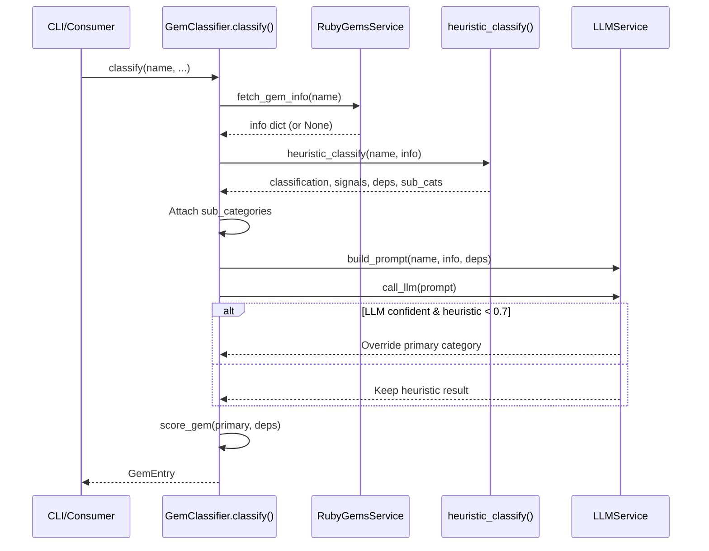

The heuristic rule-based classifier serves as the **primary decision engine** within rubygemdb's classification pipeline. It transforms a raw gem name and its metadata into a structured architectural category assignment through a cascading pattern-matching system — operating **without any network calls** and producing results in microseconds. This makes it the backbone of the classification pipeline, with the LLM service acting only as a conditional refinement overlay.

The classifier lives in the `GemClassifier` class ([classifier.py](src/rubygemdb/services/classifier.py#L22-L261)), which accepts two external service dependencies — `RubyGemsService` for fetching gem metadata and `LLMService` for optional AI augmentation. However, the heuristic classification method itself (`heuristic_classify`) is **entirely self-contained**: it works purely off the gem name string and an info dictionary that can be `None`.

## The 12-Category Taxonomy as Matching Target

The entire heuristic engine targets exactly one of twelve architectural categories, defined in the module-level `VALID_CATEGORIES` list ([classifier.py](src/rubygemdb/services/classifier.py#L7-L20)). These categories replaced an earlier 8-category system that used more abstract labels like "runtime_substrate" and "framework_integration" — a refactoring verified in the test suite which explicitly asserts old slugs are never produced (`test_old_categories_removed` in [test_classifier.py](tests/test_classifier.py#L46-L48)). The current taxonomy maps directly to developer-recognizable architectural concerns:

| Category Slug | Architectural Concern | Example Keywords |
|---|---|---|
| `runtime_spine` | Framework boot & wiring | rails, engine, bundler, activesupport |
| `cli_terminal_ui` | Command-line & TUI tools | thor, gli, commander, curses |
| `storage_persistence` | ORMs, DB adapters, file stores | activerecord, sequel, sqlite, leveldb |
| `async_networking_orchestration` | HTTP clients, servers, job queues | sidekiq, falcon, faraday, http, grpc |
| `ai_nlp` | AI/ML, NLP, LLM, embeddings | openai, anthropic, langchain, vector |
| `data_processing` | Parsing HTML/XML, CSV, PDF | nokogiri, roo, prawn, mechanize |
| `retrieval_similarity_fuzzy` | Search, fuzzy matching, indexing | elasticsearch, searchkick, fuzzy |
| `algorithms_knowledge_structures` | DS, algorithms, graphs | algorithm, rbtree, bloom, trie |
| `validation_types` | Validation, type systems, schemas | dry-validation, json-schema, activemodel |
| `parsing_encoding` | JSON, YAML, XML, serialization | yajl, msgpack, yaml, protobuf |
| `debugging_introspection` | Debuggers, profilers, logging | pry, byebug, sentry, datadog |
| `mcp_tooling` | Model Context Protocol tools | mcp, model-context-protocol |

Sources: [classifier.py](src/rubygemdb/services/classifier.py#L7-L121), [test_classifier.py](tests/test_classifier.py#L9-L23)

## Cascading Priority: The Four-Layer Matching Strategy

The `heuristic_classify` method ([classifier.py](src/rubygemdb/services/classifier.py#L27-L192)) implements a **four-layer cascade** where each layer applies only if the previous one failed to match. This design ensures deterministic predictability: the first matching pattern wins, and confidence accumulates as a simple additive score.

**Layer 1 — Name Substring Matching (Primary Heuristic):** The method lowercases the gem name and tests it against keyword lists using a helper closure `has(keys)` ([classifier.py](classifier.py#L29-L30)). Each category's match block is an `if/elif` chain in a specific order that encodes **priority rules**. The most notable priority constraint is that `dry-validation`, `dry-types`, `dry-struct`, and `dry-schema` must be checked _before_ the generic `dry-` fallback, otherwise every `dry-*` gem would incorrectly land in `runtime_spine` ([classifier.py](classifier.py#L43-L53)). When a match fires, it sets `classification.primary` to the category slug, increments `classification.confidence` by 0.3, and may toggle `signals` flags (e.g., `signals.rails = True` for `runtime_spine` gems, or `signals.external_io = True` for `async_networking_orchestration` and `debugging_introspection`).

**Layer 2 — Dependency-Based Fallback:** If name matching yields no hit across all twelve categories, the method inspects the gem's runtime dependencies ([classifier.py](classifier.py#L124-L143)). It iterates through dependency names looking for known libraries (rails, sidekiq, sentry, nokogiri) that imply a category. This fallback uses a lower confidence increment of 0.2 (vs. 0.3 for name matches) and `break`s on the first match, preserving the single-category constraint.

**Layer 3 — Category Hint Override:** After name and dependency matching, if the gem was originally inventoried under a `development` or `test` category (populated from CSV import), the method forces `cli_terminal_ui` with confidence set to at least 0.7 ([classifier.py](classifier.py#L145-L147]). This handles gems like RSpec or minitest whose names don't self-identify as CLI tools but functionally serve development workflows.

**Layer 4 — Signal Detection (Always Run):** Regardless of which layer matched, the method always checks for non-Ruby platform indicators and performs exhaustive sub-category detection from dependencies ([classifier.py](classifier.py#L149-L191]). The `signals.native_ext` flag is set when `info.get("platform")` is present and not `"ruby"`. The sub-category detection runs across all dependencies without early termination, accumulating into a set that may include tags like `"rails"`, `"database"`, `"background_jobs"`, `"monitoring"`, `"cloud"`, `"serialization"`, and `"messaging"`.

Sources: [classifier.py](src/rubygemdb/services/classifier.py#L27-L192)

## Confidence as a Design Contract

Confidence scoring operates as a simple additive accumulator starting from a baseline of 0.5 and capped implicitly by the single-match architecture (since only one layer fires, the maximum confidence from heuristics alone is 0.8 — 0.5 base + 0.3 from name match). The test suite enforces this contract: `test_heuristic_confidence_boosted_on_match` asserts that matched gems have confidence above 0.6 ([test_classifier.py](tests/test_classifier.py#L173-L175]), while `test_classify_default_unknown_gem` verifies that unmatched gems never exceed 0.7 confidence ([test_classifier.py](tests/test_classifier.py#L166-L168]). This confidence threshold is the exact decision boundary used later in the `classify()` orchestration method: if heuristic confidence is **below 0.7** and the LLM returns confidence **above 0.6**, the LLM overrides the heuristic assignment ([classifier.py](classifier.py#L237-L240]).

```mermaid
flowchart TD
    A[Gem name + metadata] --> B{Name matches<br/>category keywords?}
    B -->|Yes| C[Assign category<br/>confidence += 0.3]
    B -->|No| D{Dependency matches<br/>known library?}
    D -->|Yes| E[Assign category<br/>confidence += 0.2]
    D -->|No| F[Keep default<br/>data_processing<br/>confidence = 0.5]
    C --> G{Category hint<br/>is dev/test?}
    E --> G
    F --> G
    G -->|Yes| H[Force cli_terminal_ui<br/>confidence = max(0.7, current)]
    G -->|No| I[Run signal detection<br/>and sub-category scan]
    H --> I
    I --> J[Return classification,<br/>signals, deps, sub_cats]
```

Sources: [classifier.py](src/rubygemdb/services/classifier.py#L32-L33), [classifier.py](src/rubygemdb/services/classifier.py#L145-L147)

## Sub-Category Detection: The Cross-Cutting Concern

After the primary category is determined, the method performs an independent sweep through all dependencies to populate `sub_cats` ([classifier.py](classifier.py#L152-L191]). Unlike the main classification cascade, this loop **does not break**: every dependency is tested against a comprehensive set of keyword patterns, and matching tags accumulate into a set. This means a gem depending on both PostgreSQL and Redis will accumulate both `"database"` and `"redis"` sub-categories. The sub-category vocabulary spans fifteen distinct tags:

| Sub-Category Tag | Triggering Dependency Keywords |
|---|---|
| `rails` | rails |
| `sidekiq` | sidekiq |
| `background_jobs` | sidekiq, delayed_job, resque |
| `activejob` | active_job, activejob |
| `server` | puma, unicorn |
| `redis` | redis |
| `database` | postgresql, pg, mysql, mysql2, mariadb |
| `search` | elasticsearch, search |
| `auth` | jwt, oauth |
| `api` | graphql, grape |
| `serialization` | json, xml |
| `spreadsheet` | csv, xlsx, excel |
| `pdf` | pdf |
| `cloud` | aws, gcp, google, azure, s3 |
| `monitoring` | sentry, datadog, newrelic, honeybadger |
| `messaging` | kafka, bunny, mqtt |

These sub-categories are attached to the `GemClassification.sub_categories` field in the orchestration method ([classifier.py](classifier.py#L228-L229]) and serve as faceted metadata for downstream consumers like the TUI explorer and vector embedding index.

Sources: [classifier.py](src/rubygemdb/services/classifier.py#L152-L191), [gem.py](src/rubygemdb/models/gem.py#L9-L13)

## Risk and Invasiveness Scoring

The `score_gem` method ([classifier.py](classifier.py#L194-L222]) produces a `GemRisks` model with three dimensions — invasiveness, coupling, and abstraction leak — all derived from the primary category and dependency count.

**Invasiveness** uses a hard-coded mapping that encodes architectural impact: `runtime_spine` (score 5) represents the most invasive category since it wires into application boot and core object model, while `cli_terminal_ui`, `debugging_introspection`, and `mcp_tooling` (score 1) are the least invasive. Categories not in the map default to score 3 (the midpoint). The full gradient is:

| Score | Categories |
|---|---|
| 5 | runtime_spine |
| 4 | async_networking_orchestration, storage_persistence |
| 3 | data_processing, ai_nlp, retrieval_similarity_fuzzy |
| 2 | algorithms_knowledge_structures, validation_types, parsing_encoding |
| 1 | cli_terminal_ui, debugging_introspection, mcp_tooling |

**Coupling** is computed functionally: `min(4, max(1, len(deps)//3 + 1))`. This produces a scale of 1 (0–2 dependencies) through 4 (9+ dependencies), reflecting the intuition that a gem with many transitive dependencies is more tightly coupled to the ecosystem.

**Abstraction leak** uses a targeted map for categories whose abstractions are known to be porous: `async_networking_orchestration` and `storage_persistence` both score `"high"`, `runtime_spine`, `ai_nlp`, and `data_processing` score `"medium"`, and everything else defaults to `"low"`.

Sources: [classifier.py](src/rubygemdb/services/classifier.py#L194-L222), [gem.py](src/rubygemdb/models/gem.py#L15-L18)

## Integration into the Full Orchestration Pipeline

The public `classify()` method ([classifier.py](classifier.py#L224-L260]) orchestrates a three-phase flow: (1) fetch gem info from RubyGems.org API (with caching), (2) run heuristic classification, and (3) conditionally augment with LLM inference.



The LLM augmentation is deliberately conservative: the heuristic result is treated as authoritative unless its confidence dips below 0.7 **and** the LLM provides a confident (>0.6) alternative ([classifier.py](classifier.py#L237-L240]). This design ensures the deterministic, zero-latency heuristic dominates for well-known gems while leaving room for AI assistance on unfamiliar or ambiguous names.

The `GemEntry` model assembled at the end bundles the classification, risks, signals, dependencies, and descriptive metadata into a single structure that flows into SQLite storage ([sqlite_storage.py](src/rubygemdb/storage/sqlite_storage.py)), YAML export via the CLI pipeline ([cli.py](src/rubygemdb/cli.py#L231-L237)), and the txtai vector index for semantic search.

Sources: [classifier.py](src/rubygemdb/services/classifier.py#L224-L260), [cli.py](src/rubygemdb/cli.py#L220-L228)

## Testing Strategy

The test suite ([test_classifier.py](tests/test_classifier.py)) provides coverage across four dimensions:

- **Category integrity:** `test_valid_categories_has_exactly_12` and `test_old_categories_removed` enforce the taxonomy contract, ensuring no regression to the old 8-category system.
- **Per-category classification:** Individual tests like `test_classify_cli_gem` through `test_classify_mcp_gem` verify that specific gem names map to the correct categories. These serve as executable documentation of the keyword-to-category mapping.
- **Confidence boundaries:** `test_heuristic_confidence_boosted_on_match` and `test_classify_default_unknown_gem` validate the confidence scoring contract.
- **Sub-category enrichment:** Tests like `test_sub_category_background_jobs`, `test_sub_category_database`, and `test_sub_category_monitoring` confirm that dependency-based tags propagate correctly.

The fixture creates a `GemClassifier` with mocked `RubyGemsService` and `LLMService` instances, isolating the heuristic logic from network dependencies ([test_classifier.py](tests/test_classifier.py#L53-L59]).

Sources: [test_classifier.py](tests/test_classifier.py#L37-L249)

## Architecture Decisions and Tradeoffs

The current design favors **determinism and speed over accuracy** for the heuristic path. Name substring matching is O(n * m) where n is the length of the gem name and m is the number of keyword patterns across all categories — negligible in practice. The cascading fallback to dependency inspection adds resilience for gems whose names are opaque.

The explicit priority encoding in the `if/elif` chain is a known maintenance burden: adding a new category or keyword requires understanding the ordering constraints (e.g., `dry-` generic vs. `dry-validation` specific). This is an intentional tradeoff that keeps the system **entirely dependency-free** — no ML model, no external service, no database queries — making it suitable for cold-start scenarios where no prior classification data exists.

The default category of `data_processing` when nothing matches ([classifier.py](classifier.py#L32]) is a pragmatic choice: it biases toward a neutral, common category rather than failing with an error. Combined with the LLM override path, the system guarantees that every gem receives a plausible classification even in the absence of any matching signal.

Sources: [classifier.py](src/rubygemdb/services/classifier.py#L27-L192)

## Next Steps

The heuristic classifier operates as the first stage of a two-stage pipeline. To understand how the LLM refines its output for ambiguous gems, see [LLM-Augmented Classification with Fallback](14-llm-augmented-classification-with-fallback). For the full taxonomy definition and design rationale, see [12-Category Taxonomy System](15-12-category-taxonomy-system). The risk scoring model is detailed further in [Risk & Invasiveness Scoring](16-risk-and-invasiveness-scoring).