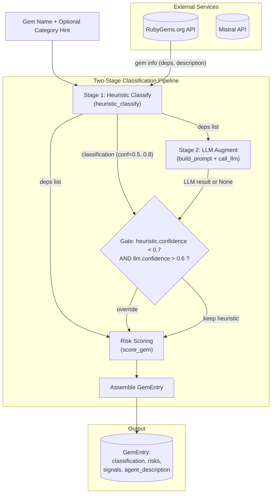

The LLM-Augmented Classification with Fallback system is the decision engine at the heart of RubygemDB's gem analysis pipeline. It implements a **layered architecture** where deterministic rule-based heuristics serve as the primary classifier, and an external LLM (Mistral API) is invoked as a secondary opinion that can override the heuristic result only under strictly bounded conditions. This design ensures that the classification system remains predictable and auditable while still capturing the semantic nuance that only a language model can provide. The orchestrator of this hybrid approach is the `GemClassifier` class, which coordinates between the `RubyGemsService` (for fetching gem metadata), the `LLMService` (for LLM inference with caching), and its own internal scoring logic to produce a fully populated `GemEntry` — the canonical record for a classified gem.

Sources: [classifier.py](src/rubygemdb/services/classifier.py#L1-L261), [llm.py](src/rubygemdb/services/llm.py#L1-L93)

## Architecture: The Two-Stage Classification Pipeline

The classification process inside `GemClassifier.classify()` proceeds through two distinct stages that are executed in sequence, each with a different responsibility. **Stage 1 is the heuristic pass**: a deterministic function `heuristic_classify()` that examines the gem's name, its RubyGems metadata, and its runtime dependencies to assign one of the 12 valid taxonomy categories. This stage produces a `GemClassification` object containing a `primary` category string and a floating-point `confidence` value that starts at `0.5` (the default for uncategorized gems) and is incremented by `+0.3` when a keyword match fires, or `+0.2` when a fallback dependency-based match succeeds. **Stage 2 is the LLM augmentation**: the system unconditionally builds a structured prompt via `LLMService.build_prompt()` — which includes the gem name, its description, dependency list, and the full 12-category taxonomy — and dispatches it to the Mistral API. The LLM response is parsed for three fields: `primary` (a category slug), `confidence` (a float), and critically, `agent_description` (a RAG-optimized prose summary). The heuristic classification always takes the first position; the LLM result is allowed to override it only if the condition `classification.confidence < 0.7 and llm_result.get("confidence", 0) > 0.6` is satisfied. This threshold-based gating means that a confidently matched heuristic (e.g., a gem named `rails` scoring `0.8`) will never be overruled by the LLM, preserving deterministic behavior for well-understood patterns, while uncertain cases (e.g., a novel gem name that falls through all keyword chains) receive the benefit of LLM reasoning.

Sources: [classifier.py](src/rubygemdb/services/classifier.py#L26-L34), [classifier.py](src/rubygemdb/services/classifier.py#L215-L245)



## Heuristic Classification: Deterministic Keyword Matching

The `heuristic_classify()` method implements a cascading `if-elif` chain that tests 12 keyword-based rules in a carefully curated priority order. Each rule checks whether the lowercase gem name contains any of the trigger keywords for a given category. The ordering is not arbitrary: it reflects real-world semantic precedence. For instance, `dry-validation`, `dry-types`, and `dry-struct` are checked before the generic `dry-` prefix catch-all, ensuring that gems from the dry-rb ecosystem that deal with validation logic are correctly routed to `validation_types` rather than being lumped into the `runtime_spine` catch-all for general dry-rb gems. Similarly, `runtime_spine` (for Rails-core, frameworks, and core Ruby extensions) is checked first because Rails-adjacent keywords like `rails` or `engine` are highly specific and would otherwise be misclassified by broad rules lower in the chain. When a keyword match is found, the confidence is boosted by `+0.3`, and the method short-circuits — no further rules are evaluated. If no name-based match fires, the method falls through to a second-level loop that inspects each runtime dependency name against a smaller set of heuristic patterns (e.g., checking for `sentry` or `datadog` in dependency names to infer `debugging_introspection`). This dependency-based fallback uses a lower confidence boost of `+0.2`, reflecting the weaker inferential signal. After all matching is complete, three post-processing steps apply: (1) if the gem's category hint (from an inventory CSV) is `"development"` or `"test"`, the classification is forcibly set to `cli_terminal_ui` with confidence raised to at least `0.7`; (2) if the RubyGems platform field indicates a non-Ruby native extension, the `signals.native_ext` flag is set to `True`; (3) a sub-category detection pass iterates over all dependency names to populate the `sub_categories` list — for example, detecting `sidekiq` in a dependency adds both `"sidekiq"` and `"background_jobs"` to the set.

Sources: [classifier.py](src/rubygemdb/services/classifier.py#L36-L185)

## LLM Service: Prompt Engineering and Caching

The `LLMService` class encapsulates all interaction with the Mistral API and is designed with resilience as a core property. Its `build_prompt()` method constructs a structured prompt that includes: the gem name, its description text (fetched from RubyGems), a comma-separated list of its runtime dependencies, and a numbered list of all 12 valid categories. The prompt instructs the model to return **JSON only** with three keys: `primary`, `confidence`, and `agent_description`. The `agent_description` field is a deliberate design choice — it is not a human-readable summary but a **RAG-optimized agent description** intended for consumption by another AI coding agent. The prompt explicitly instructs the model to "explain exactly what this gem does, when to use it, and how it might combine with other tools," making this description a first-class artifact for downstream retrieval and semantic search use cases.

The `call_llm()` method implements a multi-layer fallback strategy. First, it checks whether `settings.mistral_api_key` is set; if the key is absent (e.g., no `.env` configured), it returns `None` immediately, effectively disabling the LLM stage and falling back entirely to heuristic results. Second, it computes a SHA-256 hash of the prompt and checks an in-memory cache (persisted to `llm_cache.json` on disk) — if a cached response exists, the API call is skipped entirely. Third, it sends a POST request to the Mistral endpoint with `temperature=0` (ensuring deterministic, reproducible outputs) and a 10-second timeout. The response parsing includes robust handling for the common LLM behavior of wrapping JSON in markdown code fences: the method strips ` ```json ` and ` ``` ` blocks before passing the text to `json.loads()`. Any exception during the request, parsing, or validation results in a graceful `return None`, which the caller treats as a signal to retain the heuristic classification unchanged.

Sources: [llm.py](src/rubygemdb/services/llm.py#L30-L93)

## The Fallback Contract: When LLM Overrides Heuristics

The interaction between the heuristic and LLM stages is governed by a conservative override contract that prevents the LLM from destabilizing already-confident classifications. The governing logic in `GemClassifier.classify()` is:

```python
if classification.confidence < 0.7 and llm_result.get("confidence", 0) > 0.6:
    classification.primary = llm_result["primary"]
    classification.confidence = llm_result["confidence"]
```

This means that an LLM override occurs only when three conditions are simultaneously met: (1) the heuristic system is uncertain about its own prediction (confidence below `0.7`), (2) the LLM expresses confidence above `0.6`, and (3) the LLM actually returned a valid result (i.e., the API call succeeded, the cache hit worked, and the JSON parsed correctly). In all other scenarios — heuristic confidence at `0.7` or above, LLM confidence at `0.6` or below, API failure, missing API key — the heuristic classification is preserved unchanged. The `agent_description` field, however, is **always** populated from the LLM response regardless of whether an override occurred. This design decouples the two LLM outputs: the category assignment is treated as a fallible suggestion subject to the override gate, while the agent description is treated as universally valuable metadata worth generating on every run.

Sources: [classifier.py](src/rubygemdb/services/classifier.py#L225-L235)

## Risk and Invasiveness Scoring

After classification is finalized, `score_gem()` computes three independent risk metrics that are embedded into the `GemEntry` alongside the classification. **Invasiveness** is a category-level property ranging from 1 to 5, defined by a static lookup table: `runtime_spine` (5), `async_networking_orchestration` (4), `storage_persistence` (4), `data_processing` (3), `ai_nlp` (3), `retrieval_similarity_fuzzy` (3), `algorithms_knowledge_structures` (2), `validation_types` (2), `parsing_encoding` (2), `cli_terminal_ui` (1), `debugging_introspection` (1), `mcp_tooling` (1). **Coupling** is a dependency-derived metric computed as `min(4, max(1, len(deps)//3 + 1))`, producing a score from 1 (0-2 dependencies) to 4 (9+ dependencies). **Abstraction leak** is a categorical label (`"high"`, `"medium"`, or `"low"`) mapped from a subset of categories that tend to leak implementation details into client code — notably `async_networking_orchestration` and `storage_persistence` are classified as `"high"`, while `mcp_tooling` and `cli_terminal_ui` are `"low"`. These three metrics together provide a multi-dimensional risk profile that is used downstream for TUI filtering and reporting.

Sources: [classifier.py](src/rubygemdb/services/classifier.py#L200-L215)

## Integration with the CLI Pipeline

The `GemClassifier` is instantiated in the CLI's `run_process()` function as part of the broader three-phase pipeline (metadata verification → classification → optional vector embedding). The classification phase iterates over every gem in the inventory, calling `classifier.classify()` with the gem name and any verified metadata (homepage, source code URI, Context7 ID). The resulting `GemEntry` objects are collected, batch-saved to the SQLite database via `storage.save_classified_gems()`, and also grouped by primary category for YAML export. This architectural decision — that the classifier orchestrates its own data fetching, classification, and risk scoring — means that adding new classification signals (e.g., a new heuristic rule or a different LLM provider) requires changes only within the `GemClassifier` class and its immediate collaborators, not in the CLI orchestration code.

Sources: [cli.py](src/rubygemdb/cli.py#L121-L180)

## Testing Strategy

The test suite in `test_classifier.py` validates the LLM-Augmented Classification system along four dimensions. **Category integrity tests** verify that `VALID_CATEGORIES` contains exactly 12 entries, that all expected new slugs are present, and that all 8 old category slugs (from a previous taxonomy version like `"runtime_substrate"` and `"framework_integration"`) have been removed — this guarantees the taxonomy migration is complete. **Heuristic classification tests** use a mocked `RubyGemsService` and `LLMService` (via `unittest.mock.MagicMock`) to isolate the heuristic logic, testing each of the 12 categories with representative gem names — `thor` → `cli_terminal_ui`, `sidekiq` → `async_networking_orchestration`, `fast-mcp` → `mcp_tooling`, and so on. A negative test (`"bubbles"`) confirms that unknown gems fall back to a default category with confidence at most `0.7`. **LLM prompt tests** verify that the generated prompt includes all 12 new categories and excludes all 8 old categories, ensuring prompt integrity even if the taxonomy evolves. **Sub-category detection tests** validate that dependency names like `sidekiq`, `pg`, and `sentry-ruby` correctly populate `"background_jobs"`, `"database"`, and `"monitoring"` in the sub-categories list. Notably, the override gate logic itself (`confidence < 0.7` + `LLM confidence > 0.6`) is not directly unit-tested but is implicitly covered by the confidence assertions in the heuristic tests — the test for `"bubbles"` verifying confidence `<= 0.7` is the boundary condition that defines when the LLM override becomes eligible.

Sources: [test_classifier.py](tests/test_classifier.py#L1-L249)

## Design Rationale and Tradeoffs

The hybrid heuristic-LLM architecture was chosen for three specific reasons that reflect the constraints of operating in a resource-constrained, offline-capable environment. **First, cost efficiency**: the heuristic provides correct classification for the vast majority of common gems (Rails, Sidekiq, Nokogiri, Pry, etc.) without any API expenditure; only ambiguous or novel gems trigger the LLM path, minimizing Mistral API costs. **Second, offline resilience**: the entire heuristic pipeline requires no network access beyond the initial RubyGems metadata fetch, and the LLM service degrades gracefully to None on any failure — the system never hangs or produces partial results. **Third, auditability**: because the heuristic rules are explicit string-matching functions, the reasoning behind any classification can be traced by examining which line in the `if-elif` chain fired, making the system predictable for users and debuggable for developers. The tradeoff is that the heuristic rules are inherently brittle — a gem named `"dry-crud"` would be caught by the `dry-` catch-all and classified as `runtime_spine` rather than the more appropriate `storage_persistence`, because the rule for `dry-validation` (which is checked first) only matches validation-related patterns. The 12-category taxonomy itself is documented comprehensively in the [12-Category Taxonomy System](15-12-category-taxonomy-system) page, and the risk scoring model is detailed in [Risk & Invasiveness Scoring](16-risk-and-invasiveness-scoring). For the next step in understanding the full classification pipeline, readers should proceed to the [12-Category Taxonomy System](15-12-category-taxonomy-system) to understand the semantic boundaries of each category, then to [Heuristic Rule-Based Classification](13-heuristic-rule-based-classification) for the complete keyword matching logic.