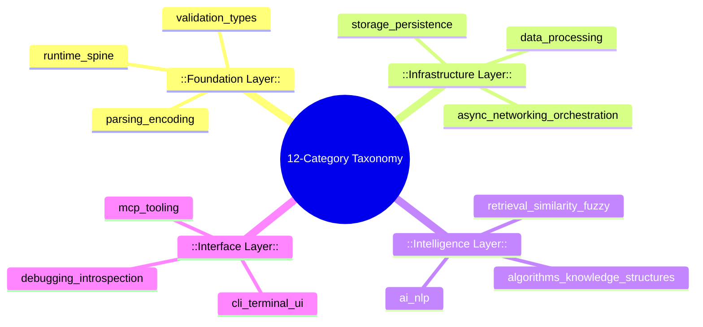
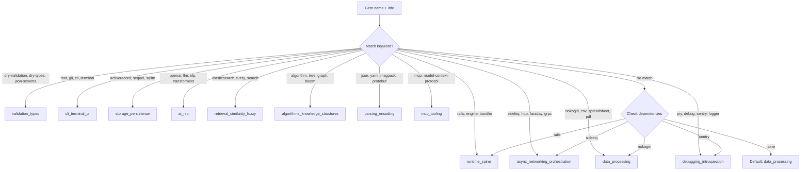

## Design Rationale & Architectural Principles

The 12-Category Taxonomy System is the intellectual backbone of rubygemdb's classification engine. It replaces an earlier 8-category system (which included amorphous groupings like `runtime_substrate`, `framework_integration`, `boundary_interface`, `application_capability`, `policy_enforcement`, `observability`, `developer_experience`, and `build_delivery`) with a schema that is **architecturally-grounded** rather than capability- or lifecycle-oriented. The old system categorized gems by *what role they played in a development workflow*; the new system categorizes them by *what architectural concern they address*.

This shift is consequential. An architect evaluating a dependency graph needs to know: "Does this gem touch my networking layer? Does it own my storage? Is it a transient CLI helper or a persistent runtime substrate?" The 12 categories provide exactly this kind of structural reasoning. Each category maps to a distinct layer or concern in a typical Ruby application architecture, and the ordering of categories in the heuristic matcher reflects a deliberate priority cascade: foundational concerns (runtime wiring, validation) are checked before domain-specific ones (data processing, AI/ML). 

Sources: [classifier.py](src/rubygemdb/services/classifier.py#L1-L23), [test_classifier.py](tests/test_classifier.py#L18-L30)

---

## The 12 Categories: A Complete Reference

Each category has a unique slug used throughout the system — in heuristic matching, LLM prompts, SQLite storage, YAML output files, and TUI filters. The table below provides the canonical definition, typical gem examples, and architectural intent.



| # | Slug | Architectural Concern | Typical Gems | Invasiveness |
|---|------|----------------------|--------------|--------------|
| 1 | `runtime_spine` | Application boot, wiring, framework core | rails, bundler, active_support, engine | 5 (highest) |
| 2 | `cli_terminal_ui` | Command-line interfaces, TUI frameworks | thor, gli, optimist, clamp, curses | 1 |
| 3 | `storage_persistence` | ORMs, database adapters, file stores | activerecord, sequel, rom, sqlite, leveldb | 4 |
| 4 | `async_networking_orchestration` | HTTP clients, messaging, job queues, servers | sidekiq, falcon, faraday, grpc, kafka, puma | 4 |
| 5 | `ai_nlp` | AI/ML, NLP, LLM, embeddings | ruby-openai, langchain, transformers, whisper | 3 |
| 6 | `data_processing` | HTML/XML parsing, CSV, spreadsheets, PDF | nokogiri, roo, prawn, mechanize, scraper | 3 |
| 7 | `retrieval_similarity_fuzzy` | Search, fuzzy matching, indexing | elasticsearch, searchkick, fuzz, pg_search | 3 |
| 8 | `algorithms_knowledge_structures` | Data structures, algorithms, graph theory | rbtree, bloom, trie, hash_ring, priority-queue | 2 |
| 9 | `validation_types` | Validation, type systems, schema DSLs | dry-validation, dry-types, dry-struct, json-schema | 2 |
| 10 | `parsing_encoding` | Serialization, encoding, data formats | oj, msgpack, yajl, protobuf, marshal | 2 |
| 11 | `debugging_introspection` | Debuggers, profilers, loggers, APM | pry, byebug, sentry, datadog, opentelemetry | 1 |
| 12 | `mcp_tooling` | Model Context Protocol tools | fast-mcp, model-context-protocol | 1 |

The **invasiveness** score (1–5) measures how deeply a gem integrates into an application's runtime. A `runtime_spine` gem (score 5) typically replaces or augments core boot logic; an `mcp_tooling` gem (score 1) is a lightweight protocol adapter. This scoring feeds directly into the `GemRisks` model that accompanies every classification.

Sources: [classifier.py](src/rubygemdb/services/classifier.py#L6-L23), [classifier.py](src/rubygemdb/services/classifier.py#L195-L222), [gem.py](src/rubygemdb/models/gem.py#L1-L41)

---

## Heuristic Classification Algorithm

The core classification logic lives in `GemClassifier.heuristic_classify()`, which applies a **priority-ordered keyword matcher** against the gem's name, with a fallback to dependency inspection.

### Matching Priority Cascade

The method uses a 12-step `if/elif` chain, each checking for specific substrings in the lowercased gem name. The order is intentional — more architecturally-assertive categories (runtime_spine, validation_types) are checked before more general ones (data_processing, parsing_encoding). This prevents a gem like `dry-validation` from being falsely classified as `parsing_encoding` (which would match on "dry") or `data_processing`.



Each successful match adds **0.3** to the confidence score (starting from a baseline of 0.5 in `data_processing`). Dependency-based fallbacks add only **0.2**, reflecting the weaker signal. A special override exists for gems in the `development` or `test` categories (from Bundler groups), which are forcibly reclassified as `cli_terminal_ui` with a confidence floor of 0.7.

### Sub-Category Detection

After the primary category is determined, the method iterates over the gem's runtime dependencies to detect **sub-categories** — contextual tags that provide finer-grained intent without polluting the top-level taxonomy. These are returned as a `List[str]` and stored in `GemClassification.sub_categories`.

| Dependency Signal | Sub-Category Tags |
|-------------------|-------------------|
| rails | `rails` |
| sidekiq | `sidekiq`, `background_jobs` |
| active_job / activejob | `activejob` |
| puma / unicorn | `server` |
| redis | `redis` |
| postgresql / pg / mysql / mysql2 / mariadb | `database` |
| elasticsearch / search | `search` |
| jwt / oauth | `auth` |
| graphql / grape | `api` |
| json / xml | `serialization` |
| csv / xlsx / excel | `spreadsheet` |
| pdf | `pdf` |
| aws / gcp / google / azure / s3 | `cloud` |
| sentry / datadog / newrelic / honeybadger | `monitoring` |
| delayed_job / resque / sidekiq | `background_jobs` |
| kafka / bunny / mqtt | `messaging` |

Sources: [classifier.py](src/rubygemdb/services/classifier.py#L24-L190), [test_classifier.py](tests/test_classifier.py#L208-L249)

---

## LLM-Augmented Classification with Fallback

The taxonomy is designed for a two-tier classification pipeline where the heuristic matcher always runs first, and the LLM only overrides when the heuristic confidence is low.

In `classify()` (the top-level entry point), the LLM is always invoked to generate an `agent_description` — a RAG-optimized summary for downstream AI agents. However, the LLM's category choice only replaces the heuristic result when two conditions are simultaneously met:

1. The heuristic confidence is below **0.7** (meaning the keyword matcher was uncertain)
2. The LLM confidence is above **0.6** (meaning the model is confident in its assessment)

```python
if classification.confidence < 0.7 and llm_result.get("confidence", 0) > 0.6:
    classification.primary = llm_result["primary"]
    classification.confidence = llm_result["confidence"]
```

The LLM prompt (in `LLMService.build_prompt()`) lists all 12 categories as a bulleted list and instructs the model to return JSON with `primary`, `confidence`, and `agent_description` fields. The prompt explicitly omits the old 8 categories — a design constraint verified by the test suite (`test_llm_prompt_does_not_contain_old_categories`).

Sources: [classifier.py](src/rubygemdb/services/classifier.py#L227-L260), [llm.py](src/rubygemdb/services/llm.py#L21-L51), [test_classifier.py](tests/test_classifier.py#L204-L207)

---

## Risk & Invasiveness Scoring Per Category

Every classification becomes a `GemRisks` object with three dimensions: **invasiveness**, **coupling**, and **abstraction leak**.

### Invasiveness Mapping

```python
invasiveness_map = {
    "runtime_spine": 5,
    "async_networking_orchestration": 4,
    "storage_persistence": 4,
    "data_processing": 3,
    "ai_nlp": 3,
    "retrieval_similarity_fuzzy": 3,
    "algorithms_knowledge_structures": 2,
    "validation_types": 2,
    "parsing_encoding": 2,
    "cli_terminal_ui": 1,
    "debugging_introspection": 1,
    "mcp_tooling": 1,
}
```

The invasiveness gradient mirrors architectural depth: categories that touch the application's entry point (runtime_spine), network boundary (async_networking), or persistent state (storage) score highest. Categories that operate at the periphery — debugging tools, MCP adapters, CLI wrappers — score lowest.

### Coupling & Abstraction Leak

- **Coupling** is derived from dependency count: `min(4, max(1, len(deps)//3 + 1))`. A gem with 12+ dependencies scores a coupling of 4; one with 0–2 dependencies scores 1.
- **Abstraction leak** is a categorical assessment of how much internal complexity the gem exposes. `async_networking_orchestration` and `storage_persistence` leak "high" because they surface threading, connection pooling, and query interfaces. `runtime_spine`, `ai_nlp`, and `data_processing` leak "medium"; all other categories leak "low".

Sources: [classifier.py](src/rubygemdb/services/classifier.py#L195-L222), [gem.py](src/rubygemdb/models/gem.py#L19-L22)

---

## Integration Points Across the Application

The taxonomy is consumed by three distinct interfaces, each reflecting a different user interaction pattern:

### CLI Batch Pipeline
In `cli.py`, the `process` command iterates over a gem inventory, classifies each gem via `GemClassifier.classify()`, groups results by category (the `categorized` dict), and writes each category's gems to a separate YAML file at `{out_dir}/{category}.yaml`. The terminal output includes a classification summary table with per-category counts.

```python
categorized[gem_entry.classification.primary].append(gem_entry.model_dump())
# ...
for cat, items in categorized.items():
    with open(f"{args.out}/{cat}.yaml", "w") as f:
        yaml.dump(items, f, sort_keys=False)
```

Sources: [cli.py](src/rubygemdb/cli.py#L218-L234)

### TUI Interactive Explorer
The TUI imports `VALID_CATEGORIES` directly to populate a `RadioSet` for filtering gems (`class_filter`) and for manual classification override in the `EditGemScreen`. Each category slug is transformed to human-readable form via `cat.replace("_", " ").title()` — for example, `async_networking_orchestration` becomes `"Async Networking Orchestration"`. The `DetailsWidget` displays the primary category alongside confidence and sub-categories.

```python
for cat in VALID_CATEGORIES:
    yield RadioButton(cat.replace("_", " ").title(), id=f"edit_cls_{cat}", ...)
```

Sources: [tui.py](src/rubygemdb/ui/tui.py#L19-L20), [tui.py](src/rubygemdb/ui/tui.py#L182-L184), [tui.py](src/rubygemdb/ui/tui.py#L1036-L1045)

### AI Agent Semantic Chat
The `TxtaiAgent` (in `agent.py`) does not directly use the taxonomy for retrieval, but the `agent_description` generated during LLM-augmented classification (which references the 12 categories) is indexed into txtai embeddings. This means semantic queries about "networking gems" or "validation libraries" will retrieve gems whose agent descriptions mention the corresponding category — creating an implicit coupling between the taxonomy and the vector search layer.

Sources: [agent.py](src/rubygemdb/agent.py#L1-L200), [llm.py](src/rubygemdb/services/llm.py#L21-L40)

---

## Data Model: How Classification is Stored

The `GemClassification` Pydantic model (in `models/gem.py`) captures the full classification output:

```python
class GemClassification(BaseModel):
    primary: str           # One of the 12 category slugs
    secondary: Optional[str]  # Reserved for future multi-label support
    sub_categories: List[str] = Field(default_factory=list)  # From dependency analysis
    confidence: float = 0.0   # 0.0–1.0, boosted on keyword match or LLM override
```

This is embedded within a `GemEntry`, which also carries `GemSignals` (rails, external_io, native_ext flags), `GemRisks`, dependency list, and metadata (homepage, source_code_uri, context7_id). The entire `GemEntry` is stored as a JSON blob in SQLite (via `storage.save_classified_gems`) and can be serialized to YAML per category for external consumption.

Sources: [gem.py](src/rubygemdb/models/gem.py#L1-L41), [classifier.py](src/rubygemdb/services/classifier.py#L227-L260)

---

## Testing Strategy

The test suite for the taxonomy (`tests/test_classifier.py`) enforces three distinct invariants:

1. **Category completeness**: `test_valid_categories_has_exactly_12` and `test_valid_categories_contains_all_expected` ensure the list is stable and contains all 12 expected slugs.
2. **Migration purity**: `test_old_categories_removed` asserts that none of the 8 old categories leak into `VALID_CATEGORIES`. This is a regression guard against partial refactoring.
3. **Per-category heuristic accuracy**: 13 individual test functions verify that specific gem names (thor → `cli_terminal_ui`, nokogiri → `data_processing`, pry → `debugging_introspection`, etc.) produce the correct primary category. The `test_classify_default_unknown_gem` test verifies that an unrecognized gem still lands in a valid category (never an undefined string) with bounded confidence.
4. **LLM prompt integrity**: Two tests confirm the prompt sent to the LLM mentions every new category and mentions zero old categories.
5. **Sub-category detection**: Three tests validate that dependency-triggered sub-categories (e.g., `sidekiq` → `background_jobs`) are correctly extracted.

Sources: [test_classifier.py](tests/test_classifier.py#L1-L249)

---

## Migration from the 8-Category System

The transition from 8 to 12 categories represents a deliberate architectural refactoring. The old categories were lifecycle-oriented (`build_delivery`, `developer_experience`, `observability`) — they described *when* a gem was used, not *what* it did. The new categories are layer-oriented: they describe which architectural layer a gem lives in.

| Old Category | Replacement Strategy |
|---|---|
| `runtime_substrate` | Merged into `runtime_spine` |
| `framework_integration` | Distributed across `runtime_spine`, `validation_types`, `storage_persistence` |
| `boundary_interface` | Split into `cli_terminal_ui` and `async_networking_orchestration` |
| `application_capability` | Distributed across `ai_nlp`, `data_processing`, `retrieval_similarity_fuzzy` |
| `policy_enforcement` | Replaced by `validation_types` |
| `observability` | Replaced by `debugging_introspection` |
| `developer_experience` | Replaced by `mcp_tooling` |
| `build_delivery` | No direct replacement (build tools classified ad-hoc) |

The `VALID_CATEGORIES` list in `classifier.py` is the single source of truth — the TUI imports it, the LLM prompt enumerates it, and the test suite validates it. Any future evolution of the taxonomy starts and ends at this list.

Sources: [test_classifier.py](tests/test_classifier.py#L18-L30), [classifier.py](src/rubygemdb/services/classifier.py#L6-L23)

---

## Summary

The 12-Category Taxonomy System replaces an ambiguous, lifecycle-oriented classification with an architecturally-grounded one. Its design follows three principles:

- **Priority-ordered matching** that checks foundational concerns before domain-specific ones, preventing over-eager classification by generic keyword matches.
- **Two-tier classification** where heuristic matching runs first (fast, deterministic, offline) and LLM augmentation only overrides when confidence thresholds cross (enabling graceful fallback without API dependency).
- **Single source of truth** in `VALID_CATEGORIES`, consumed identically by CLI, TUI, LLM prompts, and storage layers — making the taxonomy auditable, testable, and evolvable.

For developers integrating with rubygemdb, understanding these categories is essential: they determine YAML output filenames, TUI filter options, LLM prompt structure, and the invasiveness/coupling risk profile attached to every gem in the database.

---

**Next in this series**: [Heuristic Rule-Based Classification](13-heuristic-rule-based-classification) details the exact keyword matching algorithm, and [Risk & Invasiveness Scoring](16-risk-and-invasiveness-scoring) explores the scoring model in depth.