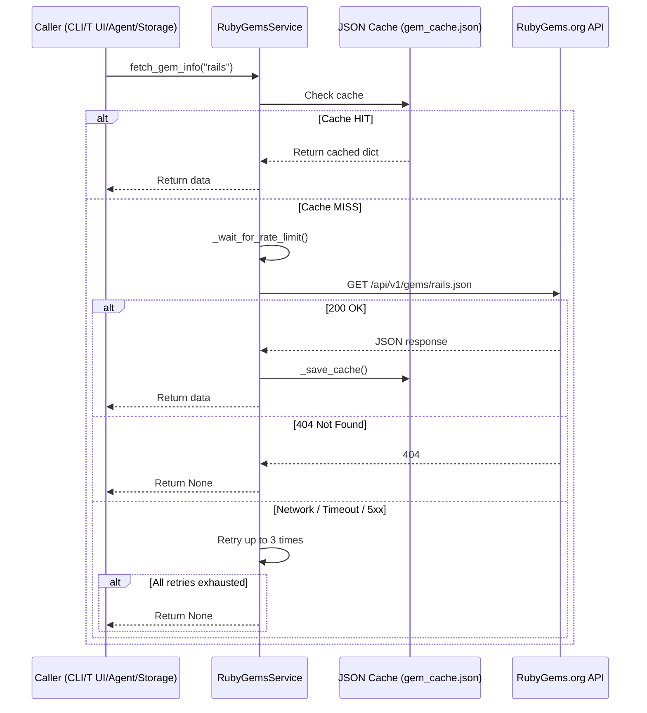

The `RubyGemsService` class provides a lightweight, caching-aware HTTP client for the [RubyGems.org API v1](https://guides.rubygems.org/rubygems-org-api/). It is the system's gateway for retrieving canonical gem metadata — descriptions, homepage URIs, source code URIs, dependency lists, and version information — and is consumed by every subsystem that needs authoritative gem data: the classifier, the storage layer, the CLI pipeline, the TUI explorer, and the AI agent. Sources: [rubygems.py](src/rubygemdb/services/rubygems.py#L8-L49)

## Architecture & Design Decisions

The service is deliberately minimal — a single class with no abstract base, no async, and no external dependencies beyond `requests` and the standard library. This simplicity is intentional: the RubyGems.org API is stable, rate-limited, and returns JSON directly, so the client needs only to mediate access, handle failures gracefully, and cache aggressively. The class receives its configuration from the centralized `Settings` object defined in `core/config.py`, specifically the `rubygems_api_url` template string and the `gem_cache_file` path. Sources: [rubygems.py](src/rubygemdb/services/rubygems.py#L6-L49), [config.py](src/rubygemdb/core/config.py#L15-L26)

### Request Flow

**Diagram explanation**: Every caller — whether the CLI pipeline, the TUI view, the classifier engine, the storage layer, or the AI agent — funnels requests through the same `RubyGemsService` instance. The cache acts as the first line of defense: on a hit, the response is returned instantly with zero network overhead. On a miss, the service enforces a 100 ms minimum interval between requests (`rate_limit_delay`), issues a GET to the RubyGems.org endpoint, and on success writes the result back to the JSON file cache before returning. Four-oh-four responses are treated as definitive absences (return `None`), while transient failures trigger up to three retries with backoff.

### Cache Implementation

The cache is a JSON dictionary stored at the path configured in `settings.gem_cache_file` (default: `data/cache/gem_cache.json`). It maps gem names to their full API response objects — there is no TTL or expiry mechanism, making it a **write-through, infinite-validity cache**. This design choice reflects the fact that gem metadata (name, description, homepage, dependencies) changes infrequently and that stale metadata is preferable to unnecessary API calls under rate limits. The cache is loaded on construction and flushed to disk after every successful fetch via `_save_cache()`. Sources: [rubygems.py](src/rubygemdb/services/rubygems.py#L14-L27)

### Rate Limiting

The `_wait_for_rate_limit()` method implements a simple **cooldown guard**: it records the timestamp of each outbound request and, if another request arrives within the `rate_limit_delay` window (default 100 ms), sleeps for the remaining duration. This prevents bursts even if multiple callers or rapid loops invoke `fetch_gem_info` in quick succession. The 100 ms default translates to a maximum of 10 requests per second — well within the unofficial RubyGems.org API polite limits. Sources: [rubygems.py](src/rubygemdb/services/rubygems.py#L17-L21), [config.py](src/rubygemdb/core/config.py#L25)

### Error Handling & Retry Strategy

When a request fails for any reason other than a definitive 404 (which returns `None` immediately), the method retries up to `retries` (default 3) times with **linear backoff**: `time.sleep(1 * (attempt + 1))`. After the first failure, it waits 1 second; after the second, 2 seconds; after the third, 3 seconds. If all attempts fail, the method returns `None`. This covers transient network issues, server-side 5xx errors, and timeouts without raising exceptions to the caller. Sources: [rubygems.py](src/rubygemdb/services/rubygems.py#L30-L49)

## Integration Points & Usage Landscape

The service is instantiated as a singleton in practice — every consumer either creates its own default instance or receives one via dependency injection. The following table details every usage site:

| Consumer | Instantiation | Injection Pattern | Method Called |
|---|---|---|---|
| **CLI Pipeline** (`cli.py`) | `RubyGemsService()` at module scope | Passed to `GemClassifier` & `SQLiteStorage` | `fetch_gem_info(name)` during Phase 1 metadata verification |
| **SQLite Storage** (`sqlite_storage.py`) | `RubyGemsService()` as fallback default | Optional constructor param `rubygems_service` | `fetch_gem_info(name)` during `load_inventory()` |
| **Gem Classifier** (`classifier.py`) | Received via constructor injection | Stored as `self.rubygems` | `fetch_gem_info(name)` for heuristic dependency analysis & LLM fallback |
| **TUI App** (`tui.py`) | `RubyGemsService()` in `GemApp.compose()` | Stored as `self.rg_service`, passed to `SQLiteStorage` | `fetch_gem_info(name)` when user views/refreshes gem details |
| **AI Agent** (`agent.py`) | Module-level `RubyGemsService()` | Exposed as `@tool` for smolagents | `fetch_gem_info(gem_name)` inside `fetch_rubygems_info` tool |

Sources: [cli.py](src/rubygemdb/cli.py#L55-L59), [sqlite_storage.py](src/rubygemdb/storage/sqlite_storage.py#L15-L17), [classifier.py](src/rubygemdb/services/classifier.py#L23-L24), [tui.py](src/rubygemdb/ui/tui.py#L1021-L1025), [agent.py](src/rubygemdb/src/rubygemdb/agent.py#L10-L14)

### Classification Pipeline Integration

The classifier is the heaviest consumer of the RubyGems service. During `heuristic_classify()`, it calls `fetch_gem_info` to obtain the full dependency tree of a gem, which it then scans for known library names (e.g., `rails`, `sidekiq`, `nokogiri`) to infer sub-categories and adjust confidence. Dependency-based classification acts as the fallback when the gem's name alone does not match any heuristic pattern. In the LLM-augmented classification path, `fetch_gem_info` supplies the raw description and metadata that are embedded into the prompt sent to Mistral. Sources: [classifier.py](src/rubygemdb/services/classifier.py#L225-L261)

### Agent Tool Surface

In the agent subsystem, `RubyGemsService` is wrapped by the `fetch_rubygems_info` tool, which is registered with the `smolagents` `ToolCallingAgent`. The tool serializes only the most relevant fields — name, info (description), version, project_uri, and runtime dependencies — into a JSON string, intentionally filtering out noisy or irrelevant API fields. This design keeps the LLM's context window clean while still providing the high-signal metadata needed for informed reasoning. Sources: [agent.py](src/rubygemdb/src/rubygemdb/agent.py#L54-L71)

## Configuration Surface

The service relies on two settings from the centralized `Settings` model:

| Setting | Default | Purpose |
|---|---|---|
| `rubygems_api_url` | `"https://rubygems.org/api/v1/gems/{name}.json"` | URL template; `{name}` is substituted by `fetch_gem_info` |
| `gem_cache_file` | `data/cache/gem_cache.json` | Filesystem path to the JSON cache dictionary |

Both can be overridden via environment variables (prefixed with `RUBYGEMDB_`) or a `.env` file thanks to `pydantic-settings`. Sources: [config.py](src/rubygemdb/core/config.py#L15-L26)

## Design Trade-offs & Limitations

The absence of cache invalidation means that once a gem is cached, the service will never re-fetch it — even if the user explicitly wants fresh data. This is a deliberate trade-off favouring reliability over freshness, given the stable nature of gem metadata. If a caller needs to bypass the cache, the only mechanism currently available is to delete the `gem_cache.json` file manually. The cache also grows unboundedly: every gem ever looked up accumulates in the JSON file, which over time could affect load performance for very large inventories.

The rate limiter is **single-threaded and process-local** — it uses `time.time()` and `time.sleep()` with no shared state. In a multi-threaded or multi-process scenario (e.g., concurrent TUI sessions), each process maintains its own cooldown timer, which could lead to burst violations at the network level. For the current single-process architecture this is not a concern.

The retry strategy uses a fixed linear backoff that does not respect `Retry-After` headers. If the API returns a 429 (rate limit exceeded) with a suggested wait time, the client ignores it and applies its own schedule. This is acceptable for the current low-volume usage but could be improved for production-scale operations.

## Next Steps

The RubyGemsService works in concert with the [Context7 Documentation Search Service](context7-documentation-search-service) (which enriches gems with documentation IDs) and the [Mistral LLM Service with Response Caching](mistral-llm-service-with-response-caching) (which drives the LLM-augmented classification path). Together, these three services form the external API integration layer that feeds the classification engine and the storage backends. For a broader view of how the service fits into the overall data flow, refer to the [Architecture Overview & Data Flow](architecture-overview-and-data-flow) page.