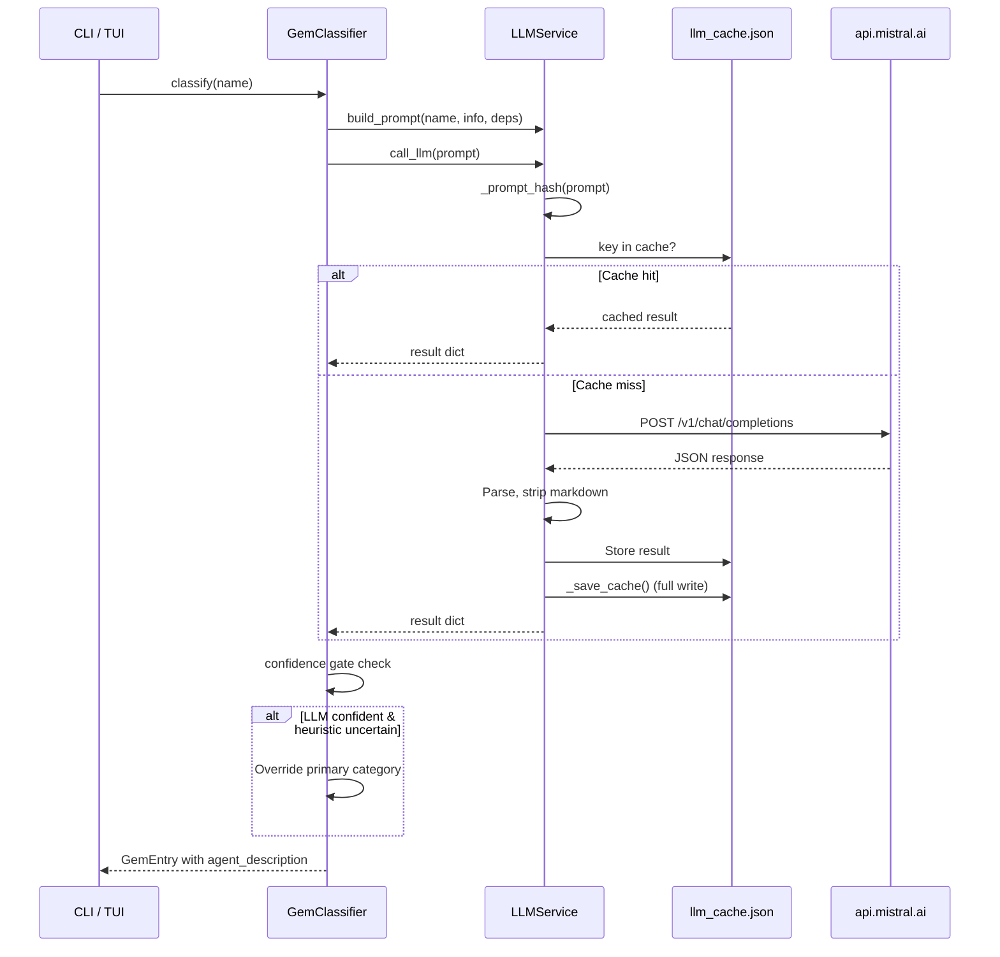

The **Mistral LLM Service** is the AI-augmentation layer of rubygemdb — a lightweight API client that wraps [Mistral AI's](https://api.mistral.ai) chat completions endpoint to generate RAG-optimized, agent-oriented descriptions for Ruby gems. Its defining architectural characteristic is a **transparent, content-addressable response cache** keyed by SHA-256 hash of the prompt, which eliminates redundant API calls and enables deterministic offline replay.

Sources: [llm.py](src/rubygemdb/services/llm.py#L1-L93)

## Class Design & Lifecycle

The `LLMService` class is intentionally minimal — a single public method (`call_llm`) and one prompt builder (`build_prompt`), with no abstract base or dependency injection framework. It is instantiated directly in the three integration points:

| Integration | File | Instantiation |
|---|---|---|
| CLI pipeline | [cli.py](src/rubygemdb/cli.py#L56) | `LLMService()` |
| TUI explorer | [tui.py](src/rubygemdb/ui/tui.py#L1022) | `LLMService()` |
| Classifier (via composition) | [classifier.py](src/rubygemdb/services/classifier.py#L23-L25) | Passed as dependency |

The service accepts no constructor arguments — all configuration is pulled from the global `settings` singleton (`rubygemdb.core.config.settings`), which loads environment variables from a `.env` file.

Sources: [llm.py](src/rubygemdb/services/llm.py#L7-L9), [config.py](src/rubygemdb/core/config.py#L7-L12)

## Content-Addressable Response Cache

The caching mechanism transforms the service from a pure remote caller into a **hybrid local/remote resolver**, with the local cache acting as the primary source of truth.

**Cache key generation** (`_prompt_hash`): The method computes `sha256(prompt.encode()).hexdigest()` — a deterministic 64-character hex digest of the **exact prompt string**. This means the same gem name, description, and dependency list always yields the same cache key, making repeated classifications of the same gem instant.

**Cache lifecycle**: On instantiation, `_load_cache()` reads the entire `llm_cache.json` file into an in-memory dictionary (or `{}` if missing). The file path is resolved from `settings.llm_cache_file` — by default `data/cache/llm_cache.json`. After a successful API call, `_save_cache()` persists the entire dictionary back to disk. This is a **full-write** strategy: every cache hit or miss rewrites the entire JSON file, which is acceptable for the expected workload (<10k entries) but would need sharding at scale.

```python
# Flow: Cache check before API call
key = self._prompt_hash(prompt)
if key in self.cache:
    return self.cache[key]           # cache hit → return immediately
# ... proceed to API call ...
self.cache[key] = result              # cache miss → store and persist
self._save_cache()
```

**Key properties**:
- **Immutable keys**: The SHA-256 hash is content-addressed; changing the prompt (e.g., adding new categories) invalidates all prior cache entries
- **No TTL/eviction**: Entries live forever in the JSON file; manual deletion is required to force reclassification
- **Thread-safety**: No locking mechanism; concurrent writes from multiple processes would corrupt the cache

Sources: [llm.py](src/rubygemdb/services/llm.py#L11-L23)

## Prompt Engineering for LLM Classification

The `build_prompt` method constructs a structured instruction prompt targeting the Mistral model, designed to produce a **single, deterministic JSON object**.

```
Categories:                       ← All 12 categories listed as bullet points
- runtime_spine
- cli_terminal_ui
- ...

Gem:
<name>                            ← Gem name from RubyGems
Description:
<info>                            ← Official description from rubygems.org
Dependencies:
<dep1>, <dep2>, ...              ← Runtime dependency names only

Return JSON only:
{"primary":"...","confidence":0.0,"agent_description":"..."}
```

**Design decisions**:
- **Temperature=0** is hardcoded in `call_llm` to minimize hallucination and maximize reproducibility, aligning with the classification use case where consistency matters more than creativity
- The **12-category taxonomy** is replicated from [classifier.py](src/rubygemdb/services/classifier.py#L7-L20) — any update to the taxonomy must be mirrored in the prompt
- The `agent_description` field is explicitly specified as a "RAG-optimized summary for another AI coding agent", which serves as the bridge to [the txtai agent page](20-txtai-based-vector-embeddings-and-indexing)

**Output parsing robustness**: The `call_llm` method employs a defensive extraction strategy against common LLM formatting quirks:

```python
if "```json" in text:                       # Typical JSON code block
    text = text.split("```json")[1].split("```")[0].strip()
elif "```" in text:                          # Plain code block (no language hint)
    text = text.split("```")[1].split("```")[0].strip()
# Then: json.loads(text)
```

This ensures the service gracefully handles both ` ```json ... ``` ` and ` ``` ... ``` ` wrapping in model responses.

Sources: [llm.py](src/rubygemdb/services/llm.py#L24-L58), [llm.py](src/rubygemdb/services/llm.py#L79-L83)

## Mistral API Integration

The API call flows through a single `requests.post` to the configured `llm_endpoint`:

| Parameter | Value | Source |
|---|---|---|
| `model` | `settings.rubygemdb_model` | Defaults to `mistral-medium-latest` |
| `messages[0].role` | `"user"` | Hardcoded — no system prompt |
| `messages[0].content` | The built prompt | From `build_prompt` |
| `temperature` | `0` | Hardcoded |
| `timeout` | `10` seconds | Hardcoded |
| Authorization | `Bearer {settings.mistral_api_key}` | From `.env` |

**Error handling strategy**: The entire API call is wrapped in a bare `try/except` that returns `None` on any failure (network error, non-200 status, JSON decode error, etc.). The classifier then falls through to its **heuristic-only** classification path — the LLM is treated as an optional enhancement, never a hard dependency.

```python
# Classifier integration (classifier.py line 232-240)
prompt = self.llm.build_prompt(name, info, deps)
llm_result = self.llm.call_llm(prompt)

if llm_result:
    if classification.confidence < 0.7 and llm_result.get("confidence", 0) > 0.6:
        classification.primary = llm_result["primary"]     # Override heuristic
        classification.confidence = llm_result["confidence"]
    agent_desc = llm_result.get("agent_description", "")
```

The **conditional override gate** (`confidence < 0.7` on heuristic side AND `confidence > 0.6` on LLM side) ensures the LLM only overrides when the rule-based system is uncertain **and** the model is confident. This prevents the LLM from second-guessing strong heuristic signals.

Sources: [llm.py](src/rubygemdb/services/llm.py#L60-L92), [classifier.py](src/rubygemdb/services/classifier.py#L231-L241)

## Configuration Surface

All LLM-related settings live under the centralized `Settings` Pydantic model:

| Setting | Type | Default | Purpose |
|---|---|---|---|
| `mistral_api_key` | `Optional[str]` | `None` | API key; if `None`, `call_llm` returns `None` immediately |
| `llm_endpoint` | `str` | `https://api.mistral.ai/v1/chat/completions` | OpenAPI-compatible endpoint |
| `rubygemdb_model` | `str` | `mistral-medium-latest` | Model ID for gem classification |
| `llm_rate_delay` | `float` | `0.5` | Seconds between LLM calls (respected by caller, not enforced within the service) |
| `llm_batch_size` | `int` | `10` | Number of gems per batch (caller-level batching) |
| `llm_cache_file` | `Path` | `data/cache/llm_cache.json` | JSON file path for the response cache |

All can be overridden via environment variables (e.g., `MISTRAL_API_KEY=...`).

Sources: [config.py](src/rubygemdb/core/config.py#L7-L14), [config.py](src/rubygemdb/core/config.py#L28-L29)

## Testing Coverage

The test suite validates two critical behaviors:

1. **Prompt completeness**: `test_llm_prompt_contains_all_12_categories` asserts every expected category slug appears in the generated prompt, and `test_llm_prompt_does_not_contain_old_categories` ensures no legacy category names leak through
2. **Cache transparency**: The service-level tests construct `LLMService` instances and verify prompt string construction — the caching behavior itself is implicit in the service design and tested indirectly through the classifier integration tests

Sources: [test_classifier.py](tests/test_classifier.py#L203-L214)

## Architecture Interaction Diagram



The diagram illustrates the **cache-first** resolution pattern: every classification attempt checks the local JSON cache before reaching for the remote API, and successful responses are immediately persisted for future reuse.

Sources: [llm.py](src/rubygemdb/services/llm.py#L60-L66)

---

**Next in this section**: Continue to [txtai-Based Vector Embeddings & Indexing](20-txtai-based-vector-embeddings-and-indexing) to see how the `agent_description` generated here is vectorized for semantic search.