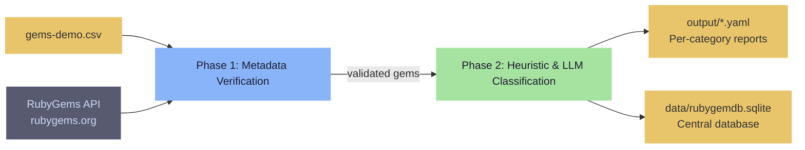

This guide gets you from zero to running classification on your first Ruby gem inventory in under five minutes. You will install the project, process a sample CSV through the CLI pipeline, explore results in the interactive TUI, and know exactly where to go next. All commands assume a Unix-like terminal with Python 3.14+ and the [uv](https://docs.astral.sh/uv/) package manager ready.

---

## Prerequisites

| Requirement | Minimum Version | Source |
|---|---|---|
| Python | 3.14+ | [python.org](https://python.org) — verify with `python --version` |
| uv (package manager) | 0.9.28+ | [docs.astral.sh/uv](https://docs.astral.sh/uv/) — install via `curl -LsSf https://astral.sh/uv/install.sh | sh` |
| Ollama * | — | Required only if you plan to use the Agent's semantic search features |

The project pins Python 3.14 in `.python-version` and declares `requires-python = ">=3.14"` in `pyproject.toml`. Earlier versions will fail at dependency resolution because libraries like `txtai` depend on `torch` wheels compiled for 3.14+.

Sources: [.python-version](.python-version#L1-L2), [pyproject.toml](pyproject.toml#L7-L10)

---

## Installation

Clone the repository and synchronise dependencies in a single command:

```bash
git clone https://github.com/rwpannick/rubygemdb.git
cd rubygemdb
uv sync --dev
```

The `--dev` flag installs development extras — `pytest`, `mypy`, `ruff` — which you will want for running tests and linting as you explore the code. Without it, only runtime dependencies land in the virtual environment: `pydantic`, `textual`, `txtai`, `pyyaml`, `requests`, `rich`, and `sqlite-vec`.

```
uv sync --dev  creates .venv/  (≈ 1.2 GB including PyTorch + txtai)
```

Once the sync finishes, verify everything works:

```bash
# CLI entry point — see available subcommands
uv run rubygemdb --help

# TUI entry point — confirm the screen draws (exit with q)
uv run rubygemdb-tui --help

# Test suite — 20+ classifier tests should pass
uv run pytest
```

The package exposes two console scripts defined under `[project.scripts]` in `pyproject.toml`: `rubygemdb` maps to `rubygemdb.cli:run_cli` and `rubygemdb-tui` maps to `rubygemdb.ui.tui:run_tui`. The `__main__.py` module also delegates to `run_cli`, so `uv run python -m rubygemdb` is equivalent to `uv run rubygemdb`.

Sources: [pyproject.toml](pyproject.toml#L30-L31), [src/rubygemdb/__main__.py](src/rubygemdb/__main__.py#L1-L5), [INSTALL.md](INSTALL.md#L57-L75)

---

## Your First Classification Pipeline

The fastest way to see the system in action is feeding a CSV of gem names through the batch processor. A minimal CSV needs one column called `name` or `gem`; extra columns like `homepage`, `source_code_uri`, `category`, and `description` are optional but give the classifier richer signals.

### 1. Prepare a CSV

Create `gems-demo.csv` in the project root:

```csv
name
rails
nokogiri
sidekiq
pry
thor
pg
ruby-openai
faraday
puma
elasticsearch-model
```

### 2. Run the pipeline

```bash
uv run rubygemdb process gems-demo.csv --out output/
```

The CLI runs two phases:



**Phase 1 — Metadata Verification.** For each gem name, the pipeline calls the RubyGems.org API (via `RubyGemsService`) to fetch description, homepage URI, and source code URI. It compares these against any existing data in the SQLite database, prompts you to verify mismatched or missing URLs, and optionally searches Context7 for a library ID. Results are written to `data/rubygemdb.sqlite` through the `SQLiteStorage` adapter.

**Phase 2 — Heuristic & LLM Classification.** Each validated gem enters the `GemClassifier`. First, a name-based heuristic scan matches keywords against the 12-category taxonomy (e.g., `thor` → `cli_terminal_ui`, `sidekiq` → `async_networking_orchestration`). If the heuristic confidence is below 0.7, the classifier falls back to the Mistral LLM for a second opinion. The final classification, sub-categories, risk scores, and dependency list are assembled into a `GemEntry` Pydantic model, then persisted to SQLite and dumped as YAML files — one per category — into the `output/` directory.

```bash
# After the run completes, inspect the results
ls output/
cat output/runtime_spine.yaml
```

Sources: [src/rubygemdb/cli.py](src/rubygemdb/cli.py#L34-L75), [src/rubygemdb/cli.py](src/rubygemdb/cli.py#L200-L278), [src/rubygemdb/services/classifier.py](src/rubygemdb/services/classifier.py#L1-L200), [src/rubygemdb/services/rubygems.py](src/rubygemdb/services/rubygems.py#L1-L49)

### 3. Understand what you see

Each YAML file contains one or more gems sharing the same primary category. A single entry looks like this:

```yaml
name: rails
classification:
  primary: runtime_spine
  secondary: null
  sub_categories:
    - rails
  confidence: 0.8
risks:
  invasiveness: 5
  coupling: 2
  abstraction_leak: medium
signals:
  rails: true
  external_io: false
  native_ext: false
dependencies:
  - actionmailer
  - actionpack
  - activejob
  - activemodel
  - activerecord
  ...
```

The `invasiveness` score (1–5) measures how deeply the gem wires into a host application's runtime — `runtime_spine` gems score 5 because they replace boot logic, while `cli_terminal_ui` gems score 1 because they are isolated entry points. `coupling` estimates how many of its dependencies your project would inherit. `abstraction_leak` flags categories (e.g., `async_networking_orchestration`, `storage_persistence`) where the gem's abstractions tend to leak implementation details into your domain code.

Sources: [src/rubygemdb/models/gem.py](src/rubygemdb/models/gem.py#L1-L41), [src/rubygemdb/services/classifier.py](src/rubygemdb/services/classifier.py#L200-L261)

---

## Exploring via the Interactive TUI

The Textual-based terminal UI gives you a visual playground for the same data without rerunning the pipeline.

```bash
# Launch with the same CSV
uv run rubygemdb-tui gems-demo.csv
```

The screen divides into two panes: a **filterable gem list** on the left and a **detail panel** on the right. Use the radio buttons to filter by category, type a gem name into the search bar, or press `space` to multi-select gems for bulk operations.

| Key | Action |
|---|---|
| `q` | Quit the TUI |
| `r` | Refresh data from the SQLite database |
| `e` | Edit the selected gem's category, source URI, or Context7 ID |
| `c` | Open the Agent chat panel for semantic queries |
| `x` | Export selected gems |
| `t` | Switch between Explorer / Chat / Export / Debug tabs |

Behind the scenes, the TUI reads from the same `data/rubygemdb.sqlite` database that the CLI wrote to, so you can classify via CLI and explore via TUI without data duplication. The `GemClassifier` is instantiated at startup and used for on-the-fly reclassification when you edit a gem's metadata.

Sources: [src/rubygemdb/ui/tui.py](src/rubygemdb/ui/tui.py#L1-L80)

---

## Configuration Quick Reference

The system loads configuration from a `.env` file in the project root via Pydantic Settings. For the Quick Start path, **no API keys are required** — the heuristic classifier works fully offline. However, some features light up once you configure them:

| Feature | Variable | Effect |
|---|---|---|
| LLM-augmented classification | `MISTRAL_API_KEY` | Boosts accuracy on ambiguous gems (confidence < 0.7 gets a Mistral second opinion) |
| Context7 cheatsheets | `CONTEXT7_API_KEY` | Enables library documentation lookup in the TUI detail panel |
| Agent semantic search | (uses Ollama locally) | Powers the `TxtaiAgent`'s vector index and the chat panel |
| RubyGems API | `RUBYGEMS_API_URL` | Already defaults to `https://rubygems.org/api/v1/gems/{name}.json` |

The `Settings` class in `src/rubygemdb/core/config.py` defines all paths relative to `project_root`, creating `data/` and `data/cache/` directories automatically on import.

```bash
# Minimal .env for LLM-enhanced classification
MISTRAL_API_KEY=sk-xxxxxxxxxxxxxxxx
```

Sources: [src/rubygemdb/core/config.py](src/rubygemdb/core/config.py#L1-L39), [INSTALL.md](INSTALL.md#L200-L286)

---

## Next Steps

You have seen the three main surfaces of RubyGemDB in action — the **CLI batch pipeline**, the **TUI interactive explorer**, and the configuration layer. Depending on your role, continue here:

- **You want to understand the 12 categories in depth** → [12-Category Taxonomy System](15-12-category-taxonomy-system)
- **You need to classify a real inventory with custom tuning** → [CLI Batch Processing Pipeline](4-cli-batch-processing-pipeline)
- **You prefer visual exploration and manual overrides** → [TUI Interactive Gem Explorer](5-tui-interactive-gem-explorer)
- **You want to ask natural-language questions about your gems** → [Agent-Powered Semantic Chat](6-agent-powered-semantic-chat)
- **You are evaluating the architecture before contributing** → [Architecture Overview & Data Flow](7-architecture-overview-and-data-flow)