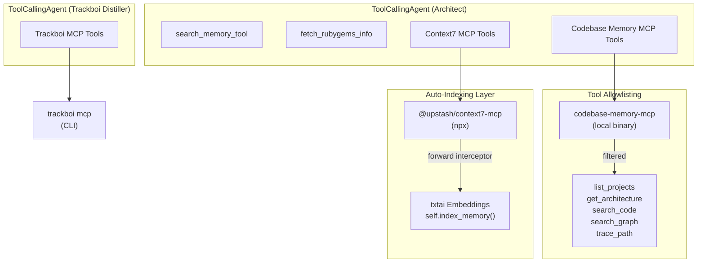

The MCP (Model Context Protocol) integration in RubyGemDB bridges the semantic gem-discovery agent with three external tool servers, enabling autonomous codebase analysis, documentation retrieval, and project management distillation. All three MCP clients are wired through the `TxtaiAgent` class in the `smolagents` framework, using `StdioServerParameters` for process-based transport. This design transforms the agent from a standalone chat interface into a collaborative assistant that can introspect a target project's architecture, search relevant Ruby gem documentation, and produce structured implementation backlogs consumed by external planning tools.

## Three MCP Server Architecture

The agent integrates three distinct MCP servers, each serving a specialized role in the context-gathering and task-management pipeline. They are initialized inside the `agent` property and `get_trackboi_distiller_agent` method, not at construction time, ensuring the `TxtaiAgent` can perform index-only operations (e.g., `--embed`) without loading any LLM or MCP process. Sources: [agent.py](src/rubygemdb/agent.py#L219-L227), [agent.py](src/rubygemdb/agent.py#L234-L241), [agent.py](src/rubygemdb/agent.py#L312-L322)

**Context7 MCP** (`@upstash/context7-mcp`) is launched via `npx -y`, making it dependency-free at the Python level. Every tool exposed by this server is wrapped by a forward interceptor that captures the string result and calls `self.index_memory(result, doc_type="context7", metadata={"source_tool": tool_name})`. This means every documentation snippet retrieved during a chat session is automatically chunked and indexed into the txtai embedding database, enriching future semantic searches with context-specific documents. The interceptor is installed in a loop over `c7_mcp.get_tools()`, replacing each tool's `forward` method with a closure that calls the original and indexes the output. Sources: [agent.py](src/rubygemdb/agent.py#L227-L232), [agent.py](src/rubygemdb/agent.py#L245-L256)

**Codebase Memory MCP** (`codebase-memory-mcp`) uses a hardcoded path to a local binary and applies a strict allowlist of five tools: `list_projects`, `get_architecture`, `search_code`, `search_graph`, and `trace_path`. The initialization is wrapped in a `try/except` block that logs the failure and sets `cbm_tools` to an empty list if the server cannot be loaded. This graceful degradation ensures the agent remains functional even when the codebase memory server is unavailable — a critical reliability pattern for autonomous operation. Sources: [agent.py](src/rubygemdb/agent.py#L233-L242)

**Trackboi MCP** (`trackboi mcp`) is attached exclusively to the secondary distiller agent created by `get_trackboi_distiller_agent`. Unlike the primary agent's servers, this MCP client receives all tools from the server without filtering. The distiller agent is configured with `add_base_tools=False` and a strict system prompt that instructs it to directly execute Trackboi tools for board, column, track, card, and file management without explaining reasoning steps. The agent model defaults to `settings.trackboi_distiller_model` (`mistral-large-latest`) and can be overridden with an alternative provider and model ID. Sources: [agent.py](src/rubygemdb/agent.py#L299-L343)

## Tool Interception and Memory Integration

The Context7 MCP tool interception pattern is the most architecturally significant integration. Each tool object returned by `c7_mcp.get_tools()` has its `forward` method replaced at runtime with an interceptor that preserves the original behavior while adding a side-effect: indexing the result into the txtai embedding store. The closure captures both the original function (`orig`) and the tool name (`tool_name`) so the metadata always identifies the source. This creates a closed-loop learning system where documentation retrieved during one session becomes semantically discoverable in future sessions without any explicit indexing command. Sources: [agent.py](src/rubygemdb/agent.py#L245-L256)

The `index_memory` method called by the interceptor splits text into 512-character child chunks using `create_child_chunks`, assigns a UUID-based document ID prefixed with the doc type (`context7`), and calls `self.embeddings.upsert()` followed by `self.embeddings.save()`. This upsert-before-save pattern ensures newly indexed documents are immediately persisted to the txtai index file at `data/txtai/rubygems_index`. Sources: [agent.py](src/rubygemdb/agent.py#L147-L173)

## Agent Architecture Integration

The primary `ToolCallingAgent` receives four categories of tools combined into a single tool list: the `search_memory_tool` (semantic search with multi-query expansion), the `fetch_rubygems_info` tool (RubyGems.org API), the full set of Context7 MCP tools (with interception wrappers), and the filtered Codebase Memory MCP tools. The agent system prompt instructs the LLM to call `get_architecture` and `search_graph` or `search_code` whenever a target project context is provided, ensuring generated implementation plans reference concrete file paths and class names rather than generic gem descriptions. This structure enforces that the agent never outputs standalone code snippets — every task must reference specific architectural integration points. Sources: [agent.py](src/rubygemdb/agent.py#L258-L298)

| MCP Server | Launch Command | Tool Access | Reliability Pattern | Purpose |
|---|---|---|---|---|
| Context7 | `npx -y @upstash/context7-mcp` | Full (with forward interceptor) | Unconditional initialization | Documentation search with auto-indexing into txtai |
| Codebase Memory | `/home/b08x/.local/bin/codebase-memory-mcp` | Allowlisted (5 tools) | `try/except` with empty fallback | Project architecture introspection |
| Trackboi | `trackboi mcp` | Full (no filtering) | `try/except` with empty fallback | Backlog distillation into board/card management |

## Distillation Pipeline and Context Window Management

The two-agent architecture forms a distillation pipeline. The primary Architect agent processes a user's query through semantic search (using `_execute_search_with_expansion`), gem info retrieval, documentation search, and codebase analysis, then produces a structured implementation backlog with discrete user stories and technical tasks. The secondary Trackboi Distiller agent receives this backlog and translates it into Trackboi board operations. This separation of concerns allows each agent to specialize in its role — the first in reasoning and analysis, the second in tool execution — without conflating their system prompts. Sources: [agent.py](src/rubygemdb/agent.py#L299-L343)

The `run` method implements a sliding context window to prevent bloat: after each agent response, if the memory contains more than six steps (three user/agent turns), it retains only the last six steps plus any system prompt steps. Both the user query and agent response are indexed into the txtai embedding database with doc types `chat_user` and `chat_agent`, making past conversation turns searchable for future queries. This combination of sliding window and persistent semantic indexing balances immediate context freshness with long-term recall capability. Sources: [agent.py](src/rubygemdb/agent.py#L540-L565)

For further architectural context, see the companion pages on [txtai-Based Vector Embeddings & Indexing](20-txtai-based-vector-embeddings-and-indexing), [Multi-Query Expansion with "Other Steve" Prompt](21-multi-query-expansion-with-other-steve-prompt), and [Agent-Powered Semantic Chat](6-agent-powered-semantic-chat).