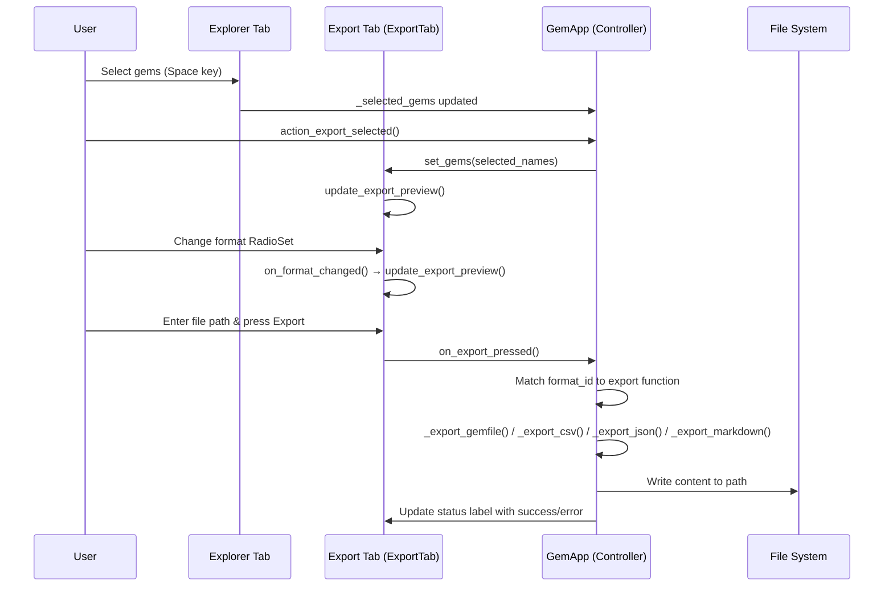

The export subsystem bridges the gap between the classified gem database and downstream consumption. Four distinct formats — **Gemfile**, **CSV**, **JSON**, and **Markdown** — serve different consumers: the Ruby ecosystem's native dependency format, spreadsheet-friendly data interchange, serialization for programmatic access, and human-readable documentation embedding. All export operations live within the Textual TUI and share a common pipeline of gem selection → format conversion → file serialization.

## Export Architecture & Data Flow

The export flow follows a **Select → Preview → Serialize → Persist** pattern. Gems are selected in the Explorer tab (via the `Space` key), then the user switches to the Export tab where an interactive preview updates reactively to both selection changes and format toggles. The actual file write happens only when the user presses the Export button.



The controller (`GemApp`) owns the four private serialization methods. Each method accepts a list of gem names, filters against `self.all_gems`, and returns a fully formatted string. The caller handles file I/O with a single `open(path, "w")` call, keeping serialization pure and testable. Sources: [TUI Export Flow](src/rubygemdb/ui/tui.py#L1359-L1440)

## Export Tab UI Design

The `ExportTab` widget is a `ScrollableContainer` composed of four logical zones:

| Zone | Widget | Purpose |
|---|---|---|
| **Summary header** | `Label(id="export-summary")` | Displays count and names of selected gems (truncated at 5) |
| **Format selection** | `RadioSet(id="export-format")` with four `RadioButton` items | Single-choice toggle for Gemfile/CSV/JSON/Markdown |
| **Live preview** | `Markdown(id="export-preview")` | Renders a code-fenced, truncated output sample (first 5 gems) |
| **Action bar** | `Input(id="export-path-input")` + `Button("Export")` | File path entry and execution trigger |

The format radio buttons use stable identifiers — `fmt-gemfile`, `fmt-csv`, `fmt-json`, `fmt-md` — which map one-to-one to serialization methods in the controller. A default export path is generated dynamically from the user's home directory and the first gem name (e.g., `/home/user/selected_gems.gemfile`). Sources: [ExportTab Widget](src/rubygemdb/ui/tui.py#L312-L345)

The preview system (`update_export_preview` + `_generate_export_preview`) renders a truncated sample using the same format structure as the real export but with placeholder values for category/source/Context7 ID/description. This design keeps preview generation fast (no DB lookups) while accurately showing the user the output shape. Sources: [Preview Generation](src/rubygemdb/ui/tui.py#L371-L434)

## Gemfile Export

The **Gemfile** format targets Ruby's Bundler dependency manager. The output is a minimal Ruby DSL file with a `source` directive pointing to the canonical RubyGems registry and one `gem` declaration per selected gem, sorted alphabetically:

```
source 'https://rubygems.org'

gem 'pg'
gem 'rails'
gem 'sidekiq'
```

The implementation is a straightforward string builder:

```python
def _export_gemfile(self, gem_names: list) -> str:
    lines = ["source 'https://rubygems.org'", ""]
    for name in sorted(gem_names):
        lines.append(f"gem '{name}'")
    return "\n".join(lines)
```

No version pins are emitted — the output assumes the user wants the latest compatible versions, consistent with Bundler's default behavior. The test suite verifies that only selected names appear and that the `source` line is present. Sources: [Gemfile Export](src/rubygemdb/ui/tui.py#L1439-L1441), [Gemfile Test](tests/test_export.py#L25-L42)

## CSV Export

The **CSV** format produces RFC-compatible output with headers and double-quoted fields. The header row is: `Name,Category,Source URI,Context7 ID,Description`. Each subsequent row draws from the `GemEntry` object fields:

```python
def _export_csv(self, gem_names: list) -> str:
    output = []
    gems = [g for g in self.all_gems if g.name in gem_names]
    output.append("Name,Category,Source URI,Context7 ID,Description")
    for gem in gems:
        desc = (gem.description or "").replace('"', '""')
        output.append(
            f'"{gem.name}","{gem.classification.primary}",'
            f'"{gem.source_code_uri or ""}","{gem.context7_id or ""}","{desc}"'
        )
    return "\n".join(output)
```

The CSV export handles the edge case of descriptions containing double quotes by RFC 4180 escaping (`""`). The test confirms that a description like `PostgreSQL "libpq" client` becomes `PostgreSQL ""libpq"" client` in the output. Null/missing fields render as empty quoted strings. Sources: [CSV Export](src/rubygemdb/ui/tui.py#L1445-L1455), [CSV Test](tests/test_export.py#L44-L62)

## JSON Export

The **JSON** format delegates entirely to Pydantic's `model_dump()` method, producing a serialized list of `GemEntry` objects with full nested structure:

```python
def _export_json(self, gem_names: list) -> str:
    gems = [g for g in self.all_gems if g.name in gem_names]
    data = [g.model_dump() for g in gems]
    return json.dumps(data, indent=2)
```

This preserves the complete gem object — classification (primary, secondary, sub-categories, confidence), risks (invasiveness, coupling, abstraction_leak), signals, capabilities, role, dependencies, and metadata. The 2-space indentation keeps output human-readable. The test confirms that the JSON round-trips correctly through `json.loads()` and retains nested fields like `context7_id` and `classification.primary`. Sources: [JSON Export](src/rubygemdb/ui/tui.py#L1457-L1460), [JSON Test](tests/test_export.py#L64-L78)

## Markdown Export

The **Markdown** format produces a GitHub-flavored table for embedding in documentation wikis, README files, or project reports:

```
| Name | Category | Source | Context7 ID | Description |
|------|----------|--------|-------------|-------------|
| pg | framework_integration | https://github.com/ged/ruby-pg | - | PostgreSQL client |
| rails | framework_integration | https://github.com/rails/rails | - | Ruby on Rails |
```

The implementation includes a **50-character truncation** on descriptions to keep table cells compact:

```python
def _export_markdown(self, gem_names: list) -> str:
    gems = [g for g in self.all_gems if g.name in gem_names]
    lines = ["| Name | Category | Source | Context7 ID | Description |",
             "|------|----------|--------|-------------|-------------|"]
    for gem in gems:
        desc = (gem.description[:50] + "...") if gem.description and len(gem.description) > 50 else (gem.description or "")
        lines.append(f"| {gem.name} | {gem.classification.primary} | {gem.source_code_uri or '-'} | {gem.context7_id or '-'} | {desc} |")
    return "\n".join(lines)
```

Missing fields render as a dash (`-`), providing visual clarity absent fields without breaking the table layout. Rows are ordered by iteration over `self.all_gems` (not sorted), matching the natural database ordering. Sources: [Markdown Export](src/rubygemdb/ui/tui.py#L1462-L1470), [Markdown Test](tests/test_export.py#L80-L96)

## Error Handling & Validation

The `on_export_pressed` handler implements three guard clauses before any write occurs:

1. **No gems selected** — If `_gem_names` is empty or missing, the export is blocked with an error notification and a status label update: `"❌ No gems selected for export"`.

2. **No file path** — If the path input is blank, the user is warned with a notification and the status reads `"❌ Please enter export path"`.

3. **Missing gems** — If the selected names include gems not present in `self.all_gems`, the export proceeds but a warning notification reports how many were skipped.

The actual file write is wrapped in a `try/except` that catches any `Exception` (permission errors, invalid paths, disk full) and surfaces it both as a status label update and a notification with `severity="error"`. All export events are logged through `self.log_info()` / `self.log_error()` for the debug trace. Sources: [Export Error Handling](src/rubygemdb/ui/tui.py#L1398-L1435)

## CLI Comparison & Database Export

The CLI `process` command takes a different approach to data persistence. Rather than exporting via the TUI's format selection, it saves classified results in two ways:

- **Per-category YAML files**: `{output_dir}/{category}.yaml` containing all gems in that category, dumped via `yaml.dump()`. Sources: [CLI YAML Output](src/rubygemdb/cli.py#L230-L233)
- **Unified SQLite database**: The `save_classified_gems()` method in `SQLiteStorage` persists all `GemEntry` objects as serialized JSON columns in the `classified_gems` table, joined with the `inventory` table for metadata. Sources: [Database Storage](src/rubygemdb/storage/sqlite_storage.py#L112-L139)

The TUI export reads from this same SQLite store via `load_classified_gems()`, which performs a `LEFT JOIN` between `classified_gems` and `inventory` to reconstruct full `GemEntry` objects with homepage, source URIs, and Context7 IDs. Sources: [Database Load](src/rubygemdb/storage/sqlite_storage.py#L188-L215)

The JSON fallback storage (`JSONStorage`) provides a lighter-weight alternative, writing classified gems to a JSON file and loading them back without SQLite dependency — useful for quick prototyping or environments where SQLite is unavailable. Sources: [JSON Storage](src/rubygemdb/storage/json_storage.py#L17-L37)

## Testing Strategy

The export tests in `tests/test_export.py` use a mock-based approach to isolate serialization logic from the full TUI application:

| Test | Format | Edge Cases Covered |
|---|---|---|
| `test_export_gemfile_format` | Gemfile | Only selected gems appear; source line present; unselected gems excluded |
| `test_export_csv_format` | CSV | Header row correctness; double-quote escaping in descriptions; empty/null field handling |
| `test_export_json_format` | JSON | Valid JSON output; nested `classification.primary` preserved; `context7_id` retained |
| `test_export_markdown_format` | Markdown | Row start pipe `|`; separator line; correct field ordering |

Each test creates a `Mock(spec=GemApp)` with a controlled `all_gems` list, then invokes the static unbound method directly (`GemApp._export_*`). This pattern tests only the serialization logic without requiring the full Textual application lifecycle, keeping tests fast and deterministic. Sources: [Export Tests](tests/test_export.py#L1-L96)

## Next Steps

- For a broader understanding of the gem data model that all exports serialize, see [Pydantic Data Models for Gems](8-pydantic-data-models-for-gems)
- To explore how gems are classified before export, see [Heuristic Rule-Based Classification](13-heuristic-rule-based-classification)
- For the testing methodology behind the export test suite, see [Testing Strategy for Classifier & Export](25-testing-strategy-for-classifier-and-export)