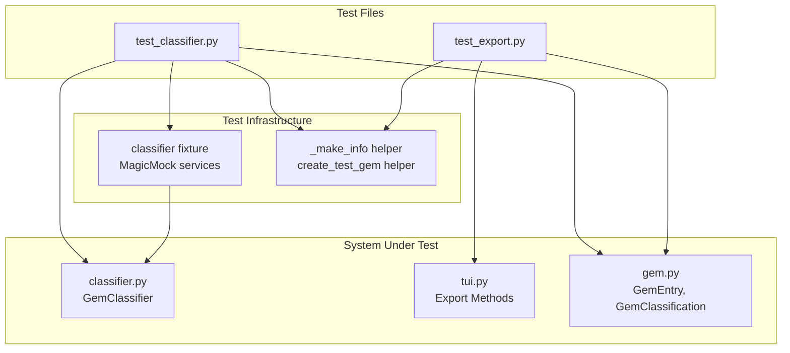
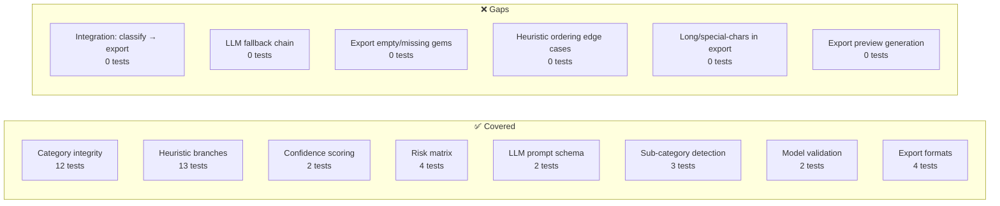

## Purpose & Scope

This page documents the testing approach for two tightly coupled subsystems in rubygemdb: the **heuristic + LLM-augmented classification engine** (`GemClassifier` in `classifier.py`) and the **multi-format export pipeline** (Gemfile, CSV, JSON, Markdown) wired through the TUI layer (`tui.py`). These two systems share a common data model (`GemEntry`) and are tested via two dedicated test files under `tests/`. The testing strategy is organized around three layers: **category integrity & schema validation**, **heuristic classification correctness**, and **export format fidelity**.

Sources: [test_classifier.py](tests/test_classifier.py#L1-L4), [test_export.py](tests/test_export.py#L1-L4)

---

## Layer 1: Category Taxonomy Integrity

The foundation of the classification system is a hard-coded list of exactly 12 categories stored in `VALID_CATEGORIES` within `classifier.py`. These categories replaced an earlier 8-category scheme (`OLD_CATEGORIES`) and are referenced by both the heuristic engine and the LLM prompt builder. The test suite enforces three invariants:

| Test | Assertion | Purpose |
|------|-----------|---------|
| `test_valid_categories_has_exactly_12` | `len(VALID_CATEGORIES) == 12` | Prevents accidental expansion or truncation of the taxonomy |
| `test_valid_categories_contains_all_expected` | Every expected slug is present | Guards against rename drift between test expectations and source of truth |
| `test_old_categories_removed` | No old slug remains in `VALID_CATEGORIES` | Ensures the taxonomy migration from 8→12 categories is permanent |

```python
# From tests/test_classifier.py
EXPECTED_CATEGORIES = [
    "runtime_spine", "cli_terminal_ui", "storage_persistence",
    "async_networking_orchestration", "ai_nlp", "data_processing",
    "retrieval_similarity_fuzzy", "algorithms_knowledge_structures",
    "validation_types", "parsing_encoding", "debugging_introspection",
    "mcp_tooling",
]
```

Sources: [test_classifier.py](tests/test_classifier.py#L12-L37), [classifier.py](src/rubygemdb/services/classifier.py#L6-L19)

---

## Layer 2: LLM Prompt Schema Compliance

The `LLMService.build_prompt()` method generates a prompt that lists all 12 valid categories for the LLM to choose from. Two tests verify that this prompt always reflects the current taxonomy and never leaks old category slugs.

`test_llm_prompt_contains_all_12_categories` instantiates a real `LLMService` (no mocking), calls `build_prompt()` with a dummy gem, and asserts that each expected category string appears in the prompt text. `test_llm_prompt_does_not_contain_old_categories` performs the inverse check, ensuring migration artifacts are absent.

This is a **lightweight integration test** — it exercises the real prompt-building logic without requiring an API key, because `build_prompt()` is pure string construction with no network dependency. The actual LLM call (in `call_llm()`) is tested indirectly through the classifier's `classify()` method only when confidence thresholds are met.

```python
def test_llm_prompt_contains_all_12_categories():
    llm = LLMService()
    prompt = llm.build_prompt("test-gem", {"info": "test"}, [])
    for cat in EXPECTED_CATEGORIES:
        assert cat in prompt
```

Sources: [test_classifier.py](tests/test_classifier.py#L201-L210), [llm.py](src/rubygemdb/services/llm.py#L26-L49)

---

## Layer 3: Heuristic Classification — All 12 Branches

The core of the testing strategy is a parameterized-like coverage of every `if/elif` branch in `GemClassifier.heuristic_classify()`. The fixture `classifier` creates a `GemClassifier` with **mocked** `RubyGemsService` and `LLMService` (`unittest.mock.MagicMock`), isolating the heuristic logic from external API calls.

A helper function `_make_info(deps, platform)` constructs a minimal gem info dictionary with a runtime dependency list and optional platform field, simulating what `RubyGemsService.fetch_gem_info()` would return.

The test matrix covers:

| Test | Gem name tested | Expected category |
|------|----------------|-------------------|
| `test_classify_cli_gem` | `"thor"` | `cli_terminal_ui` |
| `test_classify_storage_gem` | `"activerecord"` | `storage_persistence` |
| `test_classify_async_gem` | `"sidekiq"` | `async_networking_orchestration` |
| `test_classify_ai_gem` | `"ruby-openai"` | `ai_nlp` |
| `test_classify_data_processing_gem` | `"nokogiri"` | `data_processing` |
| `test_classify_retrieval_gem` | `"elasticsearch-model"` | `retrieval_similarity_fuzzy` |
| `test_classify_algorithms_gem` | `"algorithms"` | `algorithms_knowledge_structures` |
| `test_classify_validation_gem` | `"dry-validation"` | `validation_types` |
| `test_classify_parsing_gem` | `"yajl-ruby"` | `parsing_encoding` |
| `test_classify_debugging_gem` | `"pry"` | `debugging_introspection` |
| `test_classify_mcp_gem` | `"fast-mcp"` | `mcp_tooling` |
| `test_classify_http_gem` | `"faraday"` | `async_networking_orchestration` |
| `test_classify_rails_gem` | `"rails"` | `runtime_spine` |

Each test follows the same pattern: create the mocked info dict, call `heuristic_classify(name, info)`, unpack the 4-tuple return, and assert `cls.primary == expected_category`. The `cls.primary` is a plain `str` on the `GemClassification` Pydantic model, so no enum constraint prevents old slugs — the tests enforce correctness behaviorally.

The fallback branch (when no keyword matches) is tested by `test_classify_default_unknown_gem`, which checks that the gem name `"bubbles"` still maps to some valid category with a confidence ≤ 0.7. `test_heuristic_confidence_boosted_on_match` validates that a known gem like `"sidekiq"` yields confidence > 0.6.

Sources: [test_classifier.py](tests/test_classifier.py#L54-L176), [classifier.py](src/rubygemdb/services/classifier.py#L29-L123)

---

## Layer 4: Sub-Category & Dependency-Based Detection

Beyond primary category assignment, `heuristic_classify()` returns a list of sub-category tags derived from scanning dependency names. Three dedicated tests verify this logic:

- `test_sub_category_background_jobs`: gem with dependency `"sidekiq"` → sub-category `"background_jobs"`
- `test_sub_category_database`: gem with dependency `"pg"` → sub-category `"database"`
- `test_sub_category_monitoring`: gem with dependency `"sentry-ruby"` → sub-category `"monitoring"`

These tests follow the same fixture + `_make_info(deps=[...])` pattern, but they unpack the fourth element of the return tuple (`sub_cats`) rather than the classification. The sub-category logic in `classifier.py` is a flat sequence of `if` checks (not `elif`), meaning a gem can accumulate multiple sub-categories from different dependencies.

Sources: [test_classifier.py](tests/test_classifier.py#L229-L249), [classifier.py](src/rubygemdb/services/classifier.py#L131-L168)

---

## Layer 5: Risk & Invasiveness Scoring

`GemClassifier.score_gem()` computes a `GemRisks` dataclass with three fields: `invasiveness` (1–5), `coupling` (1–4), and `abstraction_leak` (low/medium/high). Four tests validate the scoring matrix:

| Test | Category | Assertion |
|------|----------|-----------|
| `test_score_gem_runtime_spine_high_invasiveness` | `"runtime_spine"` | `invasiveness >= 4` |
| `test_score_gem_mcp_tooling_low_invasiveness` | `"mcp_tooling"` | `invasiveness <= 2` |
| `test_score_gem_cli_terminal_ui` | `"cli_terminal_ui"` | `invasiveness >= 1` |
| `test_score_gem_async_networking` | `"async_networking_orchestration"` | `invasiveness >= 1` |

The scoring method is a pure function of category name and dependency list length — no services or external state are involved, so these tests use the same mocked fixture but only call `score_gem()` directly rather than going through `heuristic_classify()`.

```python
def test_score_gem_runtime_spine_high_invasiveness(classifier):
    risks = classifier.score_gem("runtime_spine", ["activesupport"])
    assert risks.invasiveness >= 4
```

Sources: [test_classifier.py](tests/test_classifier.py#L178-L198), [classifier.py](src/rubygemdb/services/classifier.py#L200-L222)

---

## Layer 6: Model Validation (Pydantic Schema)

`test_gem_classification_accepts_new_slugs` verifies that each of the 12 expected category strings can be used to instantiate a `GemClassification` Pydantic model — a sanity check that the model's `primary` field (typed as `str`, not an enum) is compatible with all slugs. `test_gem_classification_rejects_old_slugs` is explicitly a no-op (pass), because the model's `str` field cannot enforce rejection at the schema level; the enforcement is delegated to the classifier's behavioral tests that ensure old slugs are never produced.

Sources: [test_classifier.py](tests/test_classifier.py#L216-L228), [gem.py](src/rubygemdb/models/gem.py#L5-L10)

---

## Layer 7: Export Format Fidelity

The four export methods (`_export_gemfile`, `_export_csv`, `_export_json`, `_export_markdown`) are tested in isolation from the TUI by instantiating the **class method** on a `Mock(spec=GemApp)` object. The mock app provides `all_gems` — a list of `GemEntry` instances constructed by the `create_test_gem()` factory helper.

Each test verifies:

| Export format | Key assertions |
|:---|---|
| **Gemfile** | `source 'https://rubygems.org'` header present; each selected gem appears as `gem 'name'`; unselected gems are excluded |
| **CSV** | Header row `Name,Category,Source URI,Context7 ID,Description`; correct quoting of descriptions with embedded quotes (`""` XML-style); empty fields for missing data |
| **JSON** | Valid JSON parseable by `json.loads()`; correct `name` and `context7_id` values; nested `classification.primary` preserved |
| **Markdown** | Pipe-delimited header `\| Name \| Category \| Source \| ...`; separator row `\|------\|----------\|...`; row data matches gem entries |

The CSV test explicitly verifies handling of a gem description containing a double-quote character (`PostgreSQL ""libpq"" client`), testing the `replace('"', '""')` escaping logic.

```python
def test_export_csv_format():
    app = Mock(spec=GemApp)
    app.all_gems = [
        create_test_gem("pg", "https://github.com/ged/ruby-pg", 'PostgreSQL "libpq" client'),
    ]
    result = GemApp._export_csv(app, ["pg"])
    assert '"pg","framework_integration",...' in result
```

Sources: [test_export.py](tests/test_export.py#L1-L96), [tui.py](src/rubygemdb/ui/tui.py#L1439-L1475)

---

## Test Architecture Summary



**Test isolation strategy**: The classifier tests use mock objects for `RubyGemsService` and `LLMService`, so no network calls are made. The export tests use `Mock(spec=GemApp)` to avoid instantiating the full Textual TUI app (which requires an async event loop). Both test files import Pydantic models directly from `rubygemdb.models.gem` for validation checks.

Sources: [test_classifier.py](tests/test_classifier.py#L54-L60), [test_export.py](tests/test_export.py#L9-L16)

---

## Coverage Analysis & Gaps

The current test suite (30 tests in `test_classifier.py`, 4 tests in `test_export.py`) provides good coverage of nominal paths but reveals several gaps:



**Priority gaps to address:**

1. **Classification → Export integration**: No test verifies that a gem classified via `classify()` can be round-tripped through all four export formats
2. **LLM fallback chain**: The `classify()` method conditionally overrides heuristic results with LLM output (when heuristic confidence < 0.7 and LLM confidence > 0.6) — this branching logic is untested
3. **Export boundary conditions**: Empty gem name list, gems not in `all_gems`, Unicode or special characters in descriptions
4. **Heuristic keyword ordering**: The `elif` chain means `"dry-validation"` matches before `"dry-"` — no test verifies this ordering constraint, making it a brittle refactoring hazard
5. **Shared fixtures**: No `conftest.py` exists; the `classifier` fixture and `_make_info`/`create_test_gem` helpers are duplicated across files or defined locally, impeding reuse

Sources: [test_classifier.py](tests/test_classifier.py#L1-L249), [test_export.py](tests/test_export.py#L1-L96)

---

## Running the Tests

The project uses **pytest >= 9.0.3** with `pytest-mock >= 3.15.1` for enhanced mocking. With `uv` as the package manager:

```bash
uv run pytest tests/ -v
```

To run only classifier or export tests:

```bash
uv run pytest tests/test_classifier.py -v
uv run pytest tests/test_export.py -v
```

All current tests are synchronous (no `pytest-asyncio` markers required) and complete in under 1 second because they exercise pure logic with mocked dependencies. The test environment requires Python >= 3.14 as specified in `pyproject.toml`.

Sources: [pyproject.toml](pyproject.toml#L1-L28)

---

## Suggested Next Steps

- To understand the classifier's internal branching and heuristic rules in detail, see [Heuristic Rule-Based Classification](13-heuristic-rule-based-classification)
- To explore how LLM augmentation interacts with heuristics (including the confidence-threshold fallback chain), see [LLM-Augmented Classification with Fallback](14-llm-augmented-classification-with-fallback)
- For the data model that underlies both classification and export, see [Pydantic Data Models for Gems](8-pydantic-data-models-for-gems)
- To see how the export methods integrate into the full TUI workflow, see [Gemfile, CSV, JSON & Markdown Export](24-gemfile-csv-json-and-markdown-export)