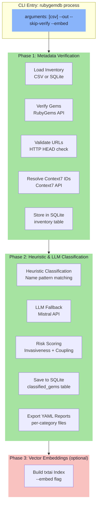
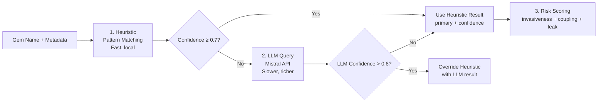
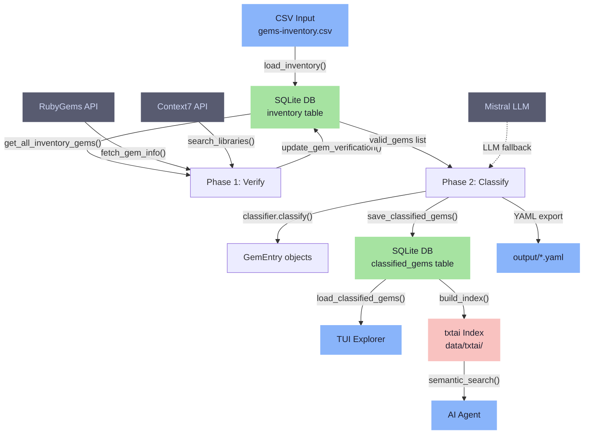

The CLI Batch Processing Pipeline is the headless workhorse of RubyGemDB — a fully automated three-phase process that ingests Ruby gem inventories, verifies their metadata against authoritative sources, classifies them into a 12-category architectural taxonomy, and generates structured reports. Designed for CI/CD workflows and bulk dataset curation, it requires no terminal interaction beyond the initial invocation (though it supports interactive prompts for edge cases). The pipeline is the primary path for populating the SQLite database that powers both the TUI explorer and the AI agent's semantic search index.

Sources: [cli.py](../src/rubygemdb/cli.py#L1-L4), [README](../README.md#L23-L24)

---

## Pipeline Architecture Overview

The pipeline operates in three sequential phases, each consuming the output of the previous one. The command is invoked via the `rubygemdb process` subcommand, with optional flags that control behavior. At its core, the pipeline orchestrates five services — `RubyGemsService`, `LLMService`, `GemClassifier`, `Context7Service`, and `SQLiteStorage` — to transform raw gem names into richly classified entries with risk scoring, sub-category detection, and vector embeddings.



Sources: [cli.py](../src/rubygemdb/cli.py#L34-L45), [cli.py](../src/rubygemdb/cli.py#L47-L56)

---

## Command Syntax & Parameters

### Basic Usage

```bash
# Process a CSV inventory
rubygemdb process gems-inventory.csv --out ./reports

# Use existing database inventory (no CSV)
rubygemdb process --out ./reports

# Skip metadata verification phase
rubygemdb process --out ./reports --skip-verify

# Run all phases including vector embeddings
rubygemdb process gems-inventory.csv --out ./reports --embed
```

### Parameter Reference

| Argument | Type | Default | Description |
|----------|------|---------|-------------|
| `csv` | positional (optional) | None | Path to a CSV file containing gem names. If omitted, the pipeline reads from the existing SQLite `inventory` table. |
| `--out` | string | `output` | Directory for generated YAML report files, one per category. |
| `--skip-verify` | flag | false | Skips Phase 1 metadata verification entirely, useful when re-running classification on already-verified data. |
| `--embed` | flag | false | After classification, builds a txtai vector index in `data/txtai/` for semantic search via the AI agent. |

Sources: [cli.py](../src/rubygemdb/cli.py#L131-L145), [pyproject.toml](../pyproject.toml#L18-L19)

### Entry Point

The `rubygemdb` console script is registered in `pyproject.toml` and maps to `rubygemdb.cli:run_cli`. The `__main__.py` file provides the `python -m rubygemdb` invocation path, which calls the same `run_cli()` function.

```python
# pyproject.toml
[project.scripts]
rubygemdb = "rubygemdb.cli:run_cli"

# __main__.py
from rubygemdb.cli import run_cli
if __name__ == "__main__":
    run_cli()
```

Sources: [pyproject.toml](../pyproject.toml#L18-L19), [__main__.py](../src/rubygemdb/__main__.py#L1-L4)

The argument parser uses Python's built-in `argparse` with a `subparsers` design that supports the `process` command. This design leaves room for future commands (e.g., `verify`, `export`) to be added without breaking the existing interface.

---

## Phase 1: Metadata Verification (The Safety Net)

This phase is the most computationally intensive and interactive part of the pipeline. For every gem in the inventory, it performs four distinct verification steps:

### Step 1 — Load Inventory

If a CSV path is provided, the pipeline delegates to `SQLiteStorage.load_inventory()`, which parses the CSV, queries the RubyGems API for each gem, verifies homepage and source URIs, resolves Context7 library IDs, and upserts everything into the `inventory` table. Already-verified gems in the database are skipped to avoid redundant API calls.

```python
if args.csv:
    inventory_items = storage.load_inventory(args.csv)
    gems = [{"name": item.name, "homepage": item.homepage, ...} for item in inventory_items]
else:
    gems = storage.get_all_inventory_gems()
```

Sources: [sqlite_storage.py](../src/rubygemdb/storage/sqlite_storage.py#L27-L58), [cli.py](../src/rubygemdb/cli.py#L47-L56)

### Step 2 — RubyGems API Lookup

Each gem is looked up on `rubygems.org/api/v1/gems/{name}.json` via the `RubyGemsService`. If a gem returns a 404 status (meaning it doesn't exist or was hallucinated by an AI), the user is prompted interactively to confirm deletion. Gems that exist have their metadata — homepage, source code URI, description — pulled fresh from the API.

```python
info = rg_service.fetch_gem_info(name)
if not info:
    if Confirm.ask(f"Gem '{name}' not found on RubyGems. Delete it?"):
        storage.delete_gem(name)
```

Sources: [cli.py](../src/rubygemdb/cli.py#L66-L72), [rubygems.py](../src/rubygemdb/services/rubygems.py#L28-L42)

### Step 3 — URL Validation & Repository Name Matching

Every `source_code_uri` is checked via an HTTP HEAD request (`verify_url`) to ensure the URL is live. Then, `check_repo_match` extracts the repository name from the URL tail and compares it against the gem name using loose substring matching. If either check fails, the user can enter a corrected URL or accept the warning.

This catches a common class of errors where a gem's repository URL points to an unrelated project or a deleted repository.

```python
valid = verify_url(final_source)
matched = check_repo_match(name, final_source)

if not valid or not matched:
    choice = Prompt.ask("Enter a valid URL to replace it, or press Enter to keep it anyway")
    if choice.strip():
        final_source = choice.strip()
```

Sources: [cli.py](../src/rubygemdb/cli.py#L12-L31), [cli.py](../src/rubygemdb/cli.py#L99-L118)

### Step 4 — Context7 Library ID Resolution

If a gem lacks a `context7_id`, the pipeline queries the Context7 API via `Context7Service.search_libraries()`. If results are found, it presents them interactively for the user to select. This is a "best-effort" step — unresolved Context7 IDs result in a blank field, not a pipeline failure.

```python
c7_results = c7_service.search_libraries(search_query)
if c7_results:
    fetched_c7 = c7_results[0].get("id") or c7_results[0].get("libraryId")
    if Confirm.ask(f"Accept context7_id '{fetched_c7}' for gem '{name}'?"):
        final_c7 = fetched_c7
```

Sources: [cli.py](../src/rubygemdb/cli.py#L120-L142), [context7.py](../src/rubygemdb/services/context7.py#L22-L36)

At the end of Phase 1, each gem's verified metadata is persisted to the `inventory` table via `SQLiteStorage.update_gem_verification()`, and a summary of updated and deleted gems is printed.

---

## Phase 2: Heuristic & LLM Classification (The Intelligence Layer)

Phase 2 takes the verified gems from Phase 1 and runs them through the two-stage classifier. The classification is **the core differentiator** of RubyGemDB — it assigns each gem a primary category from the 12-category taxonomy, with confidence scoring, sub-category extraction from dependencies, and three-axis risk assessment.

### How the Classifier Works

The `GemClassifier` in `services/classifier.py` implements a **dual-stage architecture**:



Sources: [classifier.py](../src/rubygemdb/services/classifier.py#L103-L107)

**Stage 1 — Heuristic Classification**: The gem's lowercase name is matched against keyword lists for each of the 12 categories. For example, if the name contains `"thor"`, `"cli"`, or `"terminal"`, it classifies as `cli_terminal_ui`. Each match adds 0.3 to the confidence score (starting at 0.5). If no match is found, the classifier inspects the gem's runtime dependencies — if a gem depends on `"rails"`, it's likely `runtime_spine`. Gems with no pattern match at all fall back to `data_processing` with low confidence.

```python
# Simplified example of heuristic matching
if has(["rails", "engine", "railties"]):
    classification.primary = "runtime_spine"
    signals.rails = True
    classification.confidence += 0.3
elif has(["thor", "cli", "terminal"]):
    classification.primary = "cli_terminal_ui"
    classification.confidence += 0.3
```

Sources: [classifier.py](../src/rubygemdb/services/classifier.py#L31-L99)

**Stage 2 — LLM Fallback**: If the heuristic confidence remains below 0.7, the pipeline invokes the Mistral LLM via `LLMService.call_llm()`. The LLM receives a prompt containing the gem name, description, dependencies, and the 12 taxonomy categories, and returns a JSON object with a primary category, confidence score, and an agent-optimized description. If the LLM's confidence exceeds 0.6, its result overrides the heuristic.

```python
if classification.confidence < 0.7 and llm_result.get("confidence", 0) > 0.6:
    classification.primary = llm_result["primary"]
    classification.confidence = llm_result["confidence"]
```

Sources: [classifier.py](../src/rubygemdb/services/classifier.py#L103-L113)

### Sub-Category Detection

Independent of the primary category, the classifier scans the gem's runtime dependencies for known patterns to build a list of sub-categories. For example, a gem depending on `"sidekiq"` gets `"background_jobs"` added; depending on `"pg"` or `"mysql2"` adds `"database"`. These sub-categories enable finer-grained filtering in the TUI and agent queries.

| Dependency Pattern | Sub-Category |
|---|---|
| `rails`, `activesupport` | `rails` |
| `sidekiq`, `delayed_job`, `resque` | `background_jobs` |
| `pg`, `mysql2`, `mariadb` | `database` |
| `sentry`, `datadog`, `newrelic` | `monitoring` |
| `kafka`, `bunny`, `mqtt` | `messaging` |

Sources: [classifier.py](../src/rubygemdb/services/classifier.py#L123-L165)

### Risk Scoring

Every gem receives a `GemRisks` assessment with three dimensions:

- **Invasiveness** (1–5) — How deeply the gem embeds into the application. `runtime_spine` scores 5 (framework-level); `cli_terminal_ui` scores 1 (surface-level).
- **Coupling** (1–4) — How many dependencies the gem has, calculated as `min(4, max(1, len(deps)//3 + 1))`.
- **Abstraction Leak** (`low`/`medium`/`high`) — How likely the gem is to leak implementation details. Networking and storage gems score `high`; CLI tools score `low`.

```python
invasiveness_map = {
    "runtime_spine": 5,
    "cli_terminal_ui": 1,
    "storage_persistence": 4,
    # ...
}
```

Sources: [classifier.py](../src/rubygemdb/services/classifier.py#L168-L199), [models/gem.py](../src/rubygemdb/models/gem.py#L17-L20)

### Outputs

After classification, the pipeline performs two writes:

1. **SQLite `classified_gems` table** — The full `GemEntry` objects (with classification, risks, signals, dependencies, and description) are serialized to JSON and stored via `SQLiteStorage.save_classified_gems()`. This table is what the TUI reads on startup.

2. **YAML report files** — One file per category (e.g., `output/runtime_spine.yaml`, `output/cli_terminal_ui.yaml`) containing all gems classified in that category. This enables direct consumption by other tools without needing SQLite access.

```python
# Save to unified cache for TUI
storage.save_classified_gems(results)

# Save YAMLs per category
for cat, items in categorized.items():
    with open(f"{args.out}/{cat}.yaml", "w") as f:
        yaml.dump(items, f, sort_keys=False)
```

Sources: [cli.py](../src/rubygemdb/cli.py#L176-L186), [sqlite_storage.py](../src/rubygemdb/storage/sqlite_storage.py#L102-L123)

A Rich summary table is printed at the end showing counts per category.

---

## Phase 3: Vector Embeddings (Optional)

When the `--embed` flag is provided, the pipeline invokes a third phase that constructs a txtai vector index. This enables the AI agent (`agent.py`) to perform semantic search across the classified gems. The index is stored in `data/txtai/` and built using the `TxtaiAgent.build_index()` method.

```python
if getattr(args, "embed", False):
    from rubygemdb.agent import TxtaiAgent
    agent = TxtaiAgent()
    agent.build_index()
```

The `TxtaiAgent` uses txtai's `Embeddings` class with a local GGUF model (`ollama/embeddinggemma`), SQLite-vec backend, and hybrid search (dense + sparse) with Reciprocal Rank Fusion. This phase is optional because it requires the full model download (~4GB) and can take several minutes for large inventories.

Sources: [cli.py](../src/rubygemdb/cli.py#L194-L200), [agent.py](../src/rubygemdb/agent.py#L66-L100)

---

## Interaction & Output Modes

The pipeline balances automation with interactive safeguards:

| Scenario | Behavior |
|----------|----------|
| **Gem not found on RubyGems** | Interactive prompt: delete or skip |
| **URL returns 404 or name mismatch** | Interactive prompt: enter corrected URL or keep |
| **Context7 ID missing** | Interactive selection from search results, or skip |
| **`--skip-verify` set** | All prompts skipped; gems proceed as-is |
| **No TTY (pipelines, CI)** | Prompts fail gracefully; gems with issues are skipped |

The `rich` library provides the visual layer — spinners, progress bars, and formatted tables — while keeping the pipeline suitable for headless execution as long as no interactive prompts are encountered.

Sources: [cli.py](../src/rubygemdb/cli.py#L11-L12), [cli.py](../src/rubygemdb/cli.py#L66-L72)

---

## Data Flow Summary

The following diagram traces a gem from CSV input through the entire pipeline:



Sources: [cli.py](../src/rubygemdb/cli.py#L34-L200), [sqlite_storage.py](../src/rubygemdb/storage/sqlite_storage.py#L82-L110)

---

## Integration Points

The CLI pipeline is not an island — it feeds into every other major subsystem:

| Consumer | What It Reads | Purpose |
|----------|---------------|---------|
| **TUI Explorer** ([TUI Interactive Gem Explorer](5-tui-interactive-gem-explorer)) | `SQLiteStorage.load_classified_gems()` | Browse, filter, edit, and export classified gems in a terminal UI |
| **AI Agent** ([Agent-Powered Semantic Chat](6-agent-powered-semantic-chat)) | `txtai index` built by `--embed` | Semantic search across gem inventory |
| **Export** ([Gemfile, CSV, JSON & Markdown Export](24-gemfile-csv-json-and-markdown-export)) | `classified_gems` table | Batch export to Gemfile, CSV, JSON, or Markdown |

Sources: [sqlite_storage.py](../src/rubygemdb/storage/sqlite_storage.py#L140-L162)

---

## Configuration

The pipeline reads its configuration from `settings` (a `pydantic-settings` singleton in `core/config.py`). Key settings that affect the pipeline:

| Setting | Default | Effect |
|---------|---------|--------|
| `rate_limit_delay` | 0.5s | Pause between RubyGems API calls |
| `llm_rate_delay` | 0.5s | Pause between Mistral LLM calls |
| `llm_batch_size` | 10 | Not yet used for batching (future optimization) |
| `gem_cache_file` | `data/cache/gem_cache.json` | Caches RubyGems API responses to avoid redundant lookups |
| `llm_cache_file` | `data/cache/llm_cache.json` | Caches LLM responses (hashed by prompt) to save API costs |
| `sqlite_db_file` | `data/rubygemdb.sqlite` | Central database for inventory and classifications |

Sources: [config.py](../src/rubygemdb/core/config.py#L1-L30)

---

## Next Steps

Now that you understand the batch processing pipeline, the natural progression is to explore how the classified gems are consumed:

- **[TUI Interactive Gem Explorer](5-tui-interactive-gem-explorer)** — Browse and manage the results of your pipeline run in a rich terminal interface
- **[Agent-Powered Semantic Chat](6-agent-powered-semantic-chat)** — Query your classified inventory using natural language
- **[Architecture Overview & Data Flow](7-architecture-overview-and-data-flow)** — See how the CLI pipeline fits into the broader system

To understand the classification system that powers Phase 2 in detail, see **[Heuristic Rule-Based Classification](13-heuristic-rule-based-classification)** and **[LLM-Augmented Classification with Fallback](14-llm-augmented-classification-with-fallback)**.