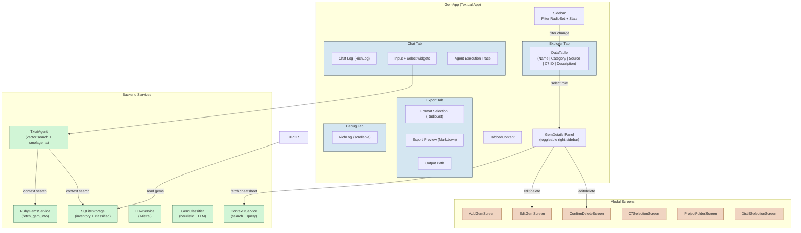
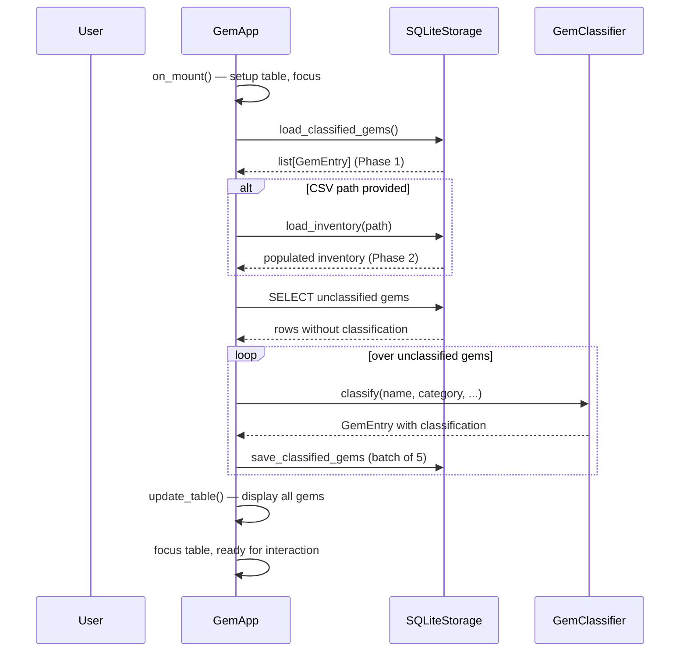

The TUI Interactive Gem Explorer is a full-screen terminal application built with the **Textual** framework that serves as the primary interactive interface for RubyGemDB. Unlike the batch-oriented CLI pipeline (which processes gems sequentially with confirmation prompts), the TUI provides a graphical, keyboard-driven environment where you can explore your gem database, inspect classification details, run AI-powered chat queries, perform bulk operations, and export results — all within a single session. It is invoked via `python -m rubygemdb ui` or through the main entry point that launches the `GemApp`.

Sources: [ui/tui.py](src/rubygemdb/ui/tui.py#L796-L1815)

## Architecture Overview

The TUI follows Textual's **widget-composition** pattern: a main `GemApp` container holds a sidebar with filters and stats, a tabbed workspace with four panes (Explorer, Chat, Export, Debug), and a sliding details panel on the right. Modal screens handle sub-dialogues like editing, deletion confirmation, or Context7 library selection.



The diagram shows the four main tabs on top, the sidebar on the left, the details panel that slides in from the right when you click a gem, and the chain of back-end services that power each feature.

Sources: [ui/tui.py](src/rubygemdb/ui/tui.py#L1060-L1120)

## Starting the TUI

You launch the TUI by running the application with the `ui` subcommand, optionally passing a CSV inventory path to populate the database:

```bash
# Launch with existing database
python -m rubygemdb ui

# Populate database from CSV first, then launch
python -m rubygemdb ui /path/to/gems_inventory.csv
```

The entry point in `run_tui()` parses the optional CSV argument, instantiates a `GemApp`, and calls `app.run()` to start the Textual event loop.

Sources: [ui/tui.py](src/rubygemdb/ui/tui.py#L1805-L1815)

## The Four-Tab Workspace

The main content area is a `TabbedContent` container holding four independent panes, each specializing in one task domain.

Sources: [ui/tui.py](src/rubygemdb/ui/tui.py#L1068-L1085)

### 1. Explorer Tab (default)

The Explorer is your primary gem browser. It displays a `DataTable` with five columns: **Name**, **Category**, **Source URI**, **Context7 ID**, and **Description**. You can navigate rows with arrow keys, highlight a gem to open its details panel on the right, and use the **Space** key to select multiple gems for batch operations. The sidebar on the left contains a `RadioSet` that lets you filter the table by any of the 12 architectural categories — selecting "All Categories" shows every gem in the database.

Sources: [ui/tui.py](src/rubygemdb/ui/tui.py#L1068-L1074)

### 2. Chat Tab

The Chat tab embeds the `TxtaiAgent` in a split-panel layout: a main chat log occupies ~70% of the width, and an Agent Execution Trace panel occupies the remaining ~30%. The chat log colour-codes messages by role — **blue** for user queries, **green** for agent responses, **red** for errors. The input bar at the bottom accepts natural-language questions. A `Select` dropdown lets you optionally scope queries to a specific project folder stored in the codebase-memory MCP tool.

Behind the scenes, the agent pipeline performs several steps: embedding the query with txtai's hybrid search, running "Other Steve" multi-query expansion, injecting codebase memory context, traversing the knowledge graph, evaluating heuristic confidence bounds, and synthesizing the response. As each step executes, status messages stream into the trace panel so you can observe the reasoning chain in real time.

Sources: [ui/tui.py](src/rubygemdb/ui/tui.py#L437-L600)

### 3. Export Tab

The Export tab lets you save selected gems to one of four formats:

| Format | File Extension | Use Case |
|--------|---------------|----------|
| **Gemfile** | `.gemfile` | Bundle management — generates `source` + `gem` directives |
| **CSV** | `.csv` | Spreadsheet import / data exchange |
| **JSON** | `.json` | Programmatic consumption / API integration |
| **Markdown** | `.md` | Documentation rendering |

A live preview panel renders the first five lines of the export so you can verify output before writing. The tab shows a summary of how many gems will be exported and lists their names. Once you confirm the output path and click **Export**, the file is written immediately and a notification confirms success.

Sources: [ui/tui.py](src/rubygemdb/ui/tui.py#L322-L435)

### 4. Debug Tab

The Debug tab contains a `RichLog` that captures all internal diagnostic messages — loading progress, classification events, error stack traces, and timing information. Every `log_debug`, `log_info`, `log_error`, and `log_warning` call in the app writes to this log. This tab is invaluable for troubleshooting classification failures or understanding why certain gems are missing from the table.

Sources: [ui/tui.py](src/rubygemdb/ui/tui.py#L1082-L1085)

## Gem Details Sidebar

When you select a row in the Explorer table (by pressing **Enter** or clicking), a `GemDetails` panel slides in from the right edge. This panel displays:

- **Name** — the gem's canonical name (bold)
- **Classification** — primary category + confidence score + sub-categories
- **Metadata** — source code URI (blue) and Context7 library ID (green, or "Missing")
- **Risks** — invasiveness (1–5), coupling (1–4), abstraction leak level
- **Description** — rendered as Markdown
- **Runtime Dependencies** — an interactive list; clicking a dependency re-targets the cheatsheet button to that dependency's name
- **Action Buttons**:
  - **Fetch Cheatsheet** — queries Context7 for usage examples and saves a markdown file to `output/cheatsheets/`
  - **Update Context7 ID** — searches Context7 for the correct library identifier
  - **Edit Category** — opens the `EditGemScreen` modal
  - **Remove Gem** — opens the `ConfirmDeleteScreen` modal
  - **Fetch Combined Cheatsheet** — generates a multi-gem cheatsheet covering all selected gems

Sources: [ui/tui.py](src/rubygemdb/ui/tui.py#L33-L103)

## Modal Screens (Sub-Dialogues)

Six modal screens handle discrete user interactions. Each is a `ModalScreen` subclass that returns a typed result when dismissed.

| Modal Screen | Purpose | Returns |
|-------------|---------|---------|
| `AddGemScreen` | Manually enter a gem name to add to the database | `str` (gem name) or `None` |
| `EditGemScreen` | Change category, source URI, and Context7 ID | `tuple[str, str, str]` or `None` |
| `ConfirmDeleteScreen` | Confirm permanent deletion of a gem | `bool` |
| `C7SelectionScreen` | Pick the correct Context7 library ID from search results (or enter manually) | `str` (library ID) or `None` |
| `ProjectFolderScreen` | Select a local project folder for Trackboi board integration | `str` (folder path) or `None` |
| `DistillSelectionScreen` | Choose which implementation options to distill into Trackboi cards | `list[str]` or `None` |

Each screen follows a consistent pattern: `compose()` builds the UI, `@on` handlers capture user input, and `self.dismiss(value)` closes the modal and returns the value to the callback registered in the main app.

Sources: [ui/tui.py](src/rubygemdb/ui/tui.py#L105-L330)

## Keyboard Shortcuts

The `GemApp` registers a set of global keyboard bindings for efficient navigation:

| Key | Action | Description |
|-----|--------|-------------|
| `q`, `Ctrl+Q`, `Ctrl+C`, `Esc` | Quit | Gracefully shuts down the app |
| `r` | Refresh | Reloads gems from the database and re-classifies unclassified entries |
| `c` | Open Chat | Switches to the Chat tab and pre-fills the input with selected gem context |
| `Space` | Toggle Selection | Selects/deselects the gem under the cursor |
| `a` | Select All | Marks all currently filtered gems as selected |
| `n` | Clear Selection | Deselects all gems |
| `u` | Bulk Update C7 | Iterates through selected gems and prompts for Context7 library IDs |
| `x` | Export Selected | Switches to the Export tab with the selected gems loaded |
| `e` | Edit Gem | Opens the `EditGemScreen` for the active gem |
| `d` | Delete Gem | Opens the `ConfirmDeleteScreen` for the active gem |
| `+` | Add Gem | Opens the `AddGemScreen` to manually add a new gem |
| `t` | Switch Tab | Cycles through Explorer → Chat → Export → Debug |

Sources: [ui/tui.py](src/rubygemdb/ui/tui.py#L843-L862)

## Page Lifecycle: What Happens at Startup

When `GemApp` mounts, it executes a carefully sequenced three-phase loading process:



The `load_data` method is decorated with `@work(thread=True, exclusive=True)` so it runs on a worker thread without blocking the UI. The `exclusive=True` flag ensures that if the user triggers a refresh while loading is in progress, the old task is cancelled and restarted — preventing duplicate classifications.

Sources: [ui/tui.py](src/rubygemdb/ui/tui.py#L1119-L1180)

## Data Flow: From Selection to Export

The multi-step flow from selecting gems to exporting them illustrates how the TUI coordinates state across widgets:

1. **Selection** — In the Explorer, pressing `Space` toggles a gem's name in the `_selected_gems` set (protected by a `threading.Lock` for thread safety). The count updates on the status notification.
2. **Switch to Export** — Pressing `x` (or clicking the Export tab) triggers `action_export_selected()`, which copies the selected names into `ExportTab.set_gems()`. The export tab immediately calculates a summary string and renders a preview.
3. **Choose Format** — Changing the `RadioSet` in the export tab fires `on_format_changed`, which calls `update_export_preview()` to regenerate the sample output.
4. **Execute Export** — Pressing **Export** maps the format ID to one of four private methods (`_export_gemfile`, `_export_csv`, `_export_json`, or `_export_markdown`), iterates over the matching `GemEntry` objects, generates the output string, and writes it to the specified file path.

All export methods operate on the in-memory `all_gems` list, which is kept in sync with the database through the `load_data` / `update_table` cycle.

Sources: [ui/tui.py](src/rubygemdb/ui/tui.py#L1359-L1466)

## Background Classification Pipeline

One of the TUI's most powerful features is its automatic background classification of newly inventoried gems. During `load_data`, the app queries for `inventory` rows that have no matching entry in `classified_gems`. Each unclassified gem is passed through `GemClassifier.classify()`, which first runs a heuristic rule-based pass (checking the gem name against known patterns like `rails`, `dry-*`, `sidekiq`, etc.) and then — if confidence is below a configurable threshold — invokes the Mistral LLM for an augmented assessment.

The classification result includes:
- **Primary category** — one of the 12 architectural categories
- **Confidence score** — a float between 0.0 and 1.0
- **Sub-categories** — additional labels from the taxonomy
- **Risk assessment** — invasiveness, coupling, abstraction leak
- **Capabilities and signals** — boolean flags for Rails, external I/O, native extensions

Results are batched in groups of 5 and saved to the database, with the table UI updating after each batch so you can monitor progress in real time.

Sources: [ui/tui.py](src/rubygemdb/ui/tui.py#L1140-L1179)

## Multi-Query Agent Chat with Trackboi Distillation

The Chat tab integrates a `TxtaiAgent` that combines vector search (via txtai with a local embedding model) with a `smolagents`-based tool-calling agent. When you type a query:

1. The input is pre-processed with project context (if a project is selected in the dropdown)
2. The agent executes a multi-step reasoning pipeline with live status updates
3. The final answer appears in the chat log as formatted Markdown

Beyond simple Q&A, the agent supports two advanced workflows:

**Trackboi Distillation** — Clicking the **Distill to Trackboi** button extracts structured options from the last agent response and presents them in `DistillSelectionScreen`. After selecting options, you choose a project folder (via `ProjectFolderScreen` — which can create a `.trackboi` board if one doesn't exist), and the agent generates user stories and technical tasks formatted for the Trackboi project management system.

**Chat Export** — The **Export to Markdown** button serializes the entire conversation (with timestamps and role labels) to `output/chat_exports/chat_YYYYMMDD_HHMMSS.md`, preserving the full interaction for documentation or sharing.

Sources: [ui/tui.py](src/rubygemdb/ui/tui.py#L437-L795)

## Configuration Dependencies

The TUI relies on several configuration values from `Settings` (defined in `core/config.py`):

| Setting | Environment Variable | Default | Purpose in TUI |
|---------|---------------------|---------|----------------|
| `context7_api_key` | `CONTEXT7_API_KEY` | `None` | Required for cheatsheet generation and Context7 ID lookup |
| `mistral_api_key` | `MISTRAL_API_KEY` | `None` | Required for LLM-augmented classification and agent |
| `sqlite_db_file` | — | `data/rubygemdb.sqlite` | Database path for gem inventory and classifications |
| `project_root` | — | auto-detected | Base directory for output folders (cheatsheets, chat exports) |

If `context7_api_key` is not set, the **Fetch Cheatsheet** and **Update Context7 ID** buttons will show error notifications. The chat agent will still function using the txtai index alone if Mistral is unavailable.

Sources: [core/config.py](src/rubygemdb/core/config.py#L1-L39)

## Comparison: TUI vs CLI

| Dimension | CLI Batch Pipeline | TUI Interactive Explorer |
|-----------|-------------------|-------------------------|
| **User interaction** | Sequential prompts with `Confirm.ask` / `Prompt.ask` | Keyboard-driven, multi-pane concurrent UI |
| **Output format** | Console text via Rich tables | Visual table with live preview, modal dialogs |
| **Classification flow** | Two explicit phases (verify → classify) with progress bars | Real-time background classification with incremental UI updates |
| **Export** | Single-format per run, specified by flag | Four-format selection with live preview |
| **Agent chat** | Not available | Full chat interface with multi-step reasoning |
| **Batch operations** | Sequential single-gem confirmation | Multi-select with space, bulk Context7 update |
| **Error handling** | Exceptions halt the process | Errors logged to Debug tab, UI notifications |
| **Learning curve** | Low — simple prompts | Moderate — keyboard shortcuts, modal navigation |

Sources: [cli.py](src/rubygemdb/cli.py#L1-L278)

## Suggested Next Pages

To deepen your understanding of how the TUI works under the hood, continue with:

- **[Textual-Based Interactive TUI Implementation](23-textual-based-interactive-tui-implementation)** — the patterns and techniques used to build the custom widgets and handle async UI updates
- **[Storage Abstraction Interface](10-storage-abstraction-interface)** — how the TUI reads and writes gem data through the storage layer
- **[Heuristic Rule-Based Classification](13-heuristic-rule-based-classification)** — the classification engine that powers the background pipeline in the Explorer tab
- **[Agent-Powered Semantic Chat](6-agent-powered-semantic-chat)** — deeper dive into the TxtaiAgent and multi-query expansion used in the Chat tab
- **[Gemfile, CSV, JSON & Markdown Export](24-gemfile-csv-json-and-markdown-export)** — details of each export format and the rendering logic