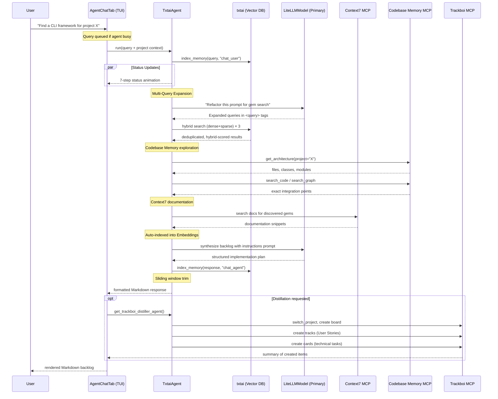

The Agent-Powered Semantic Chat subsystem transforms RubyGemDB from a static analysis tool into an interactive AI assistant that bridges semantic gem discovery, codebase architecture analysis, and project management distillation. It is exposed through the **Chat** tab in the TUI and is implemented by the `TxtaiAgent` class in `agent.py`, which orchestrates a **multi-agent architecture** built on `smolagents` (Hugging Face's agent framework) and `txtai` (neuml's vector search engine). The agent does not merely retrieve gems — it **reasons about integration points**, expands user intent through a structured "Other Steve" prompt architect persona, and can cascade results into a Trackboi project management board via a dedicated distillation agent.

## Architecture: Two Interlocking Agent Systems

The system contains two distinct agents that serve complementary roles. The **primary `ToolCallingAgent`** (the "Architect Agent") performs semantic search, gem discovery, and implementation planning. The **secondary `ToolCallingAgent`** (the "Trackboi Distiller Agent") ingests the Architect's output and materializes it into Trackboi boards, columns, tracks, and cards. Both are instantiated via `LiteLLMModel` from `smolagents`, which provides a unified interface across model providers (Mistral, OpenAI, Anthropic, Ollama, etc.) with native tool-calling support.

<ToolCallingAgent> entry points are configured with a set of tools, a system prompt (`instructions`), and a maximum step count (`max_steps=10`). The primary agent receives five categories of tools:

- **`search_memory_tool`** — the core semantic search function that uses txtai's hybrid retrieval with multi-query expansion
- **`fetch_rubygems_info`** — a raw `@tool`-decorated function that queries the RubyGems.org API for live gem metadata
- **Context7 MCP tools** — documentation search tools from the `@upstash/context7-mcp` MCP server, intercepted to auto-index results into the embedding database
- **Codebase Memory MCP tools** — project-aware tools (`get_architecture`, `search_code`, `search_graph`, `trace_path`, `list_projects`) filtered from the `codebase-memory-mcp` server
- **Trackboi MCP tools** — only attached to the distiller agent, exposing board/card/track management

Sources: [agent.py](src/rubygemdb/agent.py#L219-L299)

```
TxtaiAgent
├── txtai.Embeddings          ← vector index (ollama/embeddinggemma, SQLite backend)
│   └── _embeddings_ref       ← module-level reference for smolagents introspection
├── LiteLLMModel (primary)    ← agent model for reasoning & tool orchestration
├── ToolCallingAgent          ← primary "Architect" agent (max_steps=10)
│   ├── search_memory_tool    ← _execute_search_with_expansion()
│   ├── fetch_rubygems_info   ← RubyGems.org API tool
│   ├── Context7 MCP tools    ← docs search (auto-indexed)
│   └── Codebase Memory MCP   ← project awareness (filtered tools)
└── ToolCallingAgent (secondary) ← "Trackboi Distiller" agent
    └── Trackboi MCP tools    ← board/column/card/track management
```

Sources: [agent.py](src/rubygemdb/agent.py#L84-L119)

## Vector Index Initialization and Chunking Strategy

When `TxtaiAgent` is constructed, it initializes an `Embeddings` instance with a hybrid dense–sparse configuration and loads (or builds) the txtai index from the primary SQLite database.

| Configuration Parameter | Value | Purpose |
|---|---|---|
| `path` | `"ollama/embeddinggemma"` | Local GGUF embedding model via llama.cpp/Ollama |
| `backend` | `"sqlite"` | SQLite-vec as the vector storage engine |
| `content` | `True` | Enables dict document storage alongside vectors |
| `hybrid` | `True` | Enables both dense (neural) and sparse (BM25) retrieval |
| `scoring` | `{"method": "bm25", "normalize": False}` | Sparse scoring with unnormalized BM25 for RRF compatibility |
| `fusion` | `"rrf"` | Reciprocal Rank Fusion to combine dense and sparse rank lists |

During index building, the `_initialize_index` method streams gem records from the SQLite `inventory` table into txtai. Each gem's description is split into **parent** and **child chunks** via the `create_child_chunks` function, which operates as follows:

1. Splits the description by paragraph boundaries (double newlines)
2. If a paragraph exceeds `max_chars` (512), further splits by sentence boundaries (`.!?`)
3. Each child chunk is prefixed with `"Gem Name: {name}\nDescription: {text}"` to anchor the embedding
4. The original full `description` is preserved in the `parent_text` field for contextual recall

This dual-level structure enables fine-grained retrieval (matching specific paragraphs) while retaining the full gem context in the `parent_text` field that the agent later reads.

Sources: [agent.py](src/rubygemdb/agent.py#L16-L50), [agent.py](src/rubygemdb/agent.py#L84-L176)

## Multi-Query Expansion via the "Other Steve" Persona

The `_execute_search_with_expansion` method is the heart of the retrieval pipeline. Before executing any vector search, it asks the primary LLM model to expand the user's query through a structured persona called **"Other Steve: Ruby Prompt Architect"**.

This persona is expressed as a lengthy XML-structured system prompt that implements three core directives:

| Directive | Function | Example Rule |
|---|---|---|
| **Anti-Slop Filter** | Strips conversational padding, vibe words, metaphorical instructions, and ambiguous scope | Replace _"craft a robust solution"_ with _"Implement a method with O(n) time complexity"_ |
| **SFL Compiler** | Decomposes the task into Field (entities/processes), Tenor (persona/audience), and Mode (output schema) | Define `Field: {entities: Hash, Array; processes: parse, validate}` |
| **Conciseness Engine** | Enforces measurable, positive statements with omitted needless words | _"Time complexity must be O(1)"_ not _"Try to be efficient"_ |

The protocol concludes with a **refactored prompt** containing `<query>...</query>` XML tags. The `_execute_search_with_expansion` method extracts up to 3 of these expanded queries via regex, concatenating them with the original query for a multi-pronged search.

Each expanded query is executed against the txtai index via SQL-adjacent syntax:

```python
sql = f"SELECT id, text, name, source_code_uri, context7_id, parent_text, type, updated_at, score FROM txtai WHERE similar('{safe_query}') LIMIT {limit * 4}"
```

Results from all queries are **deduplicated by parent_text** (for non-gem types) or by gem `name`. Each candidate is then scored with a **hybrid weighting**:

$$\text{hybrid\_score} = 0.7 \times \text{match\_score} + 0.3 \times \text{recency\_score}$$

The recency score decays linearly from 1.0 (current year) to 0.1 (9 years old), encouraging the agent to prefer actively maintained gems. The top `limit` candidates are returned as a JSON array sorted by hybrid score.

Sources: [agent.py](src/rubygemdb/agent.py#L345-L530)

## Context7 and Codebase Memory MCP Integration

The agent's tool arsenal is enriched by two external MCP servers, both loaded lazily inside the `agent` property.

**Context7 MCP** (`@upstash/context7-mcp`) provides documentation search tools. Critically, the system monkey-patches each Context7 tool's `forward` method at initialization:

```python
def wrap_forward(orig=original_forward, tool_name=tool_obj.name):
    def forward_interceptor(*args, **kwargs):
        result = orig(*args, **kwargs)
        if isinstance(result, str) and result.strip():
            self.index_memory(result, doc_type="context7",
                              metadata={"source_tool": tool_name})
        return result
    return forward_interceptor
```

This interception layer ensures that every documentation snippet fetched via Context7 is automatically chunked and indexed into the txtai embedding database, making it available for future semantic searches without requiring a re-index.

**Codebase Memory MCP** (`codebase-memory-mcp`) provides project awareness. Only five tools are explicitly whitelisted: `list_projects`, `get_architecture`, `search_code`, `search_graph`, and `trace_path`. These tools allow the agent to discover exact file paths, class names, and module structures in a target project — enabling the agent to generate integration plans that reference **concrete architectural injection points** rather than generic gem usage tutorials.

Sources: [agent.py](src/rubygemdb/agent.py#L227-L254)

## Dynamic Memory Indexing and Context Bloat Prevention

As the chat session progresses, every user query and every agent response is dynamically indexed:

```python
def run(self, query: str) -> str:
    self.index_memory(query, doc_type="chat_user")
    response = self.agent(query)
    self.index_memory(response, doc_type="chat_agent")
    # sliding window...
```

The `index_memory` method chunks the text using the same `create_child_chunks` function, assigns a UUID-based document ID with a `doc_type` prefix (e.g., `chat_user_`, `chat_agent_`, `context7_`), and upserts into the txtai index. This creates a **persistent, searchable conversation history** that the agent can later query via `search_memory_tool` — enabling cross-session context recall.

To prevent unbounded context growth, the `run` method implements a **sliding window** over the agent's memory. If the memory contains more than 6 steps (approximately 3 user–agent turns), it:

1. Preserves all system prompt steps
2. Keeps the last 6 steps (the most recent interactions)
3. Discards older intermediate steps

This ensures the LLM context window stays focused on recent conversation while retaining access to historical data through the vector index.

Sources: [agent.py](src/rubygemdb/agent.py#L184-L213), [agent.py](src/rubygemdb/agent.py#L531-L556)

## Trackboi Distiller Agent

The secondary agent, created by `get_trackboi_distiller_agent`, is a specialized `ToolCallingAgent` configured with only Trackboi MCP tools. Its instructions are concise and imperative:

> **"Your ONLY job is to take an Implementation Backlog (User Stories and technical tasks) and distill it into Trackboi."**

The agent's execution protocol for each backlog:

1. Call `switch_project(projectPath="<folder>")` to target the correct project
2. Ensure the board exists (create if necessary)
3. Ensure required columns exist or use defaults
4. For each User Story, create a **Track** and save its ID
5. For each technical task, create a **Card** linked to the track

The distiller agent uses its own model configuration — defaulting to `trackboi_distiller_model` from settings (`"mistral/mistral-large-latest"`) — which can be overridden at call time with an alternative provider/model.

Sources: [agent.py](src/rubygemdb/agent.py#L301-L338)

## TUI Integration: AgentChatTab

The agent is surfaced in the TUI through `AgentChatTab` (defined in `ui/tui.py`), a `ScrollableContainer` widget that provides a full chat interface. Key UI components:

| UI Element | ID | Purpose |
|---|---|---|
| Chat title | `#chat-title` | "RubyGemDB Agent (Txtai/Ollama)" |
| Chat log | `#chat-log` | `RichLog` widget with Markdown rendering for agent messages |
| Project selector | `#project-input` | `Select` widget populated from `codebase-memory-mcp list_projects` |
| Chat input | `#chat-input` | `Input` widget for user queries |
| Export button | `#export-chat-btn` | Exports chat history to Markdown (stored in `output/chat_exports/`) |
| Clear button | `#clear-chat-btn` | Clears chat log and reloads agent |
| Distill button | `#distill-chat-btn` | Sends last agent response to Trackboi Distiller |
| Trace log | `#trace-log` | `RichLog` for real-time agent execution trace |

**Multi-Agent Orchestration Flow**: When a user submits a query with an optional `[Target Project Context: <project_name>]` prefix (set via the project selector), the following sequence executes:

1. **User Query** → immediate display in chat log
2. **Status Simulation** — a background thread cycles through 7 status messages (e.g., "Tokenizing semantic input...", "Activating 'Other Steve' query expansion...") at 2-second intervals to provide visual feedback
3. **Architect Agent Execution** — `self.agent.run(query)` triggers the full retrieval–expansion–reasoning pipeline
4. **Response Post-Processing** — the raw response is parsed: if it contains a stringified Python dictionary (common with managed agents), it's converted to structured Markdown blocks; leading prefixes like `"Here is the final answer from your managed agent 'None': "` are stripped
5. **Trackboi Distillation** — if the query was prefixed with `[DISTILL_TRACKBOI <folder>]`, the response is forwarded to the distiller agent along with the target project folder

A **query queue** system prevents input flooding: if the agent is already processing, new queries are appended to `_query_queue` and dequeued sequentially after the current task completes.

Sources: [tui.py](src/rubygemdb/ui/tui.py#L437-L647), [tui.py](src/rubygemdb/ui/tui.py#L1057-L1058)

```
┌──────────────────────────────────────────────────┐
│  Chat Tab (AgentChatTab)                         │
│  ┌───────────────────┐ ┌──────────────────────┐  │
│  │ Chat Log (RichLog) │ │ Trace Log (RichLog) │  │
│  │ [green]Agent:[/green] ... │ │ [cyan]➜[/cyan] Tokenizing...  │  │
│  │ [blue]User:[/blue] ...    │ │ [cyan]➜[/cyan] Expanding...    │  │
│  │                   │ │ [cyan]➜[/cyan] Searching...    │  │
│  └───────────────────┘ └──────────────────────┘  │
│  [Project Select ▼] [Input: Ask a question...]    │
│  [Export] [Clear] [Distill]                       │
└──────────────────────────────────────────────────┘
```

## Execution Flow: From Query to Actionable Backlog

The following sequence diagram illustrates the complete data flow when a user submits a query with a target project context:



Sources: [agent.py](src/rubygemdb/agent.py#L531-L556), [tui.py](src/rubygemdb/ui/tui.py#L596-L647)

## Configuration and Extensibility

The agent system is configured through centralized Pydantic-Settings (`core/config.py`):

| Setting | Default | Purpose |
|---|---|---|
| `rubygemdb_agent_model` | `"mistral/mistral-small-latest"` | Primary model for Architect Agent |
| `trackboi_distiller_model` | `"mistral/mistral-large-latest"` | Model for Trackboi Distiller Agent |

Both `LiteLLMModel` instances support any provider that the `litellm` library supports (Mistral, OpenAI, Anthropic, Cohere, Ollama, etc.) using the `provider/model_name` convention. The embedding model is hardcoded to `"ollama/embeddinggemma"` in the `Embeddings` constructor — a local GGUF model running through llama.cpp via Ollama.

The `get_trackboi_distiller_agent` method accepts optional `provider` and `model_id` overrides, enabling runtime provider switching for the distillation step without affecting the primary agent.

Sources: [config.py](src/rubygemdb/core/config.py#L13-L14), [agent.py](src/rubygemdb/agent.py#L301-L304)

## Next Steps

This page covers the Agent-Powered Semantic Chat system in depth. To understand the foundation it builds upon, continue to the following pages in the suggested order:

- For the vector indexing underpinning the agent's memory: [txtai-Based Vector Embeddings & Indexing](20-txtai-based-vector-embeddings-and-indexing)
- For the multi-query expansion technique in isolation: [Multi-Query Expansion with "Other Steve" Prompt](21-multi-query-expansion-with-other-steve-prompt)
- For the MCP tool integration patterns: [MCP Tool Integration for Context & Task Management](22-mcp-tool-integration-for-context-and-task-management)
- For the TUI that hosts the chat interface: [Textual-Based Interactive TUI Implementation](23-textual-based-interactive-tui-implementation)
- For the Mistral-powered LLM service used by the classifier: [Mistral LLM Service with Response Caching](19-mistral-llm-service-with-response-caching)