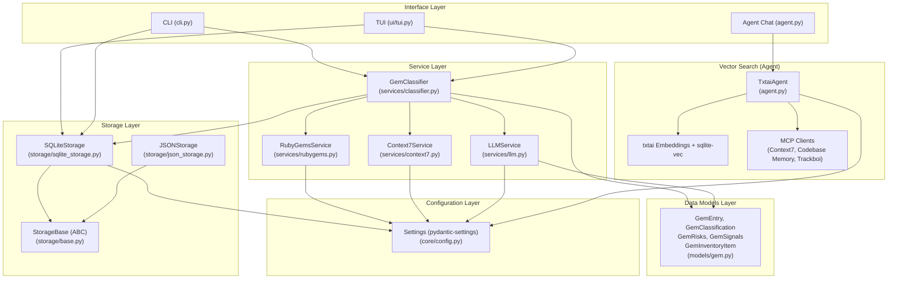
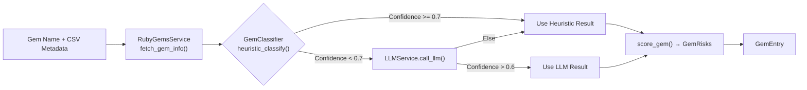
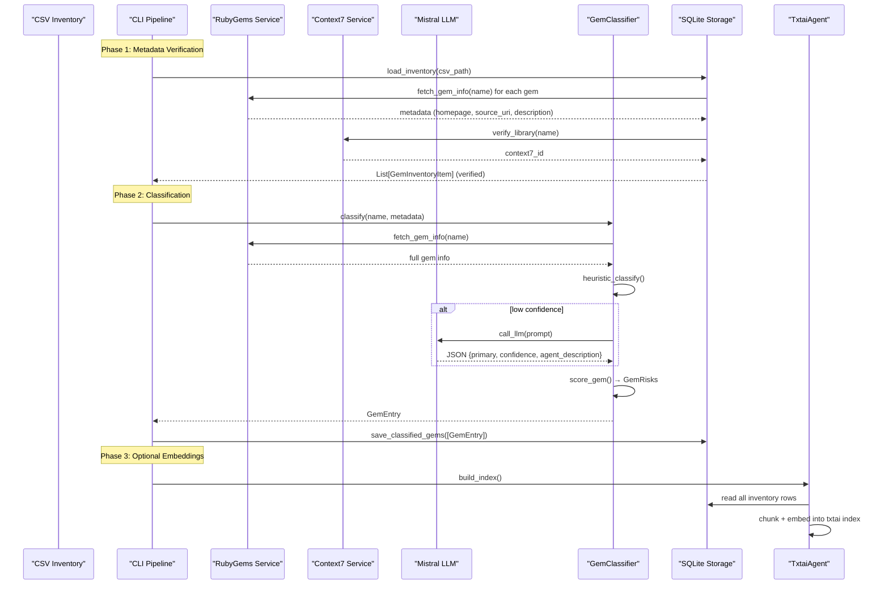

This document provides a structural map of RubyGemDB — a multi-mode system for Ruby gem analysis, classification, and AI-augmented semantic search. It reveals the layered architecture, the flow of data through each processing pipeline, and how the three distinct user interfaces (CLI, TUI, Agent Chat) converge on a shared core of services, models, and storage backends.

## Architectural Layers at a Glance

RubyGemDB follows a **layered service architecture** with four tiers: **Interface Layer**, **Service Layer**, **Storage Layer**, and **Data Models Layer**. The diagram below captures the high-level component structure and the primary data flow through the system.



The **Configuration Layer** (`core/config.py`) via the singleton `settings` object is consumed by every service and storage component, providing centralized API keys, endpoint URLs, file paths, and rate-limit parameters. All paths derive from `project_root`, and `data_dir` along with `cache_dir` are created eagerly at import time.

Sources: [core/config.py](src/rubygemdb/core/config.py#L1-L39), [pyproject.toml](pyproject.toml#L1-L53)

## Three Interfaces, One Core

The system exposes three distinct entry points, each optimized for a different workflow. Despite their surface differences, they converge on the same `GemClassifier`, `SQLiteStorage`, and Pydantic model classes.

| Mode | Module | Primary Audience | Key Characteristic |
|---|---|---|---|
| **CLI Batch Pipeline** | `cli.py` (via `__main__.py`) | CI/CD, batch operators | Two-phase process: Phase 1 metadata verification, Phase 2 heuristic+LLM classification. Optionally Phase 3 for txtai embeddings. |
| **TUI Interactive Explorer** | `ui/tui.py` | Developers doing manual curation | Textual-based terminal UI with four tabs (Explorer, Chat, Export, Debug). Supports gem details view, manual category editing, and Context7 cheatsheet retrieval. |
| **Agent-Powered Semantic Chat** | `agent.py` | AI-assisted discovery | Uses `TxtaiAgent` with txtai embeddings, multi-query expansion ("Other Steve" persona), and MCP tool integration for context-aware gem recommendations. |

### CLI Pipeline (Default Entry Point)

`__main__.py` delegates directly to `cli.py`'s `run_cli()`, which selects the `process` subcommand parser. The `run_process()` function orchestrates the entire pipeline:

1. **Inventory Loading**: Reads from either a CSV file (`GemInventoryItem` objects via `SQLiteStorage.load_inventory()`) or from an existing database inventory via `get_all_inventory_gems()`.
2. **Phase 1 — Metadata Verification**: For each gem, fetches current metadata from RubyGems.org API. Compares old (DB) vs. new (API) values for `homepage`, `source_code_uri`, `description`, and `context7_id`. Validates source code URLs (HEAD request) and checks repository name vs. gem name match. Offers interactive confirmation for deletions of hallucinated gems and for Context7 ID selections.
3. **Phase 2 — Heuristic & LLM Classification**: Runs each verified gem through `GemClassifier.classify()`, which applies name-based heuristics first, then (if heuristic confidence is below 0.7 and LLM confidence exceeds 0.6) overrides with the LLM's judgment. Results are saved to both SQLite (`classified_gems` table) and per-category YAML files.
4. **Phase 3 — Vector Embeddings** (optional `--embed` flag): Triggers `TxtaiAgent.build_index()` to rebuild the txtai index from the SQLite database.

Sources: [cli.py](src/rubygemdb/cli.py#L1-L278), [__main__.py](src/rubygemdb/__main__.py#L1-L5)

### TUI Interactive Explorer

The TUI (`ui/tui.py`) is built on the **[Textual](https://textual.textualize.io/)** framework (v8.2.3). It provides a rich terminal interface with four persistent tabs defined in `TabConstants`:

- **Explorer Tab**: Lists classified gems in a `DataTable` with columns for name, category, invasiveness, context7_id, and source code URI. Selection triggers a detail panel (`GemDetails` widget) showing classification metadata, risks, dependencies (with cheatsheet fetch buttons per dependency), and management actions (edit category, remove gem).
- **Chat Tab**: Integrates the `TxtaiAgent` for natural-language queries against the vector index.
- **Export Tab**: Gemfile, CSV, JSON, and Markdown export options.
- **Debug Tab**: A `RichLog` widget for development diagnostics.

The TUI uses modal screens (`ModalScreen` subclasses) for adding gems (`AddGemScreen`), editing gem metadata (`EditGemScreen`), selecting Context7 library IDs (`C7SelectionScreen`), and confirming deletions — keeping the main interface uncluttered while enabling deep interaction.

Sources: [ui/tui.py](src/rubygemdb/ui/tui.py#L1-L1815)

### Agent Chat (Semantic Search)

The agent (`agent.py`) provides the most sophisticated interaction mode. It builds on three pillars:

1. **txtai Vector Index**: `TxtaiAgent` uses `txtai.Embeddings` with a local LLM (`ollama/embeddinggemma`), a `sqlite-vec` backend, hybrid search (dense + sparse BM25), and Reciprocal Rank Fusion (RRF) scoring. Documents are chunked into 512-character child segments with gem name prepended for richer embeddings. The index is persisted to disk at `data/txtai/rubygems_index`.
2. **Multi-Query Expansion**: The `_execute_search_with_expansion()` method employs an "Other Steve" persona system prompt that refactors user queries into discrete, SFL-compliant search terms. It extracts `<query>` XML tags from the LLM response to generate 2-3 semantic variations, then searches each against the txtai index. Results are scored using a hybrid 70% semantic match + 30% recency boost formula.
3. **MCP Tool Integration**: The agent integrates three MCP (Model Context Protocol) clients — Context7 documentation search, a codebase memory MCP for architecture-aware recommendations, and a Trackboi MCP for distilling implementation plans into project management boards. Context7 tool results are automatically indexed into the vector database via a `forward_interceptor` wrapper.

Sources: [agent.py](src/rubygemdb/agent.py#L1-L565)

## Data Models: The Pydantic Backbone

All data flowing through the system is validated against Pydantic models defined in `models/gem.py`:

| Model | Purpose | Key Fields |
|---|---|---|
| `GemInventoryItem` | Lightweight CSV/DB row representation | `name`, `version`, `category`, `description`, `homepage`, `source_code_uri`, `context7_id` |
| `GemEntry` | Complete classified gem record | `name`, `classification` (GemClassification), `role` (description + agent_description), `capabilities`, `risks` (GemRisks), `signals` (GemSignals), `dependencies`, `homepage`, `source_code_uri`, `context7_id` |
| `GemClassification` | Category assignment | `primary` (one of 12 categories), `secondary`, `sub_categories` (from dependency analysis), `confidence` |
| `GemRisks` | Integration risk metrics | `invasiveness` (1-5), `coupling` (1-4), `abstraction_leak` ("low"/"medium"/"high") |
| `GemSignals` | Binary feature flags | `rails` (Rails integration), `external_io` (network/IO), `native_ext` (C extension) |

These models are consumed by both storage backends (serialized as JSON columns in SQLite or as flat JSON files in `JSONStorage`), and by the classifier for structured output.

Sources: [models/gem.py](src/rubygemdb/models/gem.py#L1-L41)

## Service Layer: Classification Pipeline

The `GemClassifier` class (`services/classifier.py`) implements a two-tier classification algorithm:

### Tier 1: Heuristic Rule-Based Classification

Name-based matching against 12 valid categories, ordered by specificity. The heuristic checks gem names against keyword lists (e.g., `"rails"` → `runtime_spine`, `"nokogiri"` → `data_processing`). If no direct match is found, it falls back to runtime dependency analysis (e.g., if a gem depends on `rails` or `activesupport`, it is classified as `runtime_spine`). A special case handles `development`/`test` CSV categories, assigning `cli_terminal_ui` with high confidence.

The heuristic also detects sub-categories from dependencies (e.g., `redis` dep → `redis` sub-cat, `sidekiq` dep → `sidekiq` and `background_jobs` sub-cats) and sets signal flags (`rails`, `external_io`, `native_ext`).

### Tier 2: LLM-Augmented Classification (Fallback)

If the heuristic confidence is below 0.7, the classifier requests an LLM classification via `LLMService.call_llm()`. The service builds a prompt with the gem name, description, dependencies, and the 12-category taxonomy, requesting a JSON response with `primary`, `confidence`, and `agent_description`. The LLM result overrides the heuristic only if its confidence exceeds 0.6.

The `score_gem()` method then maps the final primary category to invasiveness (1-5), coupling (derived from dependency count), and abstraction leak level based on a lookup map. For example, `runtime_spine` gets invasiveness 5 and "medium" leak, while `cli_terminal_ui` gets invasiveness 1 and "low" leak.



Sources: [services/classifier.py](src/rubygemdb/services/classifier.py#L1-L261)

## External API Services

Three external API clients, each with local caching to minimize network requests:

| Service | Module | API Endpoint | Caching Strategy | Rate Limiting |
|---|---|---|---|---|
| **RubyGems.org** | `services/rubygems.py` | `/api/v1/gems/{name}.json` | JSON file cache (`gem_cache.json`), keyed by gem name | 0.1s delay between requests |
| **Context7** | `services/context7.py` | `/api/v2/libs/search` and `/api/v2/context` | No local cache (relies on SQLite `context7_id` column) | 0.2s delay between requests |
| **Mistral LLM** | `services/llm.py` | `/v1/chat/completions` | SHA256-hash-keyed JSON cache (`llm_cache.json`) | Configured via `llm_rate_delay` (default 0.5s) |

All three services read their configuration (API keys, endpoints, delays) from the global `settings` object. The `RubyGemsService` and `LLMService` both employ a write-through cache pattern: on cache miss, they fetch from the API, store the result, and return. The `Context7Service` is stateless (no local cache) because results are persisted in SQLite by the caller.

Sources: [services/rubygems.py](src/rubygemdb/services/rubygems.py#L1-L49), [services/context7.py](src/rubygemdb/services/context7.py#L1-L66), [services/llm.py](src/rubygemdb/services/llm.py#L1-L93)

## Storage Abstraction

The storage layer defines a `StorageBase` abstract base class with three methods (`load_inventory`, `save_classified_gems`, `load_classified_gems`) that both `SQLiteStorage` and `JSONStorage` implement. `SQLiteStorage` is the primary backend, used by all three interface modes:

```
StorageBase (ABC)
├── SQLiteStorage → Inventory + classified_gems tables
└── JSONStorage  → CSV → GemInventoryItem (load) / classified_gems.json (save)
```

### SQLiteStorage Schema

The SQLite database (`data/rubygemdb.sqlite`) contains two tables:

- **`inventory`**: Gem metadata with columns `name` (PK), `version`, `category`, `description`, `homepage`, `source_code_uri`, `context7_id`, `verified` (boolean flag indicating metadata verification completeness).
- **`classified_gems`**: Classification results with `name` (PK + FK→inventory), plus JSON-serialized `classification`, `role`, `capabilities`, `risks`, `signals`, `dependencies`, and plain-text `description`.

The `SQLiteStorage` constructor accepts optional `RubyGemsService` and `Context7Service` instances, enabling dependency injection for testing. `load_inventory()` performs an on-the-fly verification loop: for each CSV row, it checks the RubyGems API for homepage/source code URIs and the Context7 API for a library ID, then updates the `inventory` table with `verified=1`.

Sources: [storage/base.py](src/rubygemdb/storage/base.py#L1-L17), [storage/sqlite_storage.py](src/rubygemdb/storage/sqlite_storage.py#L1-L239), [storage/json_storage.py](src/rubygemdb/storage/json_storage.py#L1-L37)

## Data Flow Through the System

The complete end-to-end data flow — from gem name to classified, searchable knowledge — follows this path:



Sources: [cli.py](src/rubygemdb/cli.py#L30-L270), [agent.py](src/rubygemdb/agent.py#L40-L200)

## Testing Architecture

Tests are located in `tests/test_classifier.py` and `tests/test_export.py`. The classifier tests validate heuristic classification rules (e.g., `"rails"` → `runtime_spine`, `"nokogiri"` → `data_processing`) and LLM augmentation behavior via mocking. Export tests verify Gemfile, CSV, JSON, and Markdown serialization correctness. The test suite uses `pytest`, `pytest-asyncio`, and `pytest-mock`, configured as dev dependencies in `pyproject.toml`.

Sources: [tests/test_classifier.py](tests/test_classifier.py#L1), [tests/test_export.py](tests/test_export.py#L1), [pyproject.toml](pyproject.toml#L32-L37)

## Next Reading Progression

This architecture overview establishes the structural context for every other page in the catalog. To deepen your understanding of specific layers, follow this logical progression:

1. **[Pydantic Data Models for Gems](8-pydantic-data-models-for-gems)** — Begin with the data contracts that flow through every component.
2. **[Centralized Configuration with Pydantic-Settings](9-centralized-configuration-with-pydantic-settings)** — Understand how the global settings object wires the system together.
3. **[Storage Abstraction Interface](10-storage-abstraction-interface)** — Then explore how models persist across backends.
4. **[Heuristic Rule-Based Classification](13-heuristic-rule-based-classification)** — Finally, dive into the classification engine that sits at the heart of the service layer.