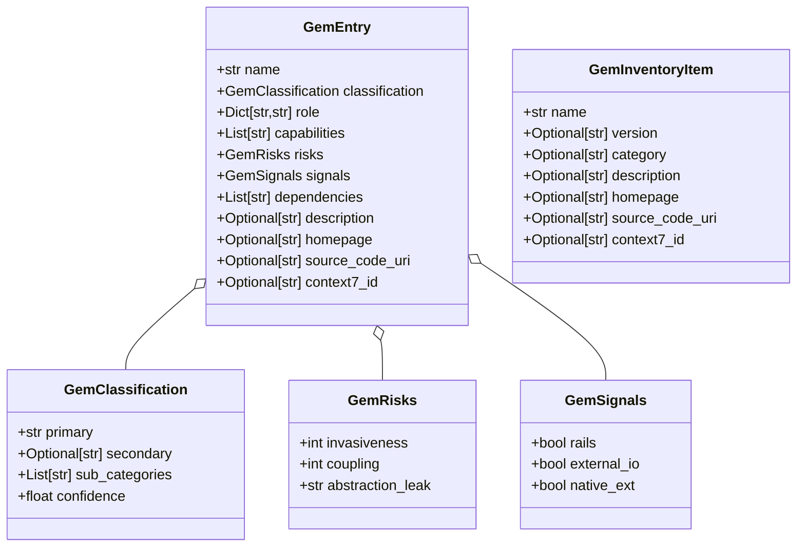

The data models defined in `gem.py` serve as the **canonical schema layer** for the entire rubygemdb pipeline. Every gem that enters the system — whether loaded from a CSV inventory, fetched from the RubyGems.org API, classified by the heuristic engine, enriched by the LLM, or persisted to SQLite — is represented as an instance of these Pydantic models. This single-source-of-truth approach ensures that all subsystems (classification, storage, TUI display, export) operate on a consistent, validated data structure with predictable field types and defaults.

Five models form a clear compositional hierarchy: atomic trait models (`GemSignals`, `GemRisks`) attach to a classification descriptor (`GemClassification`), which combines into the primary aggregate (`GemEntry`), while a lightweight sibling (`GemInventoryItem`) handles the early import phase. The following diagram illustrates their relationships.

Sources: [gem.py](src/rubygemdb/models/gem.py#L1-L41)

## Atomic Trait Models

**`GemSignals`** encodes three boolean flags discovered during heuristic analysis. These signals are lightweight discriminators that downstream consumers (the TUI, export filters, risk scoring) can inspect without re-parsing raw gem metadata. The `rails` flag indicates a gem belongs to the Rails ecosystem; `external_io` marks gems that perform network I/O (HTTP clients, message queues); `native_ext` signals a C-native extension. All three default to `False`, making the model safe to construct without explicit values.

**`GemRisks`** captures the architectural risk assessment produced by `GemClassifier.score_gem()`. The `invasiveness` field (integer 1–5) measures how deeply a gem embeds into the application's core execution path — a Rails framework scores 5, while a CLI helper scores 1. `coupling` (1–4) estimates dependency fan-out risk. `abstraction_leak` is a string-enum (one of `"low"`, `"medium"`, `"high"`) describing whether the gem's abstraction layer tends to leak implementation details into the host application. The defaults (`invasiveness=1`, `coupling=1`, `abstraction_leak="low"`) represent a benign, non-invasive gem.

Sources: [gem.py](src/rubygemdb/models/gem.py#L3-L15), [classifier.py](src/rubygemdb/services/classifier.py#L191-L229)

## The Classification Descriptor

**`GemClassification`** is the core analytical output of both the heuristic rule engine and the LLM fallback. The `primary` field holds one of the 12 canonical categories (e.g., `"runtime_spine"`, `"async_networking_orchestration"`, `"parsing_encoding"`) defined in `VALID_CATEGORIES` within the classifier service. The `secondary` field provides optional hierarchical refinement (currently reserved for future multi-label support). `sub_categories` is a dynamic list of tags (like `"rails"`, `"database"`, `"background_jobs"`) detected by scanning dependency names during heuristic classification — these enable fine-grained filtering in the TUI without requiring a separate query. `confidence` (0.0–1.0) quantifies how certain the system is about the primary assignment: heuristic matches start at ~0.6–0.8, LLM overrides require >0.6 confidence, and manual edits via the TUI set it to 1.0.

Sources: [gem.py](src/rubygemdb/models/gem.py#L7-L10), [classifier.py](src/rubygemdb/services/classifier.py#L8-L19), [sqlite_storage.py](src/rubygemdb/storage/sqlite_storage.py#L126-L128)

## The Aggregate: GemEntry

**`GemEntry`** is the composite root that ties together all gem data produced by the classification pipeline. Every field — except `name` — carries a sensible default, allowing the model to be constructed incrementally as the pipeline enriches the gem through successive phases (metadata verification → heuristic classification → LLM augmentation → risk scoring).

The `role` dictionary stores two distinct descriptions: the original RubyGems.org synopsis under `"description"`, and an LLM-generated `"agent_description"` optimized for RAG retrieval by downstream AI agents (the `"attaches_to"` key provides a coarse architectural anchor derived from the primary category prefix). The `capabilities` list is reserved for future LLM-inferred feature tags (e.g., `"file_watcher"`, `"template_engine"`). `dependencies` holds runtime dependency names extracted from the RubyGems API response.

The URL family (`homepage`, `source_code_uri`) and `context7_id` are verified and corrected during Phase 1 metadata verification in the CLI pipeline. These URLs are validated with HTTP HEAD requests and cross-checked against the gem name to detect hallucinated or mismatched repository references.

Sources: [gem.py](src/rubygemdb/models/gem.py#L17-L30), [cli.py](src/rubygemdb/cli.py#L7-L80)

## The Inventory Ingestion Model

**`GemInventoryItem`** is deliberately spartan — it represents a gem as it first enters the system from a CSV inventory file or a batch-add operation. Every field except `name` is optional because the initial import may have sparse metadata. This model is the input to `StorageBase.load_inventory()`, which returns `List[GemInventoryItem]`. The pipeline then enriches each item through verification and classification, eventually producing a full `GemEntry`. This separation of concerns keeps the import path lightweight and prevents consumers from accidentally depending on fields that have not yet been populated.

Sources: [gem.py](src/rubygemdb/models/gem.py#L32-L41), [base.py](src/rubygemdb/storage/base.py#L6-L8)

## Serialization and Persistence Patterns

The models use Pydantic v2's `model_dump()` method for serialization across all three storage backends. The JSON storage backend serializes entire `GemEntry` objects as a JSON array of dictionaries — a straightforward round-trip for the `classified_gems.json` fallback file. The SQLite backend follows a hybrid strategy: scalar fields (`name`, `description`) map to native SQLite columns, while complex nested models (`GemClassification`, `GemRisks`, `GemSignals`) are serialized as JSON strings via `json.dumps(gem.classification.model_dump())` and deserialized with `GemClassification(**json.loads(row["classification"]))`. This approach preserves the full model structure without requiring a deeply normalized relational schema, while keeping the frequently-queried `name` column indexable.

The TUI export functions (Gemfile, CSV, JSON, Markdown) also rely on `model_dump()` for generating human-readable output, ensuring consistency between storage and presentation layers.

Sources: [json_storage.py](src/rubygemdb/storage/json_storage.py#L24-L37), [sqlite_storage.py](src/rubygemdb/storage/sqlite_storage.py#L107-L143)

## Key Design Decisions

**Mutable defaults handled via `Field(default_factory=...)`** — All list and dict fields (`sub_categories`, `role`, `capabilities`, `dependencies`) use `default_factory` rather than a bare `[]` or `{}`. This is a Pydantic best practice that prevents the notorious mutable-default-shared-across-instances bug. Each new model instance gets a fresh list/dict.

**`GemRisks` default factory in `GemEntry`** — The `risks` field uses `Field(default_factory=GemRisks)` rather than a plain `GemRisks()` default. This ensures that every `GemEntry` that skips explicit risk scoring still gets a unique, mutable `GemRisks` instance, and that the default is computed lazily rather than at class definition time.

**Separation of `GemEntry` and `GemInventoryItem`** — Rather than making all fields optional in a single model and relying on runtime validation, the codebase uses two distinct models for different lifecycle stages. `GemInventoryItem` explicitly models the "inventory-only" state where only the gem name is guaranteed. `GemEntry` models the "fully classified" state. This makes type signatures in the storage interface self-documenting about what data is available at each pipeline stage.

Sources: [gem.py](src/rubygemdb/models/gem.py#L17-L30), [base.py](src/rubygemdb/storage/base.py#L9-L16)

## Cross-Cutting Usage

| Subsystem | Models Used | Purpose |
|---|---|---|
| CLI pipeline (`cli.py`) | `GemInventoryItem` (via storage), `GemEntry` (via classifier) | Phase 1 import & verification, Phase 2 classification |
| Classifier service (`classifier.py`) | `GemEntry`, `GemClassification`, `GemSignals`, `GemRisks` | Heuristic & LLM classification, risk scoring |
| Storage base (`base.py`) | `GemEntry`, `GemInventoryItem` | Abstract interface for load/save operations |
| SQLite storage (`sqlite_storage.py`) | `GemEntry`, `GemInventoryItem`, `GemClassification`, `GemRisks`, `GemSignals` | Persistence with JSON-in-column for nested models |
| JSON storage (`json_storage.py`) | `GemEntry`, `GemInventoryItem` | Fallback flat-file persistence |
| TUI (`tui.py`) | `GemEntry` | Detail view rendering, export generation |
| Export tests (`test_export.py`) | `GemEntry`, `GemClassification`, `GemRisks`, `GemSignals` | Test fixture construction |
| Classifier tests (`test_classifier.py`) | `GemClassification` | Assertions on heuristic output |

Sources: [classifier.py](src/rubygemdb/services/classifier.py#L2), [sqlite_storage.py](src/rubygemdb/storage/sqlite_storage.py#L7), [tui.py](src/rubygemdb/ui/tui.py#L23), [test_export.py](tests/test_export.py#L2), [test_classifier.py](tests/test_classifier.py#L5)

## Next Steps

The data models described here are consumed by every major subsystem. To understand how models flow through the pipeline from inventory to classified output, continue to [Storage Abstraction Interface](10-storage-abstraction-interface) and [SQLite Storage with Metadata Verification](11-sqlite-storage-with-metadata-verification). For the classification logic that populates `GemClassification` and `GemRisks`, see [Heuristic Rule-Based Classification](13-heuristic-rule-based-classification) and [LLM-Augmented Classification with Fallback](14-llm-augmented-classification-with-fallback). The [12-Category Taxonomy System](15-12-category-taxonomy-system) explains the semantic meaning behind each category string that appears in `classification.primary`.