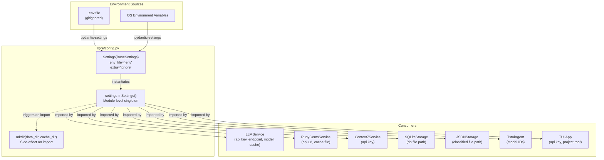

The configuration layer in RubyGemDB is a deliberate architectural microcosm: a single `Settings` class instantiated at module load time that every service, storage backend, and UI component imports directly. It leverages **pydantic-settings** (`SettingsConfigDict`) to bridge environment variables, a `.env` file, and Python-typed defaults into one unified namespace. This page dissects its structure, consumption patterns, and the trade-offs embedded in its design.

---

## Architecture: One Singleton, Seven Consumers

The entire configuration surface is defined in a single file and consumed by every subsystem in the project. The following diagram maps the relationships:



**How to read this diagram**: Environment variables (from the OS or a `.env` file) are resolved by pydantic-settings into the `Settings` class. That class is instantiated once as the module-level `settings` object. The side-effect calls to `mkdir()` run at the same time. Every consumer then imports this singleton directly — there is no dependency injection, no factory, no configuration object passed through constructors.

Sources: [config.py](src/rubygemdb/core/config.py#L1-L39)

---

## Settings Class Anatomy

The `Settings` class organizes 17 fields into five logical groups:

| Group | Fields | Default | Environment Variable |
|-------|--------|---------|---------------------|
| **API Keys** | `mistral_api_key`, `context7_api_key` | `None` (Optional) | `MISTRAL_API_KEY`, `CONTEXT7_API_KEY` |
| **Endpoints & Models** | `llm_endpoint`, `rubygemdb_model`, `rubygemdb_agent_model`, `trackboi_distiller_model`, `rubygems_api_url` | Hardcoded URL strings | `LLM_ENDPOINT`, `RUBYGEMDB_MODEL`, `RUBYGEMDB_AGENT_MODEL`, `TRACKBOI_DISTILLER_MODEL`, `RUBYGEMS_API_URL` |
| **Delays & Batches** | `rate_limit_delay`, `llm_rate_delay`, `llm_batch_size` | `0.5`, `0.5`, `10` | Directly inferable |
| **Derived Paths** | `project_root`, `data_dir`, `cache_dir` | Computed via `Path(__file__).parent.parent.parent.parent` | `PROJECT_ROOT`, `DATA_DIR`, `CACHE_DIR` |
| **Concrete File Paths** | `gem_cache_file`, `llm_cache_file`, `classified_gems_file`, `sqlite_db_file` | Composed from the derived paths above | Not overrideable individually |

**Key design choices visible here**:

1. **Optional sensitive fields**: The two API key fields are typed `Optional[str]` with a default of `None`. This means the application is *designed to degrade gracefully* when keys are missing — the LLM service returns `None` from `call_llm()` when `mistral_api_key` is absent, and `Context7Service.search_libraries()` returns an empty list when `context7_api_key` is `None`. There is no validation-level enforcement that these must be set.

2. **Computed paths**: `project_root` walks up four `parent` calls from `config.py` to reach the repository root (`/home/b08x/WorkspaceV3/rubygemdb`). All other paths derive from this anchor. This works in development but means the path is **frozen at import time** — there is no mechanism to override the root at runtime without changing the environment variable.

3. **No secrets management**: The settings are designed for a `.env` file that is gitignored (`.gitignore` line 4 explicitly excludes `.env`). There is no use of secret-stores, keychains, or encrypted config — the API keys live in plaintext on disk when using the `.env` approach.

Sources: [config.py](src/rubygemdb/core/config.py#L5-L32), [.gitignore](.gitignore#L4)

---

## The `model_config` Directive

The pivot line that connects the settings class to the outside world is:

```python
model_config = SettingsConfigDict(env_file=".env", extra="ignore")
```

This means:
- **`env_file=".env"`** — pydantic-settings will look for a file named `.env` in the current working directory (the directory from which the Python process is launched). It parses this file using `python-dotenv` semantics (key=value pairs).
- **`extra="ignore"`** — any environment variable that does not correspond to a field on the `Settings` class is silently ignored. No error is raised if `.env` contains `UNRELATED_VAR=foo`.

The `python-dotenv` package is declared as a dependency in `pyproject.toml`, confirming that the `.env` loading path is intentional. There is no explicit `load_dotenv()` call in the application code — pydantic-settings handles this internally.

Sources: [config.py](src/rubygemdb/core/config.py#L32), [pyproject.toml](pyproject.toml#L13)

---

## Consumption Patterns Across the Codebase

Each consumer accesses the `settings` singleton by importing it directly. The following table catalogues every read-site:

| Consumer File | Fields Accessed | Purpose |
|:---|:---|:---|
| `services/llm.py` | `llm_cache_file`, `mistral_api_key`, `llm_endpoint`, `rubygemdb_model` | Cache file I/O, API authentication, request routing |
| `services/rubygems.py` | `gem_cache_file`, `rubygems_api_url` | Cache file I/O, RubyGems API URL template |
| `services/context7.py` | `context7_api_key` | API authentication guard |
| `storage/sqlite_storage.py` | `sqlite_db_file` | Database file path for `sqlite3.connect()` |
| `storage/json_storage.py` | `classified_gems_file` | JSON read/write path |
| `ui/tui.py` | `context7_api_key`, `project_root` | API guard, export directory construction |
| `agent.py` | `rubygemdb_agent_model`, `trackboi_distiller_model` | Model selection for LiteLLM |
| Total | **12 distinct fields** across 17 defined | Everything from DB paths to model IDs |

**A notable asymmetry**: The `rate_limit_delay` and `llm_rate_delay` fields are defined in settings (lines 18-19) but neither is read by any consumer. `RubyGemsService` hardcodes its own `rate_limit_delay = 0.1` (line 12), and `Context7Service` hardcodes `rate_limit_delay = 0.2` (line 10). These settings fields exist in the configuration but are **dead configuration** — they were likely intended for a future refactoring that never materialized.

Sources: [config.py](src/rubygemdb/core/config.py#L18-L19), [rubygems.py](src/rubygemdb/services/rubygems.py#L12), [context7.py](src/rubygemdb/services/context7.py#L10)

---

## Import-Time Side Effects

On line 34, the module instantiates `settings = Settings()`. On lines 37-38, it immediately calls:

```python
settings.data_dir.mkdir(exist_ok=True)
settings.cache_dir.mkdir(exist_ok=True)
```

This means **the mere act of importing `rubygemdb.core.config` will create two directories on disk** (`data/` and `data/cache/` relative to the computed `project_root`). This is a deliberate bootstrap convenience — the directories are guaranteed to exist before any service writes to them. However, it also means:

- **Import order sensitivity** — If `data/` is a symlink or a mounted volume that doesn't exist yet, the `mkdir()` will create a regular directory there instead.
- **Testing implications** — Any test that imports a module which transitively imports `config` may create side-effect directories in unexpected locations. The test files do not appear to mock or patch the settings import.

This is a classic tension between convenience and testability in Python configuration modules.

Sources: [config.py](src/rubygemdb/core/config.py#L34-L38)

---

## Environment Variable Reference

The authoritative mapping from environment variable names to settings fields is defined implicitly by pydantic-settings' naming convention (upper-case, underscore-separated matches the field name). The following table lists every field that can be externally configured:

| Environment Variable | Settings Field | Type | Default |
|:---|:---|:---|:---|
| `MISTRAL_API_KEY` | `mistral_api_key` | `Optional[str]` | `None` |
| `CONTEXT7_API_KEY` | `context7_api_key` | `Optional[str]` | `None` |
| `LLM_ENDPOINT` | `llm_endpoint` | `str` | `https://api.mistral.ai/v1/chat/completions` |
| `RUBYGEMDB_MODEL` | `rubygemdb_model` | `str` | `mistral-medium-latest` |
| `RUBYGEMDB_AGENT_MODEL` | `rubygemdb_agent_model` | `str` | `mistral/mistral-small-latest` |
| `TRACKBOI_DISTILLER_MODEL` | `trackboi_distiller_model` | `str` | `mistral/mistral-large-latest` |
| `RUBYGEMS_API_URL` | `rubygems_api_url` | `str` | `https://rubygems.org/api/v1/gems/{name}.json` |
| `RATE_LIMIT_DELAY` | `rate_limit_delay` | `float` | `0.5` |
| `LLM_RATE_DELAY` | `llm_rate_delay` | `float` | `0.5` |
| `LLM_BATCH_SIZE` | `llm_batch_size` | `int` | `10` |
| `PROJECT_ROOT` | `project_root` | `Path` | Computed from `__file__` |
| `DATA_DIR` | `data_dir` | `Path` | `project_root / "data"` |
| `CACHE_DIR` | `cache_dir` | `Path` | `data_dir / "cache"` |

The file-path fields (`gem_cache_file`, `llm_cache_file`, `classified_gems_file`, `sqlite_db_file`) are computed compositions and have no corresponding environment variable. To change them, one must override the base path components (`PROJECT_ROOT`, `DATA_DIR`, or `CACHE_DIR`).

Sources: [config.py](src/rubygemdb/core/config.py#L6-L30)

---

## Architectural Evaluation

The centralized configuration approach in RubyGemDB embodies a specific set of trade-offs:

**Strengths**:
- **Single source of truth** — Every configuration value is defined in one place. Tracing what a setting does means reading one class.
- **Zero boilerplate per consumer** — Services don't need configuration passed through constructors. They import `settings` and read what they need.
- **Graceful degradation via `Optional`** — API keys that are `None` are handled explicitly rather than crashing. The application runs without Mistral or Context7, just with reduced capability.
- **Environment-driven overrides** — The `.env` pattern is well-understood and works naturally with CI/CD pipelines and containerized deployments.

**Limitations**:
- **Global mutable singleton** — Because `settings` is a module-level object, any test that modifies a setting (e.g., `settings.sqlite_db_file = ":memory:"`) affects all subsequent imports in the same process. The project does not use `pytest.monkeypatch` or `unittest.mock.patch` for settings.
- **No dependency injection** — Services directly import the settings singleton rather than receiving configuration through their constructors. This makes it impossible to have two instances of a service with different configurations in the same process.
- **Dead configuration** — The rate-limit fields defined in settings are never consumed; the services define their own hardcoded delays. This creates a maintenance risk where one might change the setting expecting it to take effect.
- **Import-time coupling** — The directory-creation side effect means you cannot import the configuration module without potential filesystem mutation. This rules out certain testing strategies.

**Comparison with alternatives**:

| Pattern | RubyGemDB's approach | Alternative: DI via constructor |
|:---|:---|:---|
| Configuration propagation | Import global singleton | Pass `settings` or `**kwargs` to `__init__` |
| Test isolation | Requires monkeypatch | Natural via test fixtures |
| Multi-tenancy | Impossible | Supported |
| Boilerplate | Minimal | More wiring per service |
| Traceability | Implicit | Explicit |

Sources: [config.py](src/rubygemdb/core/config.py#L1-L39)

---

## Relations to Other Components

The configuration layer sits at the foundation of the dependency graph — everything depends on it, but it depends on nothing (except pydantic-settings):

- The [Storage Abstraction Interface](10-storage-abstraction-interface) uses `settings.sqlite_db_file` and `settings.classified_gems_file` to locate its persistence files.
- The [RubyGems.org API Client with Caching](17-rubygems-org-api-client-with-caching) reads `settings.gem_cache_file` and `settings.rubygems_api_url` from the settings singleton.
- The [Mistral LLM Service with Response Caching](19-mistral-llm-service-with-response-caching) authenticates via `settings.mistral_api_key`, routes to `settings.llm_endpoint`, and selects the model via `settings.rubygemdb_model`.
- The [Context7 Documentation Search Service](18-context7-documentation-search-service) guards all its API calls behind `settings.context7_api_key`.
- Both the [TUI Implementation](23-textual-based-interactive-tui-implementation) and the [Agent-Powered Semantic Chat](6-agent-powered-semantic-chat) read model identifiers and API keys for their respective operations.

This flat dependency structure means that any architectural change to configuration (switching to a config file, adding a settings UI, introducing per-environment profiles) will ripple through every consumer simultaneously. The centralized design is a double-edged sword: it makes the change *visible* in one place, but the coupling means the blast radius is the entire application.

Sources: [rubygems.py](src/rubygemdb/services/rubygems.py#L4), [llm.py](src/rubygemdb/services/llm.py#L5), [context7.py](src/rubygemdb/services/context7.py#L4), [sqlite_storage.py](src/rubygemdb/storage/sqlite_storage.py#L8), [json_storage.py](src/rubygemdb/storage/json_storage.py#L6), [agent.py](src/rubygemdb/agent.py#L11), [tui.py](src/rubygemdb/ui/tui.py#L22)

---

## Recommended Reading Flow

To fully understand how configuration flows through the system, read these pages in order:

1. **This page** — You are here. Understand what settings exist and how they are loaded.
2. [Pydantic Data Models for Gems](8-pydantic-data-models-for-gems) — See how the other half of pydantic (data modelling rather than settings) structures the gem entities.
3. [Storage Abstraction Interface](10-storage-abstraction-interface) — Trace how `settings.sqlite_db_file` becomes a concrete database connection.
4. [Mistral LLM Service with Response Caching](19-mistral-llm-service-with-response-caching) — See how `settings.mistral_api_key` enables the optional classification pipeline.