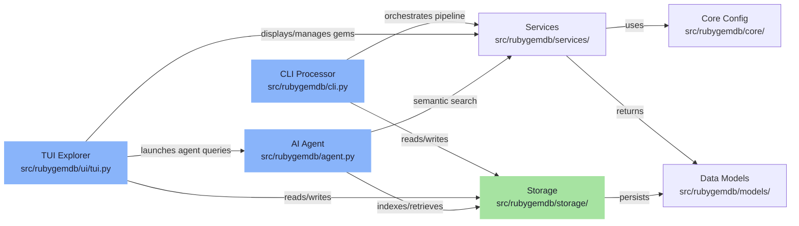
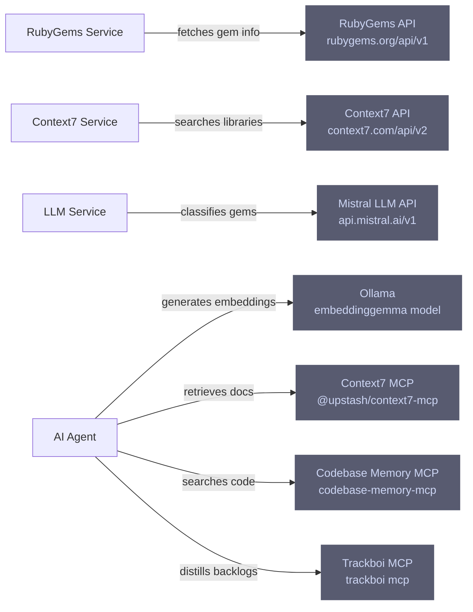
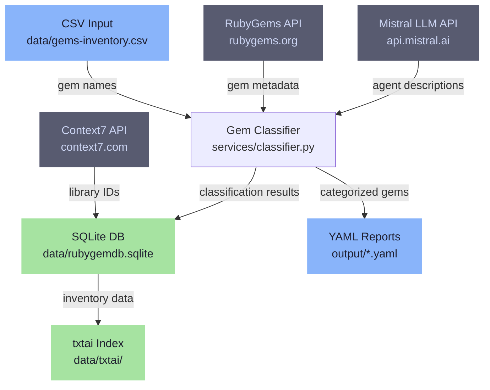

<div align="center">

# RubyGemDB

**Ruby gem classification and analysis through heuristic taxonomy and LLM-augmented semantic search**

[](https://opensource.org/licenses/MIT)
[](https://www.python.org/downloads/)
[](https://docs.astral.sh/uv/)

</div>

---

## Features

- **12-Category Taxonomy** — Classifies gems into architectural patterns (runtime_spine, storage_persistence, ai_nlp, etc.) with confidence scoring and sub-category detection from dependency analysis
- **Heuristic + LLM Hybrid** — Fast pattern matching for obvious cases, with Mistral-powered LLM fallback when heuristic confidence drops below 0.7
- **Semantic Vector Search** — txtai-powered embeddings with multi-query expansion and recency boosting for finding gems by natural language description
- **AI Agent with MCP Tools** — Context7 documentation retrieval, Codebase Memory integration, and Trackboi backlog distillation via Model Context Protocol
- **Interactive TUI** — Textual-based terminal UI for browsing, filtering, editing, and exporting classified gems with real-time classification
- **Batch CLI Pipeline** — Headless processing of gem inventories with metadata verification, classification, and YAML report generation
- **Risk Assessment** — Invasiveness, coupling, and abstraction leak scoring for architectural impact analysis

---

## Architecture



## External Integrations



---

## Classification Taxonomy

### Primary Categories

| Category | Description | Risk Level |
|----------|-------------|------------|
| `runtime_spine` | Rails core, frameworks, Ruby extensions | Invasiveness: 5/5 |
| `cli_terminal_ui` | CLI frameworks, terminal UI tools | Invasiveness: 1/5 |
| `storage_persistence` | ORMs, DB adapters, file storage | Invasiveness: 4/5 |
| `async_networking_orchestration` | HTTP clients, messaging, job queues | Invasiveness: 4/5 |
| `ai_nlp` | AI/ML, NLP, LLM, embeddings | Invasiveness: 3/5 |
| `data_processing` | HTML/XML parsing, CSV, PDF, scraping | Invasiveness: 3/5 |
| `retrieval_similarity_fuzzy` | Search, fuzzy matching, indexing | Invasiveness: 3/5 |
| `algorithms_knowledge_structures` | Data structures, graphs, trees | Invasiveness: 2/5 |
| `validation_types` | Validation, type systems, schemas | Invasiveness: 2/5 |
| `parsing_encoding` | JSON, YAML, XML, MessagePack | Invasiveness: 2/5 |
| `debugging_introspection` | Debuggers, profilers, monitoring | Invasiveness: 1/5 |
| `mcp_tooling` | Model Context Protocol tools | Invasiveness: 1/5 |

### Sub-Category Detection

Automatic sub-category extraction from dependency names:

- `rails`, `sidekiq`, `background_jobs`, `activejob`, `server`
- `database`, `redis`, `search`, `auth`, `api`
- `serialization`, `spreadsheet`, `pdf`, `cloud`
- `monitoring`, `messaging`

---

## AI Agent Architecture

### Semantic Search Pipeline

The agent implements a multi-stage search process:

1. **Query Expansion** — "Other Steve" prompt architect rewrites queries into SFL-compliant semantic variations
2. **Vector Retrieval** — Hybrid search (dense + sparse) with 30% recency boost for updated gems
3. **Codebase Context** — Optional MCP integration with Codebase Memory for target project analysis
4. **Synthesis** — Generates pragmatic implementation backlogs with concrete file references

### MCP Tool Integration

| Tool | Purpose |
|------|---------|
| `search_memory_tool` | Primary semantic search across gems, chat history, and docs |
| `fetch_rubygems_info` | Fetch detailed gem metadata from RubyGems API |
| Context7 MCP | Retrieve library documentation and cheatsheets |
| Codebase Memory MCP | Search target project architecture |
| Trackboi MCP | Distill backlogs into task boards |

### Agent Prompt Structure

```
Pragmatic Intent → Context & Findings → Implementation Backlog → Risks & Trade-offs
```

Each backlog item includes:
- User Story (`As a <system>, I need <capability>`)
- Technical tasks with concrete file references
- Architectural integration points

---

## Development

### Project Structure

```
rubygemdb/
├── src/rubygemdb/
│   ├── cli.py              # CLI batch processor
│   ├── agent.py            # AI agent with txtai embeddings
│   ├── core/
│   │   └── config.py       # Pydantic Settings configuration
│   ├── models/
│   │   └── gem.py          # Pydantic data models
│   ├── services/
│   │   ├── classifier.py   # Heuristic + LLM classification
│   │   ├── rubygems.py     # RubyGems API client
│   │   ├── llm.py          # Mistral LLM client
│   │   └── context7.py     # Context7 API client
│   ├── storage/
│   │   ├── base.py         # Storage interface
│   │   ├── json_storage.py # JSON file storage
│   │   └── sqlite_storage.py # SQLite storage
│   └── ui/
│       └── tui.py          # Textual TUI application
├── tests/
│   ├── test_classifier.py
│   └── test_export.py
└── pyproject.toml
```

### Data Flow



---

## License

MIT License — see [LICENSE](LICENSE) for details.

---

## References

- [RubyGems API](https://rubygems.org/api/v1/gems/{name}.json)
- [Context7 API](https://context7.com/api/v2/)
- [txtai](https://neuml.github.io/txtai/)
- [Textual](https://textual.textualize.io/)
- [Pydantic](https://pydantic.dev/)
